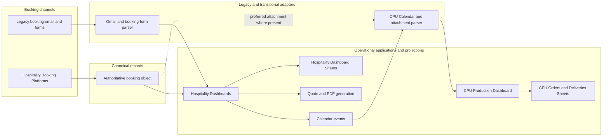
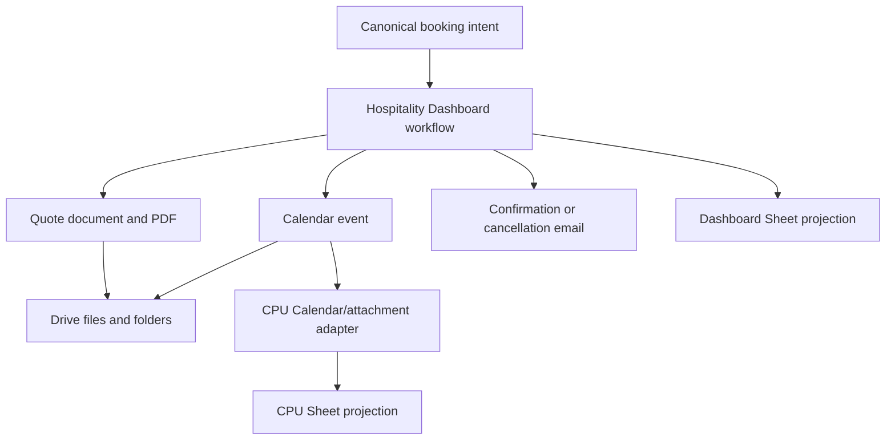
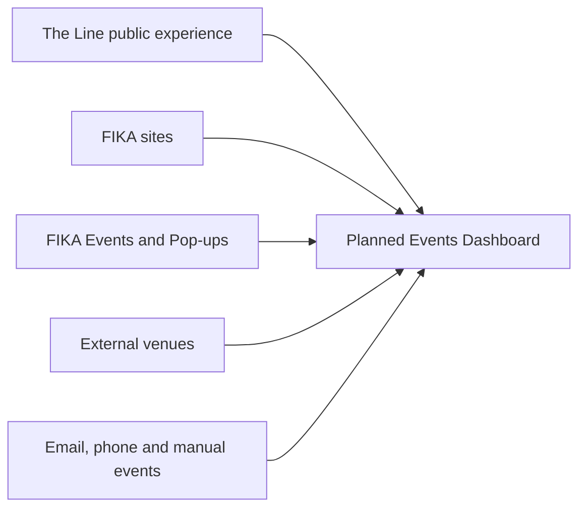

# Current System Map

## Status and evidence boundary

This map describes only relationships confirmed by the Stage 1 inventories and hospitality/CPU audits. It does not assert production URLs, deployment state, owners, users, volumes, or criticality where those facts remain TODO.

## Classification

- **Canonical record:** the authoritative representation of a business concept. The Hospitality Booking Platform is confirmed as the authority for hospitality bookings; the draft `FikaBooking` schema is not yet adopted.
- **Operational projection:** a derived representation used to operate, report, cache, or audit work. It can be rebuilt or reconciled from its authority and must not silently become a competing truth.
- **Legacy adapter:** a transitional component that reconstructs or normalises business facts from an older channel or layout.

## Current platform overview

The current workspace contains site-specific Hospitality Booking Platforms and Hospitality Dashboards, shared hospitality utilities, the CPU Production Dashboard, workforce and client-specific reporting tools, and planned capabilities without repositories. Hospitality variants share substantial code but remain separate current implementations.

MNK is the preferred direct-booking baseline. Angel Court supports direct booking and retains a legacy inbox adapter. CFC is built but not live. Demo supports sales and tender demonstrations. The Line has a hospitality dashboard but is not the standard booking baseline.

The direct platform path is authoritative. The legacy path should normalise into the same booking contract. The current CPU path remains Calendar-led and does not yet consume draft `FikaBooking` v1 directly.

## Hospitality Booking Platforms

| Variant | Confirmed position | Current data relationship |
|---|---|---|
| MNK | Live; preferred consolidation baseline | Creates booking-object JSON directly and projects to its dashboard without a booking-form spreadsheet |
| Angel Court | Live; direct platform preferred | Creates booking objects; legacy email/form path remains a required fallback adapter |
| CFC | Development; built but not operationally deployed | Uses the shared direct booking-object flow |
| Demo | Sales/tender demonstration | Demonstrates the direct booking-object flow; must not define production business rules |

The platform recalculates and validates requests server-side, creates booking IDs, writes operational line-item/request views, and sends notifications. Menu/brochure catalogues and platform settings are current inputs. The authoritative physical repository, mutation/version delivery, and final schema adoption remain TODO.

## Legacy inbox adapters

Hospitality Dashboard variants contain Gmail search, message/attachment traversal, spreadsheet conversion, source classification, parsing, duplicate detection, and scan logging. Angel Court must retain this path for tenants who still submit by email. The Line contains distinct form/revision matching behaviour.

These adapters reconstruct fields from message and workbook layout. They are not sources of business truth. Their intended output is a canonical booking with a stable legacy source reference; that canonical transformation is not yet implemented as a shared adapter.

## Hospitality Dashboards

Dashboards review bookings, generate quotes/documents, create Calendar events, send confirmations/cancellations, archive files, and maintain operational workflow fields. Their Sheets contain booking projections, quote and Calendar references, statuses, audit information, and variant-specific fields.

The dashboards should consume booking objects rather than reconstruct bookings wherever possible. Dashboard workflow status is not authoritative commercial booking status. MNK recharge logic and The Line revision behaviour are confirmed variant-specific concerns pending separate domain decisions.

## Quote generation, Drive, Calendar and Sheets

- **Quote generation:** Dashboard code creates documents/PDFs and stores quote metadata. Pricing policy and template differences remain explicit by variant.
- **Drive:** stores source forms, booking JSON, quotes, PDFs, Calendar attachments, archives, and CPU preparation/allergen evidence. Drive file references are integration metadata, not canonical business identity.
- **Calendar:** dashboards create operational events; CPU currently uses events as its discovery envelope and part of its duplicate/version logic. Calendar is not the canonical booking repository.
- **Sheets:** booking-platform line items/request logs, dashboard data, CPU Orders/Deliveries, settings, and scan logs are current projections, configuration, or audit stores according to their documented role. A Sheet layout must not define a canonical schema.

## CPU production

The CPU scanner reads configured Calendars, prefers a recognised booking JSON attachment, and falls back to quote, booking-form, title, description, location, and owner mappings. It stores a lossy order projection and aggregates production quantities by normalised item display name and site.

CPU statuses (`READY`, `NEEDS_ATTENTION`, `CANCELLED`), preparation state, chef attribution, warnings, detected changes, and photographs are operational/production state. A future `FikaProductionOrder` will represent production work; it does not yet exist as a canonical schema or repository.

## Existing integrations

| Integration | Confirmed current role | Classification |
|---|---|---|
| Gmail | Legacy booking intake and workflow email in Hospitality Dashboards; booking-platform notifications | Legacy adapter and external communication |
| Google Drive | Source/quote/PDF/JSON storage, attachment reading, Office conversion, archives, CPU evidence | External integration and file store |
| Google Calendar | Hospitality event creation and CPU discovery/delivery events | Operational integration and transitional adapter envelope |
| Google Sheets | Configuration, projections, logs, reporting and workflow state | Mixed; role must be explicit per Sheet |
| Google Docs/Slides | Quote/document generation and CPU attachment parsing | Document integration/legacy adapter |
| BrightHR | Workforce Operations Platform data workflow | External integration; detailed authority/sync behaviour requires manual review |
| Square, SumUp and Goodtill | Confirmed scope for migration/abstraction capability | Planned/provider boundary; current implementation evidence remains TODO |
| Feedback applications | Multi-site feedback collection/reporting over hospitality data | Shared operational utilities |
| Munich RE hot-drinks tools | Live client-specific tally/reporting with Sheets/Drive data | Client-specific operational reporting |
| Local Codex MCP tooling | In scope | Local tooling; detailed current implementation inventory TODO |

No direct Gmail ingestion or external order API was found in the CPU project.

## Planned Events capability

The Events Dashboard is a planned internal company-wide source of truth for events from The Line, FIKA sites, FIKA Events and Pop-ups, external venues, and email-, phone-, or manually-created events. FIKA Events and Pop-ups and The Line will remain separate public/client-facing experiences feeding that shared internal capability.

No repository, adopted event schema, storage, deployment, or confirmed integration implementation was found. These are planned capabilities, not current-system applications.

## Planned Logistics capability

Logistics is a planned company-wide capability downstream of hospitality/CPU workflows. No local Logistics Dashboard repository or adopted logistics schema was found. Current CPU delivery Calendar events and the CPU Deliveries Sheet are evidence of an operational delivery concern, but not evidence of the target Logistics design.

## Sources of truth summary

| Concept | Current/declared authority | Non-authoritative representations |
|---|---|---|
| Hospitality booking | Hospitality Booking Platform and its booking object | Dashboard Sheets, line-item/request-log Sheets, Calendar, quote/forms, CPU Orders |
| Booking pricing | Submission-time server-authoritative snapshot in the booking object | Quote/PDF presentation and Sheet projections |
| Menu/catalogue at submission | Site booking-platform catalogue/configuration; governance TODO | Frozen item snapshots in bookings; brochures as documented provenance |
| Dashboard workflow | Dashboard operational projection, pending formal ownership | Booking commercial status must remain separate |
| CPU production work | No canonical production-order repository yet | CPU Orders Sheet is the current operational projection |
| Events | Planned Events Dashboard authority | Current event records/channels require future inventory and schema decisions |
| Configuration | Mixed current source files, Settings Sheets and properties | Target central ownership remains future work |

## Transitional adapters and operational projections

Transitional adapters currently include Gmail/form parsers, The Line revision parsing, dashboard booking-object projection adapters, CPU Calendar discovery, CPU quote/form parsing, and Office document conversion. They should be retained until canonical replacements are verified and recoverable.

Operational projections include booking-platform line-item/request logs, Hospitality Dashboard Sheets, Calendar events, quotes/PDFs, CPU Orders, CPU Deliveries, scan logs, and reporting views. Each projection requires an explicit authority, refresh direction, reconciliation rule, and retention policy during future implementation work.

## Remaining current-state questions

- TODO: Confirm lifecycle, users, owners, criticality, health, and production volumes for applications still marked TODO.
- TODO: Confirm the durable authoritative booking repository and versioned mutation/delivery mechanism.
- TODO: Confirm current production relationships for BrightHR, till providers, reporting, and local MCP tooling beyond inventory evidence.
- TODO: Confirm status ownership and write-back rules for dashboard and CPU corrections.
- TODO: Inventory retention, backup, recovery, release, permission, and observability arrangements.
