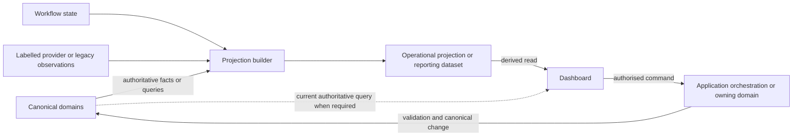

# ADR-007: Projection and Dashboard Boundary

- Status: Accepted
- Date: 2026-07-27
- Stage: Stage 6 — Platform Architecture
- Decision owners: Platform Governance, constrained by participating domains' approved business authority
- Depends on: ADR-001, ADR-005 and ADR-006
- Related records: ADR-003 and ADR-004 remain supporting decisions within this boundary
- Supersedes: none

## Context

[ADR-001](ADR-001-stage-6-platform-boundaries.md) separated canonical domains, applications, orchestration, repositories, projections, providers and legacy adapters. [ADR-005](ADR-005-domain-event-and-integration-contract.md) established duplicate-safe event delivery, ordering and replay boundaries. [ADR-006](ADR-006-repository-and-consistency-contract.md) established domain queries for authoritative reads and projections as non-authoritative derived views with explicit recovery.

FIKA's current dashboards, Sheets, Calendar records, documents and reports combine operational visibility, workflow controls, provider observations and derived data. They remain valuable systems of execution, but their use must not silently transfer ownership from Booking, Production or another canonical domain. The architecture therefore needs a complete contract for projection definition, freshness, rebuilding, access and dashboard action boundaries.

The Hospitality dashboard is the first case study because it displays Booking-derived information, dashboard workflow state, Calendar/provider references and CPU-related operational visibility. The case study tests the general boundary; it does not design the Booking-to-Production workflow reserved for ADR-009.

## Evidence considered

| Evidence | Supported conclusion | Authority |
|---|---|---|
| [ADR-001](ADR-001-stage-6-platform-boundaries.md) | Applications consume authorised projections; projections are rebuildable and non-authoritative; dashboards do not own canonical meaning. | Accepted architecture |
| [ADR-005](ADR-005-domain-event-and-integration-contract.md) | Projection consumers must handle duplicate, late and out-of-order delivery; replay does not repeat external effects. | Accepted architecture |
| [ADR-006](ADR-006-repository-and-consistency-contract.md) | Authoritative reads use domain queries; projection lag and failure are explicit; dashboard actions cross command boundaries and revalidate current state. | Accepted architecture |
| [Platform principles](../platform-principles.md) | Source-of-truth clarity, storage independence, explicit status, observable automation, data minimisation and gradual migration are required. | Canonical principles |
| [ROLE-003](../business-decisions/role-003-permission-actions.md), [ROLE-004](../business-decisions/role-004-assignment-scopes.md), [ROLE-005](../business-decisions/role-005-approval-publication-separation.md) and [ROLE-006](../business-decisions/role-006-access-boundaries.md) | Viewing, contributing, managing, approving, publishing and administering are distinct scoped actions; display access does not establish authority. | Canonical Decision sections |
| [BOOK-004](../business-decisions/book-004-immutable-pricing-amendments.md), [BOOK-006](../business-decisions/book-006-booking-amendment-cancellation-decline.md) and [BOOK-007](../business-decisions/book-007-booking-source-references.md) | Booking changes preserve attributable history, price versions and stable provenance; dashboard rows cannot replace those records. | Canonical Decision sections |
| [PROD-001](../business-decisions/prod-001-production-order-eligibility.md), [PROD-004](../business-decisions/prod-004-production-amendments-cancellations.md) and [ADR-004](ADR-004-booking-to-production-boundary.md) | Production owns fulfilment state and independently responds to Booking changes; dashboard workflow state is not either domain's canonical lifecycle. | Canonical Decisions and accepted architecture |
| [Pack 2 traceability](../schema-reviews/pack-2-bdr-to-schema-traceability.md), [Pack 4 traceability](../schema-reviews/pack-4-bdr-to-schema-traceability.md) and [Pack 6 traceability](../schema-reviews/pack-6-bdr-to-schema-traceability.md) | Stable identity, scope, source references, versions, audit and cross-domain references support traceable projections without transferring ownership. | Integrated schema evidence |
| [Current-system map](../current-system-map.md) | Hospitality and CPU dashboards, Sheets, Calendar and documents are systems of execution, projections, providers or adapters; classifications are mixed but not canonical by default. | Canonical current-state evidence |
| [Hospitality dashboard audit](../../inventory/reports/hospitality-dashboard-family.md), [booking-platform audit](../../inventory/reports/hospitality-booking-platform-family.md) and [CPU audit](../../inventory/reports/cpu-production-dashboard.md) | Current dashboard rows combine Booking data, workflow fields, quote/Calendar references and parser state; CPU rows are lossy projections with distinct Production/workflow concerns. | Supporting operational evidence |
| [Stage 5 closure](../stages/stage-5-closure-2026-07-25.md) and [Stage 6 record](../stages/stage-6-platform-architecture.md) | Packs 1–8 were protected and ADR-007 was the registered bounded architecture task at decision time. | Canonical stage records |

## Decision

FIKA OS will use explicitly owned **projections** for efficient operational, workflow, dashboard and reporting reads. A projection is derived state with declared sources, purpose, freshness, access rules and recovery responsibilities. It never becomes authoritative over its source domains through convenience, denormalisation, operational use or physical persistence.

Dashboards normally read projections. When an authorised business decision requires current canonical information, they use the owning domain's authoritative query. Every dashboard action crosses an application or domain command boundary and is revalidated against current canonical state; no dashboard writes directly to another domain's repository or to a projection as a substitute for a business command.

The diagram shows logical responsibilities, not deployment, storage, transport or a selected event broker.

## Projection and dashboard taxonomy

| Term | Meaning | Critical boundary |
|---|---|---|
| Authoritative domain query | Read exposed by the owning domain for current information needed in an authorised decision. | May return canonical state, constrained authoritative view, eligibility result, status or version; does not grant mutation authority. |
| Operational projection | Derived model optimised for current operational visibility, coordination or dashboard performance. | May combine domains and lag; does not own source records or bypass commands. |
| Workflow projection | View combining orchestration progress with canonical references or domain facts. | Workflow and technical processing state remain distinct from participating-domain state. |
| Reporting dataset | Derived data for aggregation, historical analysis, exports, trends or management reporting. | May use different granularity; is not automatically safe for authoritative operational decisions. |
| Dashboard | Human-facing view supporting visibility, control and improvement. | Presentation and action initiation do not create canonical ownership or authority. |
| Projection builder | Logical responsibility that validates authorised inputs and deterministically updates derived state. | Need not be separately deployed and does not make business decisions for source domains. |
| Projection store | Logical persistence boundary for derived state. | Not a canonical repository; physical technology remains undecided. |
| Projection checkpoint | Technical progress state used for gap detection, restart and rebuild. | Not business completion, precedence, event occurrence time or canonical version. |
| Snapshot or materialised view | Derived representation captured or maintained for an identified read purpose. | The term does not imply a physical storage feature or canonical authority. |
| Export | Generated representation of authorised data for a bounded purpose and stated point or period. | Downloading, emailing or retaining it does not make it authoritative. |

Canonical state is not projection state. A dashboard row is not a canonical record. Projection state is not audit, workflow or provider state even where one view displays all four.

## Projection ownership

- Every projection has a logical owner accountable for its definition, source contract, access policy, freshness expectation, reconciliation, lifecycle and retirement.
- Projection ownership may sit with an application capability, operational-view boundary, reporting responsibility or workflow orchestration boundary. It never transfers source-domain ownership.
- Cross-domain projections identify every participating source domain and retain its authority distinctions.
- Source domains own canonical meaning and changes. Projection builders own derived-state correctness against declared inputs and rules. Dashboards own presentation and safe command initiation.
- Physical consolidation of projection stores does not merge logical ownership or access rules.
- One projection may support several views only when their semantics, access and freshness needs genuinely align.
- Similar labels are not merged when their meanings differ. A display label cannot redefine a canonical status.
- FIKA Core may standardise narrow checkpoint, freshness, source-link and outcome conventions. It must not become a universal projection store, dashboard database, global reporting schema or cross-domain mutation layer.

### Evidence-supported projection families

| Family | Purpose and logical owner | Sources and refresh | Prohibited authoritative use | Recovery/security considerations | Evidence and unresolved points |
|---|---|---|---|---|---|
| Hospitality operational projection | Support Hospitality review and operational handling. Current accountable projection owner: TODO. | Booking facts/queries plus separately labelled workflow and provider observations; event-driven or query refresh may coexist. | Cannot own commercial Booking status, price history, Production state or provider outcome. | Expose source freshness and failed updates; minimise Client/Contact information by role. | Current-system map; Hospitality audits; BOOK-001–007. Numerical freshness and ownership remain ungoverned. |
| Production operational projection | Show Production work, preparation visibility and exceptions. Production or its authorised operational-view responsibility owns definition; exact assignment: TODO. | Production facts/queries; legacy Calendar and parser observations remain labelled during transition. | Cannot reconstruct commercial Booking authority or treat parser `READY` as confirmation. | Preserve Booking/Production IDs and versions; expose legacy/reconciliation state. | PROD-001–005; Pack 6; CPU audit. Detailed orchestration is ADR-009. |
| Cross-domain workflow projection | Explain progress across independently accepted operations. Orchestration boundary owns process view. | Workflow-state facts plus attributable domain outcomes. | Cannot overwrite Booking, Production or later Logistics lifecycle. | Distinguish pending, refused, uncertain and complete operations; reconcile from authoritative queries. | ADR-006; workflow catalogue. Compensation policy remains domain-specific. |
| Operational reporting datasets | Trends, aggregates and exports for governed users. Accountable reporting owner: TODO by dataset. | Authorised domain facts or reconciled projections at a declared cutoff. | Cannot create source facts or support authoritative action without explicit policy. | Govern calculation version, lineage, corrections, access and export purpose. | Platform principles; current reporting tools. Metric definitions and restatement policy remain future decisions. |

This is not a catalogue of every future dashboard.

## Projection input boundary

Permitted logical inputs are:

- ADR-005 domain or integration events;
- authorised domain queries;
- workflow-state facts;
- validated, clearly labelled provider observations;
- controlled legacy imports or change detection;
- governed reference data;
- correction or supersession facts;
- authorised rebuild inputs.

Every input has known origin, identity, meaning and contract version where applicable. Delivered events are validated before use and deduplicated by stable event identity. Provider webhooks and legacy rows remain observations until mapped and, where business meaning is required, accepted by an owning domain.

Query-driven refresh provides a result at a point in time; it does not create a transaction with later source changes. Inputs that are untrusted, incomplete or incompatible are rejected, quarantined or represented as unresolved—they are not guessed into business facts.

## Identity and source linkage

- A projected record retains stable canonical identifiers for every source record it represents and, where material, the source version or effective point used.
- Source-record identity, projection-record identity, event identity, workflow identity, provider identity and export identity remain distinct.
- A projection may have a composite or view-specific identity for deterministic update, but that identity does not replace canonical identity.
- Display names, email addresses, dates and mutable provider labels are not universal identifiers.
- Cross-domain rows preserve traceability to each source instead of suggesting one new aggregate.
- Projection-local fields—processing status, display grouping, cached labels and checkpoint references—are explicitly separate from copied canonical fields.
- Correction, supersession, merge, split, archive, withdrawal and restricted access follow source-domain facts and governed retention/privacy policy. This ADR does not invent those business rules.
- An `as of` point and source-version information are exposed when materially useful for judging the view.

## Derivation rules

- Derivation is deterministic where practical and documented sufficiently for replay, testing and explanation.
- Copied canonical fields may become stale; denormalisation never transfers ownership.
- Derived fields identify their definition and source dependencies.
- Calculations that establish business meaning require governed Decisions. Presentation calculations are labelled and cannot become canonical facts through display.
- Unknown, unavailable and not applicable remain distinguishable unless governed policy permits consolidation.
- Missing values do not silently become zero, false, complete, declined or cancelled.
- Corrections do not silently rewrite business-significant reporting history; historical restatement requires explicit policy.
- A provider status is not translated into a FIKA canonical status without an approved mapping and domain acceptance.

## Freshness and completeness

Freshness dimensions remain separate:

- business occurrence time;
- canonical record time and version;
- event recording and publication time;
- projection processing time;
- projection `as of` point;
- last successful and last attempted update;
- source-specific freshness;
- whole-view freshness;
- user-visible refresh time.

Each projection declares a qualitative purpose category: authoritative current read required, operationally near-current projection, periodic operational projection, historical/reporting dataset, or manually refreshed/imported legacy view. Numerical service levels require later evidence and are not set here.

Freshness must be observable enough for a consumer to judge suitability. “Last updated” identifies the source and meaning of that timestamp. Cross-domain views expose materially different source freshness; an overall healthy indicator cannot conceal a stale critical source.

Completeness is separate from freshness and availability. A fresh projection can be partial; an available projection can be stale; an empty result can be genuinely empty or reflect unavailable/incomplete inputs. Those conditions are represented separately. Missing projected data is never proof that canonical data does not exist.

## Update, duplicate, ordering and checkpoint rules

- At-least-once inputs must be safe to process repeatedly without duplicate projected outcomes.
- Projection builders retain sufficient input identity and checkpoint evidence to recognise completed, rejected, delayed and missing work.
- Event identity, subject identity and checkpoint identity remain distinct.
- No global ordering is assumed. Where one subject's version matters, the builder compares attributable source version or uses an authoritative query rather than arrival order alone.
- Late or out-of-order input cannot overwrite a newer derived representation merely because it arrived last.
- Gaps, unsupported versions and discontinuities are visible and trigger catch-up, query or reconciliation.
- A checkpoint records technical progress, not business precedence, canonical completion or workflow success.
- Checkpoint advancement occurs only after the corresponding projection update is durably accepted for that processing scope.
- Multi-source projections may require source-specific checkpoints; one source's progress must not conceal another's delay.

## Failure and recovery

- Input validation failure, processing failure, projection persistence failure, checkpoint uncertainty and source unavailability remain distinct.
- A failed projection update does not change canonical state and is not evidence that the originating business action failed.
- Recovery determines whether work is absent, completed, duplicated or uncertain before retrying.
- Partial batches expose affected scope and do not present the whole projection as current.
- Poison or incompatible inputs are quarantined with safe diagnostic context rather than blocking invisibly or being discarded.
- Projection health includes last successful progress, outstanding gaps, rejected input, rebuild state and reconciliation need where applicable.
- Manual repair is authorised, attributable and reproducible where practical; it cannot directly rewrite source-domain facts.

## Replay and rebuilding

- Every projection declares whether it is fully rebuildable, partly rebuildable or dependent on retained legacy/manual state.
- Rebuild inputs are authorised and complete enough for the projection's stated purpose; limitations are explicit.
- Rebuild starts from a controlled baseline or replaces derived scope without creating business occurrences.
- ADR-005 replay rules apply: repeated facts do not repeat notifications, provider writes or other external side effects by default.
- Projection-local operational state that cannot be derived is separated and preserved or migrated deliberately rather than accidentally erased.
- A rebuilt projection is reconciled before being declared healthy.
- Event sourcing, replay infrastructure, snapshot mechanism and retention duration remain unselected.

## Reconciliation

Reconciliation compares projection contents and checkpoints with authoritative source queries, accepted facts and workflow records. It identifies missing, extra, stale, conflicting or inaccessible representations without silently changing canonical state.

Resolution may rebuild a projection, reprocess an existing fact with the same identity, refresh from an authoritative query, quarantine ambiguity or escalate for authorised intervention. A business correction uses the owning domain's command; a projection repair does not masquerade as that correction. Reconciliation evidence records scope, source versions, findings, action, actor and outcome where applicable.

## Authoritative-query boundary

Use a domain query when an action or decision materially depends on current owned state, eligibility, authority-sensitive detail or a comparison token. Use a projection when efficient visibility, filtering, coordination or aggregation can tolerate its declared freshness and completeness.

A dashboard may combine both. It must not label projected data as current merely because an adjacent authoritative query succeeded, and it must not turn repeated domain queries into an unrestricted analytical interface.

## Dashboard read boundary

- Dashboards normally read purpose-appropriate projections or reporting datasets.
- Source, authority level, freshness, completeness and provider/legacy status remain understandable.
- Filtering, sorting, grouping, formatting and dashboard-local preferences do not change canonical state.
- Empty, loading, unavailable, stale, partial and genuinely zero-result states remain distinct.
- Caching cannot conceal source freshness or authority.
- Sensitive fields are minimised for the user's authorised purpose; view, export and action permissions may differ.
- Direct physical access to another domain's write storage is outside the governed architecture.
- A dashboard read has no hidden mutation side effect.
- Reduced-visibility operation during failure is permitted only when the limitation is explicit and safe for that use.

## Dashboard action boundary

- Every business action invokes an authorised application or owning-domain command; it does not write directly to a canonical repository or projection store.
- The receiving boundary re-evaluates capability, configuration, permission, responsibility, authority, current canonical state, invariants and concurrency as applicable.
- Displayed projected state is advisory at command time. A version or comparison token may accompany the request, but acceptance never relies solely on a dashboard row.
- A previously available action can be rejected after state or authority changes.
- Outcomes distinguish submitted, accepted and persisted, partially completed, rejected, uncertain and reconciliation required.
- Optimistic display updates are labelled as pending and never presented as canonical completion.
- Retries use ADR-006 command idempotency; provider effects use separate idempotency and reconciliation.
- Bulk actions preserve per-record validation, authority and outcome visibility.
- Projection refresh after command success is a separate outcome. The dashboard reconciles when the command result and displayed projection differ.

## Hospitality dashboard case study

| Concern | ADR-007 application |
|---|---|
| Purpose | Internal Hospitality operational visibility and controlled action initiation across Booking-derived work, dashboard workflow and current provider/legacy processes. It is not a new canonical Hospitality aggregate. |
| Logical owner | A Hospitality operational-view/application responsibility must own projection definition and health. The accountable business role is TODO and cannot be inferred from current code. |
| Participating domains | Booking is confirmed. Production information remains Production-owned. Client, Client Contact, Operational Location and Service references may be displayed where authorised. Logistics remains a future domain. |
| Authoritative reads | Current Booking version/status, amendment eligibility or comparison context when an action depends on them; Production queries when current fulfilment state is materially required. Exact query catalogue is future design. |
| Operational projections | Booking summaries, service timing/location, item summaries and cross-domain operational visibility at declared freshness. Combined rows retain source identities and do not become canonical records. |
| Workflow/technical state | Review progress, quote/document/Calendar processing, scan warnings, retries and reconciliation may be shown when separately labelled from Booking and Production status. Ownership of current dashboard-local fields requires inventory during implementation design. |
| Provider/legacy observations | Calendar, Gmail, Drive, document and Sheet state remain provider or legacy observations with stable references and verification state. They cannot override canonical status. |
| Traceability | Preserve Booking ID/version, relevant Production Order IDs/versions, workflow/correlation identity, event identity where applicable and separate provider references. |
| Freshness | Operationally near-current is the qualitative intent for active work, but no numerical target is governed. Source-specific age, failure and partiality must be visible. Authoritative command decisions re-query current state. |
| Actions | Review, amendment, cancellation/decline, quote/document, Calendar/provider or Production-related actions cross their owning command/orchestration boundary and revalidate. Current buttons do not establish authority. |
| Partial failure | A Booking command may succeed while projection, document, Calendar, notification or downstream work remains pending or fails. The dashboard shows those outcomes separately and supports reconciliation. |
| Legacy coexistence | Site variants, Angel Court inbox ingestion, Sheets and Calendar-led CPU processing may continue while projections and canonical paths are proven. No cutover or retirement is authorised. |

The dashboard must not treat its workflow status as commercial Booking status, parser `READY` as Booking confirmation, CPU preparation state as Booking state, or Calendar status as FIKA canonical status. Projection lag cannot be used to claim that a canonical action succeeded or failed.

This case study does not define Booking-to-Production triggers, Production response to amendments, Logistics state, compensation, notification recipients, status transitions, screen layout, API or migration date. Those remain governed follow-up work.

## Reporting and export boundary

- Reporting datasets aggregate and transform authorised facts at a declared period or source cutoff.
- Business-significant definitions record source facts, time basis, inclusion/exclusion rules, missing-data treatment, correction treatment and effective definition version where material.
- Operational views and historical reports may differ because of timing, corrections or scope, but lineage must explain why.
- Historical restatement is a business-policy decision and is not invented here.
- Aggregates and manual reporting adjustments remain distinguishable from canonical transactions and corrections.
- Exports retain purpose-appropriate provenance and `as of` context. Export access, retention and onward use may be more restrictive than view access.
- A spreadsheet output does not become canonical through operational use.

## Provider and legacy boundaries

- Provider observations are labelled with provider identity, observation time and verification/reconciliation status where useful; they do not become FIKA facts automatically.
- Legacy imports preserve source identity and uncertainty. Missing or conflicting information is not guessed.
- Current dashboards and Sheets may remain systems of execution during controlled coexistence without becoming canonical repositories.
- Dual operation makes authority, refresh direction, conflict handling and reconciliation explicit.
- New projections may be compared with legacy outputs before responsibility changes. This ADR authorises no cutover or retirement.

## Security and privacy

- Projection access follows least privilege and purpose-based minimisation; cross-domain combination does not erase source restrictions.
- Receiving or viewing data grants neither canonical repository access nor authority to act.
- Dashboard, export and command permissions are evaluated separately.
- Sensitive and personal data is copied only when required for the declared projection purpose and protected through its rebuild and retention lifecycle.
- Projection builders, checkpoints, logs, metrics and diagnostics avoid uncontrolled payload copies.
- Rebuild and reconciliation require appropriate operational authority but confer no business authority.
- User-facing failures avoid exposing secrets, provider internals or restricted records.

## Audit and observability relationship

Projection observability records source/checkpoint progress, lag, rejected input, failures, rebuilds, reconciliation and manual repair. Dashboard action audit references the initiating actor, authority context, command, canonical outcome and correlation where applicable.

Projection access may require audit evidence according to later policy. Projection logs are not the complete audit model, event metadata does not replace governed audit, and projection history does not replace canonical business history. Technical health, workflow status and business state remain distinct.

## Outcome semantics

| Outcome | Canonical change known? | Operational meaning and required treatment |
|---|---|---|
| Current and complete | Unchanged by the read | Declared sources processed through the stated `as of` point; still non-authoritative. |
| Current but partial | Unchanged | Fresh received scope, known missing scope; warn and restrict decisions affected by omissions. |
| Stale | Unchanged | Known lag beyond intended use; show age and use authoritative query where required. |
| Freshness unknown | Unchanged | Suitability cannot be established; do not present as current. |
| Source unavailable | Unknown only to the view | Source could not be read; distinguish from no records. |
| Source incomplete | Unchanged | Input gap exists; reconcile before completeness-dependent use. |
| Projection unavailable | Unchanged | Derived read cannot be served; canonical domains may remain healthy. |
| Projection rebuilding | Unchanged | Derived state is being reconstructed; expose scope and avoid premature healthy status. |
| Projection rebuild failed | Unchanged | Preserve failure/reconciliation evidence; human intervention may be required. |
| Input rejected | Unchanged | Unsupported or invalid input quarantined; do not advance it silently. |
| Processing delayed | Unchanged | Accepted input is awaiting derived processing; retry may be safe under deduplication. |
| Reconciliation required | Unknown divergence | Compare authoritative sources and projection; do not choose a winner silently. |
| Provider observation unverified | No FIKA change established | Display only when clearly labelled; map/validate before canonical use. |
| Legacy state awaiting reconciliation | No canonical conclusion | Preserve provenance and limit authoritative use. |
| Authoritative query required | Not yet determined | Obtain current owned state before deciding or acting. |
| Dashboard command submitted | No accepted change established | Pending only; idempotent follow-up and outcome lookup required. |
| Command accepted and persisted | Yes | Canonical outcome exists; projection may still lag. |
| Command rejected | No for that attempt | Show safe reason; correct/re-authorise before a new attempt. |
| Command outcome uncertain | Unknown | Reconcile before retry or success display. |
| Workflow partially complete | Participating facts may differ | Show completed, pending, refused and uncertain steps separately. |
| Export generated as of a point | Unchanged | Static authorised representation with cutoff/provenance; not automatically current later. |

No state is silently represented as current, complete, zero or successful.

## Consequences

### Positive consequences

- Dashboards can remain fast and useful without becoming competing sources of truth.
- Users can distinguish canonical outcomes from projection, provider and workflow conditions.
- Duplicate, late and missing inputs can be recovered deterministically.
- Cross-domain views retain traceability and source security boundaries.
- Legacy dashboards can coexist while new read models are proven.
- Reporting can evolve without changing operational domain meaning.

### Trade-offs and risks

- Projection definitions need explicit ownership, lineage, health and rebuild plans.
- Eventual consistency requires visible freshness and more nuanced user states.
- Some dashboard actions need authoritative queries in addition to fast projected reads.
- Cross-domain views must enforce multiple access constraints and cannot use one unrestricted dataset for convenience.
- Incomplete retained history may prevent a fully deterministic rebuild and must remain visible.

## Explicit non-decisions

This ADR does not decide:

- database or projection-store technology;
- relational, document, graph, key-value or analytical storage model;
- event broker, messaging provider, streaming or batch platform;
- projection-processing, dashboard, front-end or business-intelligence framework;
- cache, search or query technology;
- physical projection schemas, tables, collections, indexes or partitions;
- queue topology, event partitioning or checkpoint implementation;
- replay infrastructure, snapshot implementation or event sourcing;
- projection deployment topology, hosting or cloud platform;
- numerical freshness objectives, retry counts/timings or reconciliation thresholds;
- retention periods or ungoverned historical-restatement policy;
- universal business precedence or merge rules;
- full event catalogue, audit contract or provider mappings;
- complete dashboard catalogue;
- Hospitality dashboard screen design, implementation or technology;
- full Hospitality Booking-to-Production workflow reserved for ADR-009;
- immediate migration or retirement of stable legacy dashboards.

## Alternatives considered

### Dashboard reads canonical write storage directly

Rejected because it couples presentation to persistence, encourages unrestricted queries and bypasses domain-query and access boundaries.

### Dashboard rows become canonical records

Rejected because combined operational rows collapse domain ownership, workflow state and provider observations into a competing truth.

### Projection is always current after event delivery

Rejected because delivery, processing and durable projection update are distinct outcomes under ADR-005 and ADR-006.

### One global dashboard database and reporting schema

Rejected because logical ownership, access, freshness and meaning differ across consumers even if physical storage is later consolidated.

### Most recent arrival wins

Rejected because technical arrival order does not establish canonical version or business precedence.

### Immediate replacement of legacy dashboards

Rejected because gradual migration requires comparison, reconciliation, rollback and acceptance evidence.

## Questions returned to the BDR process

These do not block ADR-007 but must be governed before dependent implementation invents policy:

- Which business role owns each Hospitality operational projection and reporting dataset?
- Which dashboard-local statuses represent governed business meaning, and which are application workflow only?
- Which authoritative decisions, if any, may rely on a projection with known age or partiality?
- What business-significant reporting measures, inclusion rules and historical-restatement policies are required?
- Which data may be exported, by whom, for what purpose and under which retention policy?
- Which legacy dashboard or Sheet fields require preserved operational authority during transition?
- What qualitative freshness expectation applies to each operational decision, and where are numerical targets justified?
- Which current manual projection corrections should become canonical commands versus remain separately labelled annotations?

## Required follow-up decisions

1. ADR-008: Identity and AUTHMOD Enforcement Boundary.
2. ADR-009: Booking-to-Production Orchestration.
3. ADR-010: Legacy Coexistence and Retirement.
4. ADR-011: Notification Contract, only when a shared capability is authorised.

## Traceability summary

| ADR-007 conclusion | Primary support |
|---|---|
| Projections and dashboards remain non-authoritative | ADR-001; ADR-006; platform principles; current-system map |
| Inputs are validated, duplicate-safe and order-aware | ADR-005; ADR-006 |
| Identity and versions remain traceable to source domains | Packs 1–8 schema patterns; BOOK-004, BOOK-007, PROD-004 |
| Freshness, completeness and availability remain distinct | ADR-006 failure semantics; platform reliability and UX principles |
| Rebuild never repeats external side effects | ADR-005 replay contract; ADR-006 reconciliation contract |
| Dashboard actions use authorised commands and current-state revalidation | ROLE-003–006; ADR-001; ADR-006 |
| Reporting calculations cannot invent business meaning | Documentation governance; platform source-of-truth principle |
| Provider and legacy observations remain labelled | BOOK-007; current-system map; ADR-001; ADR-006 |
| Hospitality dashboard combines projections without owning Booking or Production | BOOK-001–007; PROD-001–005; ADR-004; Hospitality and CPU audits |

## Validation notes

This ADR was reviewed against ADR-001, ADR-005, ADR-006, Packs 1–8 BDRs, schemas and traceability, the Stage 5 closure, Stage 6 record, current-system evidence, platform principles and Hospitality/CPU audits. It changes no BDR Decision, schema, fixture, inventory, production repository or infrastructure configuration and does not design ADR-009.
