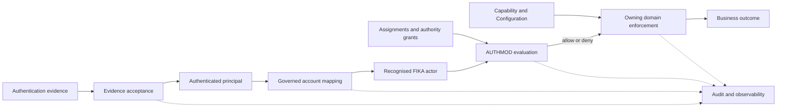

# ADR-008: Identity and AUTHMOD Enforcement Boundary

- Status: Accepted
- Date: 2026-07-27
- Stage: Stage 6 — Platform Architecture
- Decision owners: Platform Governance, constrained by Operations Leadership, AUTHMOD and each domain's approved business authority
- Depends on: ADR-001, ADR-005, ADR-006 and ADR-007
- Supersedes: none

## Context

[ADR-001](ADR-001-stage-6-platform-boundaries.md) established AUTHMOD as the authority-evaluation boundary and prohibited applications from inferring authority. [ADR-005](ADR-005-domain-event-and-integration-contract.md) established attributable actor context for governed events. [ADR-006](ADR-006-repository-and-consistency-contract.md) requires commands and authoritative queries to enforce current authority rather than relying on repository access. [ADR-007](ADR-007-projection-and-dashboard-boundary.md) requires dashboard actions to cross an authoritative command boundary and separates view, action and export access.

Pack 2 governs organisational roles, responsibilities, Assignments, explicit scoped AUTHMOD grants, controlled actions, access boundaries, delegation and emergency access. It does not establish an authentication provider, Person or Worker domain, account lifecycle, session policy or provider-to-FIKA identity mapping. Current dashboards contain deployment, active-user and administrative-PIN assumptions, but those implementation observations do not establish canonical identity or authority.

FIKA OS therefore needs a provider-neutral contract that accepts authentication evidence, maps a principal to an accountable FIKA actor, evaluates current AUTHMOD authority and carries trusted actor context to every protected boundary without collapsing identity, employment, assignment, capability, configuration or business eligibility.

Internal staff sign-in is the first case study. It tests the boundary but does not define a login product, identity provider, account-administration process or workforce policy.

## Evidence considered

| Evidence | Supported conclusion | Authority |
|---|---|---|
| [ROLE-001](../business-decisions/role-001-role-catalogue-ownership.md) and [Authority Model](../fika-os-canon/04-authority-model.md) | Operations Leadership owns the Role Catalogue; AUTHMOD owns action vocabulary, scopes, separation-of-duties and delegation constraints; Platform Governance implements but does not create authority. | Canonical Decisions and governance |
| [ROLE-002](../business-decisions/role-002-roles-responsibilities-assignments.md) | Job title, role, responsibility, Assignment and authority are distinct; Assignments and grants are effective-dated, auditable and revocable. | Canonical Decision |
| [ROLE-003](../business-decisions/role-003-permission-actions.md) | View, Contribute, Manage, Approve, Publish and Administer are distinct controlled actions attached to explicit role, scope and effective period. | Canonical Decision |
| [ROLE-004](../business-decisions/role-004-assignment-scopes.md), [ROLE-005](../business-decisions/role-005-approval-publication-separation.md), [ROLE-006](../business-decisions/role-006-access-boundaries.md) and [ROLE-007](../business-decisions/role-007-emergency-access.md) | Scope, approval/publication separation, least privilege, delegation and emergency access require explicit governed evidence and audit. | Canonical Decisions |
| [CAP-004](../business-decisions/cap-004-capability-domain-permission-boundary.md) and [CFG-001](../business-decisions/cfg-001-configuration-ownership.md) | Capability availability and Configuration neither define authority nor grant information access. | Canonical Decisions |
| [Pack 2 traceability](../schema-reviews/pack-2-bdr-to-schema-traceability.md), [Assignment schema](../../schemas/pack-2/assignment.schema.json), [Authority Grant schema](../../schemas/pack-2/authority-grant.schema.json) and [Access Boundary schema](../../schemas/pack-2/access-boundary.schema.json) | Stable assignee, role, action, scope, status, effective period, provenance and audit references exist; provider identity and authentication remain outside those contracts. | Integrated schema evidence |
| [ADR-001](ADR-001-stage-6-platform-boundaries.md), [ADR-005](ADR-005-domain-event-and-integration-contract.md), [ADR-006](ADR-006-repository-and-consistency-contract.md) and [ADR-007](ADR-007-projection-and-dashboard-boundary.md) | Domain enforcement, trusted actor references, current revalidation, failure safety and projection-access separation are already architectural requirements. | Accepted architecture |
| [Platform principles](../platform-principles.md) | Security, least privilege, replaceable providers, explicit source-of-truth and gradual migration are required. | Canonical principles |
| [Current-system map](../current-system-map.md) and [Hospitality dashboard audit](../../inventory/reports/hospitality-dashboard-family.md) | Current deployment audience is unconfirmed; active-user attribution and a settings PIN are implementation evidence, not an authority model. | Canonical current-state and supporting evidence |
| [Stage 5 closure](../stages/stage-5-closure-2026-07-25.md) and [Stage 6 record](../stages/stage-6-platform-architecture.md) | Packs 1–8 are protected and ADR-008 is the registered next bounded decision. | Canonical stage records |

## Decision

FIKA OS will separate authentication, principal mapping, actor recognition, AUTHMOD authorisation and business-command execution into independently observable boundaries.

An approved authentication boundary may establish that a principal controlled valid authentication evidence. FIKA OS must then resolve that principal through a governed account mapping to a stable FIKA actor. AUTHMOD evaluates whether that recognised actor, through effective Assignment and Authority Grant evidence, may perform a controlled action in the requested scope. The owning domain still validates capability, Configuration, current canonical state and business invariants before accepting the operation.

If identity, mapping, current authority or a required security dependency cannot be established, the protected operation fails safely. Successful authentication, a valid session, application access or provider group membership never produces implicit business authority.

The diagram shows logical trust and enforcement boundaries, not a provider, protocol, gateway, deployment or storage design.

## Identity and access taxonomy

| Term | Architectural meaning | Critical boundary |
|---|---|---|
| Person | Stable FIKA reference to a human identity represented for an authorised purpose. | May exist without current work or application access; email/provider account is insufficient identity. Person ownership and lifecycle require a future BDR and schema. |
| Worker | A governed relationship, if later adopted, between a Person and FIKA's work context. | Distinct from sign-in, account and Assignment. No Worker contract or lifecycle is adopted by this ADR. |
| Actor | Stable accountable identity for an attempted or completed FIKA OS interaction. | Recognition grants no authority. Human, service, integration and provider actors remain distinguishable. Actor ownership requires later domain design. |
| Principal | Identity asserted within an authentication or execution context. | Must be mapped to an accepted FIKA actor before ordinary AUTHMOD evaluation; an unmapped principal creates no Person or account. |
| Account | Governed link through which a principal can map to a FIKA actor for access. | Distinct from Person, Worker and Assignment. Linking/lifecycle policy is deferred. |
| Credential | Secret or mechanism used to authenticate a principal. | Raw credentials remain outside domain services, canonical business records, events and projections. |
| Authentication evidence | Integrity-protected evidence that an approved boundary authenticated a principal under stated conditions. | Must be accepted for source, audience, validity and trust before use; its claims do not become canonical facts automatically. |
| Session | Bounded authenticated interaction context. | Technical security state, not Person, Worker, Assignment or authority state; validity does not guarantee current authority. |
| Assignment | Effective-dated, auditable link between a named assignee and a role, responsibility or governed scope. | Provides context but does not itself grant authority. |
| Permission / Authority Grant | Explicit AUTHMOD grant permitting a controlled action for an organisational role, scope and effective period. | The governed record is the Authority Grant; it remains separate from Assignment, capability and technical access. |
| Capability | Approved business ability available in a governed scope. | Availability does not grant actor authority. |
| Configuration | Governed setting controlling whether or how an ability operates in a scope. | Does not grant authority or override protected rules. |
| Responsibility | Work or accountability owned by a role or domain. | Expected action is not proof of current authority. |
| Authorisation decision | Bounded evaluation of whether a recognised actor may attempt a specified action on a target in the current context. | Does not perform or guarantee the business action. |
| Enforcement point | Logical boundary that refuses a protected operation when required authority cannot be established. | UI visibility is advisory; domain/query/administrative boundaries enforce authoritatively. |

The Pack 2 `assigneeId` reference supports a named assignee but does not itself define Person or Worker. This ADR does not silently adopt either domain.

## AUTHMOD ownership boundary

AUTHMOD owns:

- the controlled actions View, Contribute, Manage, Approve, Publish and Administer;
- Authority Grants to organisational roles and, where governed, attributable assignees;
- action scope, effective period, status and revocation;
- access-boundary, separation-of-duties, delegation and emergency-access constraints;
- the authoritative evaluation of those grants for a recognised actor context;
- attributable grant and evaluation evidence where required.

AUTHMOD does not own:

- Person, Worker, account, credential, provider principal or session;
- employment, organisational membership or job title;
- the Role Catalogue's business meaning, domain responsibilities or Assignment creation authority;
- Operational Capability availability or Configuration values;
- target-domain records, invariants, lifecycle or command outcome;
- authentication mechanisms, provider claims, UI visibility or repository access;
- business ownership merely because it enforces authority.

AUTHMOD implements approved authority. It cannot infer a grant from job title, seniority, Assignment, provider group, application access, technical administration or historical use.

## Authentication-evidence boundary

Authentication evidence is accepted only when the receiving boundary can establish, as applicable:

- an approved issuer/source and intended audience;
- stable provider subject identity;
- integrity and authenticity;
- validity period and current acceptance status;
- authentication time or assurance information where the protected use requires it;
- applicable invalidation or revocation signals;
- replay protection appropriate to the evidence type;
- minimum provider claims required for mapping and security, with unnecessary claims discarded.

Provider-specific claim names, token formats and authentication methods remain adapter concerns. FIKA domain services receive trusted actor context, not raw credentials or unrestricted provider evidence.

Authentication success means only that the principal was authenticated under accepted conditions. It does not establish Person identity, Worker status, account mapping, Assignment, authority, business eligibility or command success.

## Principal-to-actor mapping

- Mapping uses a governed account relationship between an approved provider/source subject and a stable FIKA actor identifier.
- Provider subject identifier and FIKA actor identifier remain distinct and attributable.
- Email may support human review or matching evidence, but is mutable and never a universal mapping key.
- An unmapped principal is not auto-created as a Person, Worker, actor, Assignment or account.
- Ambiguous matches, conflicting stable subjects and reuse of one mapping outside its governed scope are denied or quarantined for authorised reconciliation.
- Automatic account linking, merge, split and multi-account policy are not adopted.
- Linking, unlinking, activation, suspension and closure are governed, attributable changes with concurrency protection under ADR-006 once their business policy exists.
- Provider changes must preserve continuity through explicit migration and reconciliation; matching display names or email addresses is insufficient.

Mapping and authentication outcomes remain separately observable. A principal can authenticate successfully and still fail actor mapping.

## Person, Worker, actor, account and session lifecycle

- Person history is not erased by account suspension or session termination.
- Worker or employment state, if later governed, is distinct from account and actor status.
- Assignment history remains effective-dated and auditable after expiry or revocation.
- Account status controls mapping/access eligibility; it does not rewrite Person, Worker or Assignment history.
- Actor status records whether an identity may act through the platform under later governed policy; it does not assert employment state.
- Session state records a technical interaction; it does not become a canonical actor record.
- Deactivation, suspension, closure, merge, recovery and retention policy require future business decisions. Architecture must not infer them from provider behaviour.

## Assignment, Permission, Capability and Configuration

For a protected operation:

1. The platform identifies the controlled action and target scope.
2. The actor's applicable effective Assignment is resolved where the grant requires one.
3. AUTHMOD evaluates an active Authority Grant, scope, time, access boundary, delegation and separation-of-duties constraints.
4. The owning domain evaluates Operational Capability and Configuration through their owners where relevant.
5. The owning domain enforces current business invariants and lifecycle.

No step substitutes for another. Responsibility may explain who is expected to act but not whether the actor currently may. A Permission cannot enable an unavailable Capability. Configuration cannot grant access. An AUTHMOD allow does not compel a domain to accept a command.

## Authorisation-decision contract

An authorisation request identifies, at minimum where applicable:

- recognised actor identifier and actor type;
- controlled action;
- target type, stable identifier and governed scope;
- effective time;
- relevant Assignment and Authority Grant references or resolvable context;
- initiating, executing and represented actors when different;
- delegation, emergency-access or acting-on-behalf-of evidence;
- information classification and requested detail level for reads/exports;
- correlation identifier and requested operation identity;
- required current domain context without copying unrestricted canonical records.

AUTHMOD returns an attributable outcome such as allowed, denied, indeterminate or dependency unavailable, plus a safe reason category and evaluation reference. An allow is bounded to that actor, action, target, scope, time and evidence. It is not a reusable universal entitlement and does not mean the business operation ran.

Unknown authority, unavailable authority evidence and expired evidence fail closed for protected operations. Denial responses must not reveal hidden records or permission structure.

## Enforcement points

Authoritative enforcement occurs at every protected boundary that performs or releases controlled work:

- domain command acceptance;
- authoritative domain queries;
- projection, dashboard and reporting reads;
- exports and downloads;
- cross-domain orchestration steps;
- provider-effect requests;
- configuration, capability, assignment and authority administration;
- delegation, emergency-access and support operations;
- rebuild, reconciliation and manual repair where sensitive access is involved.

Applications may hide or disable unavailable actions for usability, but client-side checks are not enforcement. Repository access, provider sharing controls and projection-store access are not substitutes for domain or AUTHMOD checks.

Commands revalidate authority and current domain state at execution. A previously visible button, allowed projection row or earlier authorisation decision does not guarantee acceptance later.

## Trusted actor context

FIKA Core may define a narrow, integrity-protected actor context containing:

- actor identifier and actor type;
- initiating actor;
- executing actor when automation performs the work;
- represented actor for governed acting-on-behalf-of;
- relevant Assignment and Authority Grant references;
- delegation or emergency-access reference;
- authentication/evaluation time and assurance reference only where required;
- correlation and operation identity.

The context contains references, not copied authority records, credentials or unrestricted provider claims. It is created or renewed only by a trusted boundary, cannot be accepted from an untrusted client, has bounded applicability and is revalidated where current authority matters.

Actor context carried in an ADR-005 event records the effective context of the completed fact; it is historical evidence and must not be reinterpreted as the actor's current authority.

## Session, caching, revocation and revalidation

- Sessions require bounded validity and integrity, but duration and mechanism remain undecided.
- Sensitive actions may require newer authentication or authoritative revalidation only under future governed policy; this ADR does not invent assurance thresholds.
- Authority decisions may be cached only with scope, inputs, decision time and invalidation limits explicit.
- Cached allows never outlive known expiry and must not conceal revocation or changed access boundaries.
- Current authority is re-evaluated for protected mutations, sensitive authoritative reads and administration where stale authority could create material risk.
- Revocation, Assignment expiry, account suspension, delegation expiry and emergency-access termination must affect subsequent protected operations without relying solely on voluntary sign-out.
- Propagation delay or uncertainty is observable and fails safely where current authority cannot be established.
- Numerical session limits, cache lifetimes and revocation service levels are deferred.

## Delegation, acting on behalf of and impersonation

- Delegation is an explicit, scoped, auditable, revocable, fixed-end-date AUTHMOD relationship. It does not transfer ownership or erase the delegator.
- Acting on behalf of preserves initiating, executing and represented actors and the authority basis for the action.
- Impersonation is a distinct exceptional support/security capability, not ordinary sign-in or delegation. No general impersonation policy is adopted.
- A support or administrative actor cannot acquire another person's business authority merely by viewing their account or reproducing their interface.
- Emergency access follows ROLE-007: minimum scope, explicit authorisation, fixed duration, complete audit and independent review. Exact authorisers, duration and workflow remain future policy.

## Human, service, integration and provider actors

- Human actors map through governed accounts to accountable FIKA actor identities.
- Service actors have explicit platform identity, purpose, owner, scope and authority appropriate to automated actions. They do not impersonate a developer or initiating human.
- When a service executes a human-initiated task, both initiating and executing actors remain attributable; the service's authority and the human's required authority are evaluated according to the operation.
- Integration actors represent controlled FIKA integration processes and remain distinct from external providers.
- Provider actors or observations identify the external source. Provider identity never becomes a FIKA integration actor or human actor automatically.
- Actor categories, lifecycle ownership and eligibility beyond these boundaries require future governance.

## Command and query enforcement

- Commands authenticate/map the principal where interactive, evaluate AUTHMOD, then let the owning domain validate capability, Configuration, current state, invariants and concurrency.
- Authoritative queries enforce View and access-boundary rules for the requested scope and detail.
- An allow decision does not mean a command was accepted, persisted, published, projected or externally executed.
- Retries retain attributable initiation while revalidating current authority under ADR-006.
- Background continuation uses an explicit service actor and original correlation; it does not reuse a human session as permanent authority.

## Dashboard, projection, reporting and export access

- Dashboard sign-in and route access do not grant every displayed action.
- Projection access is independently authorised by information category, purpose, scope and detail level.
- Cross-domain projections preserve each source's access restrictions.
- View, action, export and administrative access remain separable.
- A stale projected permission hint may improve usability but cannot authorise a protected operation.
- Exports may require narrower scope or stronger authority because they create durable copies; exact policy remains a BDR question.
- Projection builders and reporting jobs use explicit service/integration actors and minimum source access.

## Administrative authority and separation of duties

- Account, Assignment, Authority Grant, access-boundary, Capability and Configuration administration are separately controlled operations.
- Administer does not confer operational, commercial, Approve or Publish authority.
- The actor proposing, approving, applying and reviewing a change remain attributable where governed separation requires it.
- An administrator cannot grant themselves authority unless an explicit governed process permits the relevant action and separation constraints.
- Platform Governance implements controls and consistency checks; it does not become business authority.
- Repository, provider-console or deployment access does not create AUTHMOD authority.

## Provider and legacy coexistence

- Provider authentication and sharing controls may remain systems of execution during migration, but their users, groups and roles are not automatically canonical AUTHMOD records.
- Provider subject mappings, legacy allowlists, current access and canonical actor/grant state are reconciled explicitly.
- Disagreement is not silently resolved in favour of provider, legacy or canonical data; the authoritative direction for each transition is documented.
- Legacy applications may continue with their current access controls while limitations, audience and risk are recorded and a governed replacement is proven.
- A legacy allowlist or administrative PIN cannot be propagated as the target authority model.
- No migration, cutover or retirement is authorised by this ADR.

## Security and privacy

- Protected operations default to deny when required identity or authority cannot be established.
- Least privilege, purpose limitation and personal-data minimisation apply across mapping, AUTHMOD, domains, projections and audit.
- Raw credentials, authentication secrets and unnecessary provider claims do not enter canonical business records, domain events, projections or general logs.
- Account enumeration is limited through safe responses that distinguish internal outcomes without exposing hidden identity facts to unauthorised callers.
- Session and authentication evidence receive security protection appropriate to their role; the mechanism is deferred.
- Access to authority, audit and security records is itself authorised.
- Cross-domain actor context is reference-minimised and integrity-protected.
- Retention, deletion, legal basis and detailed workforce privacy require later governance.

## Audit and observability

Authentication, evidence acceptance, actor mapping, AUTHMOD decision, domain command, provider effect and projection update remain separately observable outcomes.

Where applicable, audit can identify the initiating actor, executing actor, represented actor, controlled action, target/scope, effective Assignment/Authority Grant/delegation reference, decision, time, reason category and correlation. Administrative, emergency, delegated, impersonation-like and manual-repair operations require heightened traceability under their governed policies.

Audit is not the complete Person, Worker, account or AUTHMOD model. Security logs minimise provider claims and personal data. Repeated-failure thresholds, monitoring recipients, audit retention and whether audit failure blocks a particular action remain future risk policy.

## Failure and reconciliation semantics

| Outcome | Authentication / actor / authority | Protected operation and recovery |
|---|---|---|
| Evidence absent | Not authenticated | Operation does not run; obtain authentication where appropriate. |
| Evidence invalid or expired | Not accepted | Operation does not run; reauthentication may be appropriate. |
| Authentication source unavailable | Unknown | No fallback allow; retry only when source trust can be established. |
| Verification metadata unavailable | Evidence indeterminate | Fail safely; do not accept unverified claims. |
| Principal unmapped | Authenticated, actor unknown | No ordinary FIKA access; authorised mapping/reconciliation required. |
| Mapping ambiguous or conflicting | Authenticated, actor unresolved | Quarantine/deny; human reconciliation may be required. |
| Account suspended or closed | Actor mapping known, access ineligible | Deny subsequent operations; preserve Person/Worker/history. |
| Actor unrecognised | No accepted FIKA actor | Deny without auto-creation. |
| Worker or Assignment fact unavailable | Actor may be known, required context unknown | Fail closed where required; authoritative lookup/reconciliation. |
| AUTHMOD unavailable | Authority indeterminate | Protected operation does not run; never implicit allow. |
| Permission absent or explicit prohibition | Authority denied | Operation does not run; no blind retry. |
| Scope mismatch | Authority denied for target | Operation does not run; correct scope/grant through governance. |
| Capability unavailable | Authority may exist | Domain refuses unavailable ability; Permission cannot override it. |
| Configuration incompatible | Authority may exist | Domain refuses under current Configuration; no implicit exception. |
| Delegation invalid or expired | Delegated authority absent | Deny; use valid governed authority. |
| Session stale | Authentication context insufficient | Reauthenticate/revalidate as applicable before operation. |
| Revocation pending or uncertain | Current authority uncertain | Fail safely for affected protected operations; reconcile propagation. |
| Cached decision stale | Prior decision unsuitable | Re-evaluate authoritative facts; do not rely on cache. |
| Provider/canonical or legacy/canonical disagreement | Identity or authority conflict | Do not select a winner silently; reconcile with evidence. |
| Administrative command uncertain | Canonical change unknown | Lookup/reconcile before retry under ADR-006 idempotency. |
| Audit delayed or failed | Business/security outcome separate | Record failure visibly; blocking policy is future governed risk policy. |
| Reconciliation/manual intervention required | Conflict unresolved | Preserve evidence and restrict affected access until authorised resolution. |

Failure to establish identity or authority never becomes success. Recovery does not repeat completed business or provider effects.

## Internal staff sign-in case study

| Scenario | Required architectural result |
|---|---|
| Approved source authenticates a known staff principal with valid mapping | Evidence is accepted, principal maps to a FIKA actor, then each requested View/action is independently evaluated through AUTHMOD and the owning boundary. No universal staff access is inferred. |
| Principal authenticates but has no account mapping | Authentication succeeds; actor recognition fails; ordinary access is denied without creating Person, Worker, account or Assignment. |
| Email matches but provider subject conflicts | Mapping conflict is denied/quarantined. Email similarity cannot override the governed stable mapping. |
| Mapped actor lacks dashboard View | Authentication and mapping succeed; AUTHMOD denies that scoped View. Hidden/denied response must avoid exposing dashboard data. |
| Actor may view but not perform one action | Dashboard loads only authorised data; the action is hidden/disabled for usability and is still refused at the authoritative command boundary if attempted. |
| Assignment or grant is revoked during an open session | Session may remain technically valid, but the next protected operation revalidates and is denied. Revocation does not depend on voluntary sign-out. |
| Account is suspended | Subsequent mapping/access is denied while Person, possible Worker and prior Assignment/audit history remain intact. |
| Authentication provider/evidence verification is unavailable | Sign-in cannot be trusted and no fallback authority is granted. Existing sessions follow bounded revalidation policy; exact timing is deferred. |
| AUTHMOD is unavailable | Protected actions and sensitive reads requiring evaluation fail closed; the outage remains distinct from a permission denial. |
| Legacy dashboard uses allowlist/provider sharing | It may continue as a documented legacy control, but the list is not imported as canonical authority without mapping and governance. |
| Background service continues staff-initiated work | The service acts under its own explicit identity/authority while retaining the initiating actor and correlation; it does not impersonate the staff member. |
| Administrator changes another actor's Permission | Requires separate Administer authority plus governed approval/separation rules; technical admin access alone is insufficient and all actors/outcomes are audited. |

The case study does not select a provider, approved email domain, authentication method, account policy, MFA requirement, login screen, session duration or onboarding/offboarding process.

## Consequences

### Positive consequences

- Provider changes do not redefine FIKA identity or authority.
- Authentication, access and business acceptance failures become explainable and recoverable.
- AUTHMOD remains coherent without absorbing workforce, capability, Configuration or domain rules.
- Revocation and delegated actions remain attributable across sessions and automation.
- Dashboards can offer helpful UI controls without becoming the security boundary.
- Legacy access can coexist without becoming permanent entitlement.

### Trade-offs and risks

- Implementations need explicit account mapping, actor context and dependency-health handling.
- Protected actions may require fresh authority checks beyond session validation.
- Provider and legacy disagreement requires reconciliation rather than convenient email matching.
- Person, Worker, actor and account ownership must be governed before implementation can finalise records and lifecycle.
- Fail-closed behaviour may reduce availability for protected operations during authority dependency failures.

## Explicit non-decisions

This ADR does not decide:

- identity or directory provider;
- authentication protocol or password, passkey, magic-link, social or federated mechanism;
- MFA product, factors or policy;
- token format, cookie/session design, credential store or key-management product;
- authorisation framework, policy engine, exclusive RBAC/ABAC/ReBAC model or policy language;
- API gateway, middleware framework, database, identity store, physical AUTHMOD schema or cache design;
- hosting, cloud platform or deployment topology;
- provider claims, mappings or approved email domains;
- automatic account linking, recovery, invitation, merge or split policy;
- Person, Worker, actor or account schema and ownership;
- staff onboarding/offboarding, contractor, client or external-user policy;
- complete Permission catalogue or universal role hierarchy;
- grant/deny precedence beyond governed BDRs;
- delegation, impersonation or break-glass policy beyond ROLE-002 and ROLE-007 boundaries;
- numerical session duration, cache lifetime, revocation service level, retry timing or monitoring threshold;
- escalation recipients, retention period, login UI or account-administration UI;
- immediate migration or retirement of stable legacy access.

## Alternatives considered

### Provider authentication and groups are FIKA authority

Rejected because provider claims are external evidence and cannot replace governed Assignment, scope or AUTHMOD grants.

### Email address is universal identity

Rejected because email is mutable, may be shared/reassigned and does not establish stable Person, account or actor identity.

### Worker status, job title or Assignment directly grants Permission

Rejected by ROLE-002 and ROLE-003. Authority requires an explicit AUTHMOD grant.

### Each dashboard keeps its own permission list

Rejected because it fragments authority and makes application access a competing source of entitlement.

### AUTHMOD owns every business invariant

Rejected because AUTHMOD evaluates authority; owning domains decide business validity, Capability and Configuration remain separate.

### UI visibility is sufficient enforcement

Rejected because clients and projections may be stale or bypassed. Protected server/domain boundaries must refuse unauthorised work.

### Revalidate every fact synchronously for every display

Rejected as a universal requirement because ADR-007 permits governed projections and cached hints for usability; authoritative revalidation is required where risk demands current state.

### Use only cached Permissions or allow on dependency failure

Rejected because stale or unavailable authority cannot become implicit allow.

### Replace all legacy access immediately

Rejected because gradual migration requires mapping, reconciliation, validation and controlled cutover.

## Questions returned to the BDR process

These do not block ADR-008 but must be resolved before implementation invents policy:

- Which domain owns Person, Worker, actor and account records, and what are their lifecycle relationships?
- Which actor categories are approved, and who may establish, suspend, close, merge or repair their mappings?
- May one actor have multiple accounts or providers, and under what linking/recovery rules?
- What staff onboarding, offboarding, suspension and reactivation decisions trigger account and authority change?
- Which authentication assurance or additional verification is required for sensitive actions?
- Which domain-specific actions and information categories require real-time rather than bounded cached authority evaluation?
- What are the approved delegation, acting-on-behalf-of, support impersonation and break-glass policies beyond existing minimum constraints?
- What approval and separation-of-duties rules govern account and Authority Grant administration?
- Which legacy access lists remain temporarily authoritative for execution, who owns them and what are their exit criteria?
- What retention/privacy rules apply to accounts, authentication evidence, mapping history and access-decision audit?
- Which failures in audit recording must block which categories of protected action?

## Required follow-up decisions

1. ADR-009: Booking-to-Production Orchestration.
2. ADR-010: Legacy Coexistence and Retirement.
3. ADR-011: Notification Contract, only when a shared capability is authorised.

## Traceability summary

| ADR-008 conclusion | Primary support |
|---|---|
| Authentication, Assignment and authority are separate | ROLE-001–003; Pack 2 traceability; ADR-001 |
| AUTHMOD owns grants/evaluation but not business invariants | ROLE-001–003; CAP-004; Authority Model; ADR-001 |
| Scoped, effective, revocable grants and default-deny enforcement | ROLE-002–007; Pack 2 schemas; platform security principle |
| Capability and Configuration grant no authority | CAP-004; CFG-001–003 |
| Trusted actor context remains reference-minimised and attributable | ADR-005; ADR-006; Pack audit patterns |
| Commands and authoritative reads enforce beyond UI | ADR-001; ADR-006; ADR-007 |
| Projection, dashboard, export and action access remain distinct | ROLE-003; ROLE-006; ADR-007 |
| Provider and legacy identities remain behind adapters | ADR-001; ADR-006; current-system map |
| Internal staff sign-in cannot rely on email, PIN or provider sharing alone | Hospitality audit; ROLE-002–006; documentation governance |

## Validation notes

This ADR was reviewed against ADR-001, ADR-005, ADR-006, ADR-007, ROLE-001–007, CAP-004, CFG-001–003, Pack 2 schemas and traceability, Packs 1–8 governance, the Stage 5 closure, Stage 6 record, current-system evidence and platform principles. It changes no BDR Decision, schema, fixture, inventory, production repository or infrastructure configuration and does not start ADR-009.
