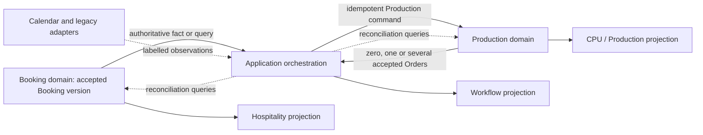

# ADR-009: Booking-to-Production Orchestration

- Status: Accepted
- Date: 2026-07-27
- Stage: Stage 6 — Platform Architecture
- Decision owners: Platform Governance, constrained by Booking, Production and AUTHMOD business authority
- Depends on: ADR-001, ADR-005, ADR-006, ADR-007 and ADR-008
- Related records: ADR-003 remains proposed supporting direction; ADR-004 is reconciled supporting architecture
- Supersedes: none

## Context

Booking owns customer-facing commercial and service intent. Production owns the operational work required to fulfil an eligible Booking. The current Hospitality-to-CPU path frequently moves through dashboard rows, Calendar records, attached JSON, quotes, forms and parser heuristics. Those systems remain operationally important, but they cannot define the canonical handoff or merge Booking and Production ownership.

[ADR-001](ADR-001-stage-6-platform-boundaries.md) identified Booking-to-Production as the first confirmed cross-domain orchestration. [ADR-005](ADR-005-domain-event-and-integration-contract.md) established duplicate-safe event delivery. [ADR-006](ADR-006-repository-and-consistency-contract.md) established independent domain acceptance, partial-failure and reconciliation. [ADR-007](ADR-007-projection-and-dashboard-boundary.md) separated workflow visibility from canonical state. [ADR-008](ADR-008-identity-and-authmod-enforcement-boundary.md) requires trusted actor context and command-time authority enforcement.

Stage 5 subsequently governed Production eligibility, timing, units, routing and amendment/cancellation treatment. ADR-009 turns those decisions into a technology-neutral orchestration contract without selecting transport, workflow runtime, storage or deployment.

## Evidence considered

| Evidence | Supported conclusion | Authority |
|---|---|---|
| [BOOK-001](../business-decisions/book-001-booking-service-time.md), [BOOK-002](../business-decisions/book-002-booking-item-quantity-units.md) and [BOOK-003](../business-decisions/book-003-dietary-allergen-references.md) | Booking owns customer service time, ordered quantities/units and customer-facing dietary/allergen requirements; Production receives attributable fulfilment inputs. | Canonical Decisions |
| [BOOK-004](../business-decisions/book-004-immutable-pricing-amendments.md), [BOOK-006](../business-decisions/book-006-booking-amendment-cancellation-decline.md) and [BOOK-007](../business-decisions/book-007-booking-source-references.md) | Booking versions, amendments, cancellation/decline reasons and source references preserve history and authority. | Canonical Decisions |
| [PROD-001](../business-decisions/prod-001-production-order-eligibility.md) | Only an approved Booking committing FIKA to qualifying operational fulfilment creates one or more Production Orders; the minimum Production lifecycle is Requested, Planned, In Production and Completed. | Canonical Decision and governed Pack 6 clarification |
| [PROD-002](../business-decisions/prod-002-booking-production-timing.md) | Booking owns customer-facing timing; Production owns Required Ready Time and preparation/dispatch timing; Production is location-independent. | Canonical Decision and governed Pack 6 clarification |
| [PROD-003](../business-decisions/prod-003-production-units-yields.md) | Production owns preparation units, yields, conversions, batches and aggregation without changing the commercial Booking. | Canonical Decision |
| [PROD-004](../business-decisions/prod-004-production-amendments-cancellations.md) | Pre-start Production may update/cancel automatically; after Production starts, changes preserve history, notify operationally and require human review. | Canonical Decision |
| [PROD-005](../business-decisions/prod-005-multi-facility-production-routing.md) | One Booking may create work at several Operational Locations; Production owns routing; no separate Production Facility concept exists. | Canonical Decision and governed Pack 6 clarification |
| [Pack 4 traceability](../schema-reviews/pack-4-bdr-to-schema-traceability.md) and [Pack 6 traceability](../schema-reviews/pack-6-bdr-to-schema-traceability.md) | Booking versions/actions and Production Orders/Lines/routing/change records provide stable traceable contracts without one shared aggregate. | Integrated schema evidence |
| [Production Order](../../schemas/pack-6/production-order.schema.json), [Production Line](../../schemas/pack-6/production-line.schema.json), [Routing Allocation](../../schemas/pack-6/production-routing-allocation.schema.json) and [Production Change Record](../../schemas/pack-6/production-change-record.schema.json) | Production owns order identity, source Booking reference/version, lifecycle, timing, lines, routing and change history. | Integrated schema evidence |
| [ADR-003](ADR-003-canonical-booking-and-ingestion-adapters.md) and [ADR-004](ADR-004-booking-to-production-boundary.md) | Direct canonical Booking and legacy adapters converge; CPU state and Sheets remain outside Booking. Earlier TODOs are superseded by later BDRs where resolved. | Supporting architecture |
| [ADR-001](ADR-001-stage-6-platform-boundaries.md), [ADR-005](ADR-005-domain-event-and-integration-contract.md), [ADR-006](ADR-006-repository-and-consistency-contract.md), [ADR-007](ADR-007-projection-and-dashboard-boundary.md) and [ADR-008](ADR-008-identity-and-authmod-enforcement-boundary.md) | Domains accept independently; orchestration is non-canonical; delivery is at least once; actions revalidate authority; projections and providers remain non-authoritative. | Accepted architecture |
| [Current-system map](../current-system-map.md), [Hospitality dashboard audit](../../inventory/reports/hospitality-dashboard-family.md) and [CPU audit](../../inventory/reports/cpu-production-dashboard.md) | Calendar/attachments currently drive CPU discovery and CPU Sheets retain a lossy operational projection; stable legacy coexistence is required. | Canonical current-state and supporting evidence |
| [Stage 5 closure](../stages/stage-5-closure-2026-07-25.md) and [Stage 6 record](../stages/stage-6-platform-architecture.md) | Packs 1–8 are protected and ADR-009 is the registered next bounded task. | Canonical stage records |

## Decision

FIKA OS will coordinate Booking-to-Production through an explicit **application-orchestration boundary**. A qualifying, attributable Booking version triggers Production evaluation; it does not create or mutate Production directly. The orchestrator issues an idempotent Production command. Production independently validates eligibility, authority, Capability, current Booking evidence, routing and its own invariants, then creates zero, one or several Production Orders.

Later Booking versions are processed as new attributable changes. Before Production starts, governed Production updates or cancellations may be applied automatically. Once affected Production has reached **In Production**, amendments or cancellations require explicit human review and an authorised Production decision. History is preserved throughout.

No orchestration step transfers ownership, assumes one distributed transaction or treats event delivery, a Calendar record, attached JSON, a Sheet row or dashboard state as proof of canonical completion.

The diagram shows logical responsibilities only. It does not select transport, broker, workflow engine, storage or deployment.

## Orchestration taxonomy

| Term | Meaning | Critical boundary |
|---|---|---|
| Canonical Booking | Booking-domain record of customer-facing commercial and service intent. | Owns identity, version, status and commitments; not Production state or routing. |
| Canonical Production Order | Production-domain record of qualifying fulfilment work. | Owns Production timing, Lines, routing, lifecycle and change history; never rewrites Booking. |
| Application orchestration | Logical coordination of commands, facts and outcomes across Booking and Production. | Owns sequencing/progress only; may be synchronous, asynchronous or mixed. |
| Orchestration instance | Correlation for one bounded Booking change and its Production-processing attempts. | Identity is distinct from Booking, Production Order, event, command and projection identities. |
| Orchestration state | Technical/workflow progress such as awaiting evaluation, submitted, partial or reconciling. | Never overwrites Booking or Production status. |
| Trigger fact | Authoritative fact indicating a Booking version may require Production evaluation. | Does not prove eligibility or creation. |
| Eligibility decision | Production-owned determination that a Booking version requires operational fulfilment under current rules. | Produces a Production outcome, not a Booking mutation. |
| Production command | Authorised request for Production to create, revise, cancel or review work. | May be refused; commands are not facts. |
| Production outcome | Production's accepted/rejected/partial/uncertain response with attributable Order IDs and versions where applicable. | Event delivery or command submission is not this outcome. |
| Forward correction | New authorised change preserving prior facts after an earlier accepted outcome. | Not rollback or historical deletion. |
| Reconciliation | Comparison of orchestration state with authoritative Booking and Production facts. | Repairs only through authorised owning-domain commands. |

## Booking ownership

Booking owns:

- Booking identity, version and commercial/service status;
- customer-facing service date/time and location commitment;
- customer, contact and commercial intent;
- ordered Booking Items, ordered quantities/units and approved conversion input captured from the customer agreement;
- dietary/allergen and service instructions in Booking scope;
- immutable accepted pricing snapshots and amendment history;
- cancellation/decline reason and source provenance.

Booking does not own Production eligibility decisions, Orders, Lines, preparation quantities, Required Ready Time, routing, production lifecycle, capacity, preparation progress or post-start operational disposition.

A Booking change is valid once Booking accepts and persists it, even when Production processing is pending, refused, partial or unavailable.

## Production ownership

Production owns:

- whether the current attributable Booking version requires operational fulfilment under PROD-001;
- Production Order and Line creation, identity and versions;
- the minimum lifecycle Requested, Planned, In Production and Completed;
- Required Ready Time and optional Production Start Time;
- preparation units, yields, conversions, batches and aggregation;
- routing to one or more Operational Locations with Production Capability;
- Production change history and the disposition of Booking amendments/cancellations;
- the decision required after Production has started.

Production does not own Booking commercial status, customer-facing price, Booking history or customer commitment. A producing location remains an Operational Location with Production Capability; no Production Facility entity is introduced.

## Application-orchestration responsibility

The orchestrator:

- receives or discovers an attributable Booking change;
- validates envelope/source identity and resolves gaps;
- obtains authoritative Booking information when the trigger payload is insufficient;
- creates one orchestration instance per bounded logical Booking change;
- evaluates whether Production must be asked to assess the change;
- issues idempotent Production commands with trusted actor/service context;
- records requested, accepted, partial, uncertain and reconciliation progress;
- correlates zero, one or several Production outcomes;
- updates workflow projections and invokes later notification intent only under governed policy;
- reconciles against Booking and Production authoritative queries.

It cannot decide Production eligibility on Production's behalf, choose routing, mutate repositories, rewrite Booking, manufacture compensation or treat its checkpoint as business completion.

## Trigger and eligibility boundary

- A trigger is an accepted Booking fact or authoritative discovery that the Booking reached or changed within a state governed to commit FIKA to qualifying food/drink fulfilment.
- Bookings awaiting approval, quotation or customer confirmation do not create Production Orders.
- Not every Booking creates Production; only qualifying operational fulfilment does.
- Exact mapping from the Booking status vocabulary to PROD-001's “approved state” must be governed before implementation if it is not already explicit in the adopted Booking contract.
- Production performs the authoritative eligibility decision at command time using the referenced current/required Booking version, Production Capability, applicable Configuration and its own invariants.
- Eligibility may return no Production required, Production required, temporarily held under a governed prerequisite, rejected input, or indeterminate/reconciliation required. The precise hold policy and prerequisite catalogue are BDR questions.
- Trigger receipt, event delivery and eligibility are separate outcomes.

## Identity, versioning and traceability

- Booking ID and Booking version identify the source commercial fact.
- Booking Item IDs identify source lines; Production Line IDs remain Production-owned.
- Each Production Order retains the source Booking ID and version on which its accepted work is based.
- Each Production Line retains attributable source Booking Item references where applicable.
- Production Order version changes independently from Booking version.
- Orchestration instance, command, event, correlation, causation, idempotency, provider, projection and legacy-source identities remain distinct.
- A later Booking version never silently overwrites the source version recorded by Production.
- One Booking version may correlate to zero, one or several Production Orders; several Orders do not create several customer Bookings.
- Traceability must explain which Booking version caused each created, revised, cancelled, reviewed or unchanged Production outcome.

## Initial Production creation

1. Booking accepts and persists a qualifying version and records/publishes the relevant fact under ADR-005.
2. Orchestration validates the fact or retrieves the authoritative Booking version.
3. The executing service actor and initiating actor, where applicable, are preserved under ADR-008.
4. Orchestration submits an idempotent request for Production to evaluate/create work from that Booking version.
5. Production revalidates authority, source identity/version, eligibility, Capability, Configuration, required inputs and current Production state.
6. Production creates zero, one or several Orders atomically only within each Production-owned consistency scope and returns attributable outcomes.
7. Orchestration records the outcome and separately coordinates projections, notifications or provider effects.

No step implies one distributed transaction. A persisted Booking is not rolled back because Production, publication, notification or projection later fails.

## One-to-many routing and partial outcomes

- Production may route work across multiple Operational Locations with Production Capability under PROD-005.
- Routing rules, capacity and delivery requirements are Production-owned inputs; the customer continues to hold one Booking.
- Orchestration does not select producing locations or infer routing from Calendar owner, dashboard site or legacy text.
- A multi-order request records every intended/known Production outcome separately.
- Some Orders may be accepted while another is rejected, unavailable or uncertain. This is **partially applied**, not total success or total failure.
- Already accepted Orders remain valid unless Production accepts an authorised forward correction.
- Whether Production creation across several Orders requires any stronger business all-or-nothing rule is not governed and returns to the BDR process.

## Booking amendments and corrections

- Booking records an explicit new amendment version; accepted history is not overwritten.
- Orchestration processes each new attributable Booking version once logically and identifies every linked Production Order based on earlier versions.
- Production compares source version and current Order state before accepting a revision.
- Before affected Production reaches In Production, Production may update relevant Orders automatically under PROD-004 while preserving prior requested work and change evidence.
- Once affected Production is In Production, the change becomes a human-review case. Production does not silently replan, erase or overwrite completed/prepared work.
- Production may accept a revised fulfilment plan, record no operational change, refuse an unsafe change or require further action, according to governed policy.
- A correction to Booking remains a Booking command; a Production correction remains a Production command. Neither dashboard nor orchestrator edits both domains as one record.
- Pricing consequences remain Booking/commercial concerns and are not copied into Production unless a later governed use requires them.

## Booking cancellation and decline handling

- Booking cancellation or decline preserves the original Booking and reason.
- A declined or cancelled Booking that never created Production does not manufacture a Production Order solely to record absence.
- For linked work not yet In Production, Production may cancel the affected Orders automatically under PROD-001/004 while preserving history.
- Once an affected Order is In Production, cancellation or amendment requires operational notification and authorised human review. It does not delete or automatically cancel the Order.
- The review determines the Production-owned disposition; waste, refund, credit, substitution, customer-contact and commercial-impact policy are not invented by this ADR.
- Missing input, an absent Calendar event or a projection row disappearing is never treated as cancellation.

## Command, event and query roles

- A Booking domain event/integration event communicates a completed Booking fact; it never commands Production.
- Orchestration consumes that fact and issues an explicit Production command.
- Production accepts or rejects under its own rules and records/publishes its resulting facts.
- Queries retrieve authoritative Booking or Production state for eligibility, gap resolution, command-time revalidation and reconciliation.
- Provider webhooks, Calendar changes, attached files and Sheet changes are observations behind adapters and do not bypass commands.
- A notification communicates an outcome or review need; it is not the Production action itself.

## Idempotency, duplicate and ordering rules

- Event deduplication uses immutable ADR-005 event identity; Production command idempotency uses a stable request identity scoped to the logical Booking change and intended operation.
- Repeated delivery or retry of the same intent must return/reconcile to the existing outcome rather than create duplicate Orders or work.
- Reuse of the same request identity with materially different intent is rejected or quarantined.
- Production also enforces durable uniqueness/relationship rules sufficient to prevent duplicate work for the same accepted Booking version and routing intent without prescribing implementation.
- No global ordering is assumed. Booking version and authoritative queries, not arrival timestamp alone, determine which source change is current enough to process.
- Late input cannot overwrite a Production outcome based on a newer accepted Booking version.
- Missing intermediate Booking versions, unsupported versions and subject/version gaps are visible and reconciled before unsafe processing.
- Technical occurrence, publication, delivery and processing times do not establish universal business precedence.

## Concurrency and stale-input handling

- Commands carry the expected Production version/comparison context where modifying existing Orders.
- Production rejects stale writes explicitly under ADR-006 and revalidates current Booking evidence, current Production state and authority before retry.
- Concurrent Booking versions may be received while Production work is changing; orchestration serialises or reconciles per logical Booking lineage without selecting a physical mechanism.
- No silent last-write-wins or automatic merge is allowed where business meaning changes.
- A stale projected row, Calendar update time or attachment modification time is not a canonical concurrency token.

## Progress and checkpoint semantics

Orchestration may record:

- instance/correlation identity;
- source Booking ID and version;
- trigger/evaluation status;
- submitted command identities;
- expected and observed Production Order references;
- per-order outcomes;
- retry, waiting and human-review state;
- gaps, uncertainty and reconciliation status;
- notification/projection follow-up state where relevant.

Requested, evaluated, command submitted, accepted, persisted, published, delivered, projected, displayed and reconciled remain distinct. A completed checkpoint proves only technical processing through its defined point; it is not Booking confirmation, Production completion or projection freshness.

## Failure and recovery

- Booking publication incomplete: Booking remains valid; recover publication with the same event identity.
- Trigger delivered but invalid/unsupported: reject or quarantine without issuing Production work.
- Booking query unavailable: record waiting/uncertain state; do not guess from projection/provider data.
- Production command rejected: retain the reason and current facts; do not report Production created.
- Production command outcome uncertain: query/reconcile before retry.
- One of several Orders fails: retain accepted Orders and expose partial outcome.
- Production event/publication incomplete: Production fact remains valid; recover publication separately.
- Projection or dashboard failure: canonical Booking/Production remains unchanged; rebuild/catch up under ADR-007.
- Provider/legacy effect uncertain: lookup/reconcile before repetition.
- Required authority unavailable: fail safely under ADR-008.

Recovery first determines absent, accepted, rejected, partial or uncertain outcomes. It never uses blind repetition or converts technical failure into business cancellation.

## Compensation and forward correction

Compensation is a new authorised domain command that changes future/current state while preserving history. It is not a distributed rollback and does not erase a valid Booking or Production fact.

Architecture may coordinate a governed cancellation, revision, hold release or other Production action only where existing business policy supports it. Refund, credit, waste, substitution, customer contact and Logistics action require separate business authority. When no compensating policy exists, orchestration records partial completion and requests human review rather than inventing one.

## Replay and reprocessing

- Replay reuses the original immutable event identity and does not create a new Booking occurrence.
- Reprocessing uses existing orchestration/command identities or a traceable corrective attempt; it does not duplicate Production work.
- Before reprocessing, the system reconciles current Booking and Production versions and revalidates authority.
- Projection rebuild and event replay do not resend notifications, provider writes or other external effects by default.
- Reprocessing after a defect records the reason, scope and resulting outcome.
- Event sourcing remains unselected.

## Reconciliation

Reconciliation compares:

- authoritative Booking ID/version/status and source history;
- Production Orders, their source Booking versions and lifecycle;
- orchestration commands, outcomes and checkpoints;
- ADR-005 event publication/delivery evidence;
- projection state;
- labelled provider and legacy observations.

It identifies missing, duplicate, stale, partially applied, conflicting or uncertain work. Deterministic technical repair may resume an existing intent. Business correction occurs only through authorised Booking or Production commands. Reconciliation never silently selects Calendar, attached JSON, Sheet or arrival order over canonical state.

## Authority and actor context

- Booking mutations require applicable Booking authority; Production mutations require separately evaluated Production authority.
- Authority to Manage Booking does not grant authority to Manage Production.
- Orchestration uses a purpose-limited service actor and preserves the initiating human actor when applicable.
- Each protected command re-evaluates actor mapping, Assignment, Authority Grant, scope, Capability, Configuration, current state, invariants and concurrency under ADR-008.
- An AUTHMOD allow permits the attempt but does not guarantee domain acceptance.
- Human review records the reviewing actor, authority basis, decision, time, reason and affected versions.

## Notification and human-review boundary

- Notifications may communicate Production creation outcomes, failures or post-start review needs only under governed recipient/channel policy.
- Notification delivery is separate from Booking/Production success and cannot complete or cancel work.
- PROD-004 establishes that post-start amendments/cancellations generate operational notification and require human review; it does not define recipient, channel, deadline or escalation.
- Missing notification policy does not authorise architecture to invent recipients or thresholds.
- A human-review requirement means Production needs an authorised decision; it does not make the Booking invalid.

## Workflow visibility and outcome semantics

| Outcome | Canonical meaning | Required visibility/action |
|---|---|---|
| Trigger observed | Booking fact may need evaluation | No Production conclusion yet. |
| Ineligible / no Production required | Production accepted that no qualifying work is required for that version | Preserve decision/version; do not create placeholder work unless governed. |
| Eligible, command pending | Production work is expected but not accepted | Show pending, not created. |
| Production accepted and persisted | One or more canonical Orders exist | Return IDs/versions; publication/projection may still lag. |
| Held pending prerequisite | Governed Production prerequisite not satisfied | Distinguish from rejection; exact policy requires BDR support. |
| Rejected | Production refused the command | No new accepted work for that attempt; show safe reason. |
| Partially applied | Some Orders accepted, others rejected/unavailable/uncertain | Never show total success; reconcile per Order. |
| Outcome uncertain | Acceptance cannot be established | Query/reconcile before retry or display. |
| Version gap or stale input | Source lineage insufficient/older | Obtain missing/current authoritative state. |
| Human review required | Affected work is In Production or policy requires judgement | Preserve current state; await authorised Production decision. |
| Booking cancelled, Production pending | Booking cancellation valid; Production response not complete | Do not imply Production cancelled. |
| Production changed, projection stale | Canonical Production changed | Dashboard may lag; refresh/reconcile projection. |
| Reconciliation required | Sources/process state diverge | Restrict unsafe automation and expose evidence. |
| Completed orchestration | Declared Booking-to-Production intent resolved across expected Orders | Does not prove notification, provider, projection or Logistics completion. |

Unknown, unavailable, ineligible, rejected, zero Orders, cancelled, partial and complete are never conflated.

## Provider and legacy boundaries

- Calendar, Gmail, Drive, forms, quotes, attached JSON and Sheets remain provider/legacy observations until validated and classified.
- Structured JSON is not canonical merely because it is structured; its source identity, contract, version and correspondence to canonical Booking must be verified.
- Adapters preserve source identity, timestamps, parser evidence and uncertainty.
- Ambiguous reconstruction is quarantined or sent for review rather than guessed into Production.
- The Hospitality and CPU dashboards may remain systems of execution during controlled coexistence.
- CPU `READY`, `NEEDS_ATTENTION`, `CANCELLED`, prep flags and Sheet rows remain projection/workflow labels unless mapped through canonical commands; they do not redefine domain lifecycles.
- Parallel canonical and legacy ingestion must use shared source/Booking traceability and reconciliation to prevent duplicate Production work.
- Manual Sheet edits do not automatically become canonical commands.
- Each migration period names its authority and write direction; two silent canonical writers are prohibited.
- Cutover and retirement remain ADR-010 work.

## Security and privacy

- Orchestration and projection consumers receive only the Booking/Production facts required for fulfilment and support.
- Service actors have least-privilege command/query authority and no unrestricted repository access.
- Client/contact, commercial, dietary and allergen information is minimised and shared only for authorised operational purpose.
- Provider payloads, parser content and attachments are not copied into workflow state or logs without necessity.
- User-visible errors do not expose credentials, provider secrets or sensitive source payloads.
- Replay, reconciliation and manual repair require operational authority but confer no business authority.

## Audit and observability

The platform must correlate Booking fact/version, event, orchestration instance, Production command, Production Order/version, actor context, provider/legacy references and projection progress without treating correlation as shared ownership.

Observability distinguishes trigger receipt, eligibility decision, command submission, acceptance/rejection, persistence, publication, delivery, projection, notification, provider effect, retry, human review and reconciliation. Logs and metrics minimise sensitive payloads. Audit records attributable decisions and changes; event/orchestration history is not the complete audit model. Whether audit failure blocks a particular operation remains governed risk policy.

## Hospitality Booking-to-Production case study

| Concern | ADR-009 application |
|---|---|
| Initial authority | The canonical Booking version, not the dashboard row, Calendar event, attachment or quote, supplies the customer commitment. |
| Trigger | An accepted Booking fact indicating the governed committed state prompts Production evaluation. Exact status-to-trigger mapping remains a BDR/contract decision. |
| Eligibility | Production determines whether operational fulfilment is required under PROD-001 and current Capability/Configuration. |
| Command boundary | A purpose-limited orchestrator submits an authorised idempotent Production command; Hospitality/CPU dashboards and adapters cannot write Production repositories. |
| Creation | Production may create zero, one or several Orders, each traceable to Booking ID/version and source items. |
| Routing | Production routes Lines to Operational Locations with Production Capability. Calendar ownership/site mappings do not determine canonical routing. |
| Timing | Booking service time remains customer-facing; Production Required Ready Time and preparation timing remain Production-owned. |
| Amendments | New Booking versions trigger linked-Order evaluation. Pre-start Orders may update automatically; In Production Orders require human review. |
| Cancellation | Booking cancellation remains valid independently. Pre-start Production may cancel; started Production requires review and preserved history. |
| Visibility | Hospitality and CPU dashboards show separate Booking, Production, orchestration, projection and legacy states with source freshness. |
| Partial outcome | Multiple Orders are reported individually; one failure does not hide accepted work or become total success. |
| Reconciliation | Compare canonical IDs/versions with orchestration, CPU projection and Calendar/attachment evidence; repair only through authorised commands. |
| Legacy coexistence | Calendar-led CPU discovery, attached JSON, parsers and Sheets continue while canonical processing runs in parallel under duplicate-prevention and reconciliation controls. |

The CPU Orders Sheet is not the Production repository. CPU preparation state is not Booking state. Booking approval does not prove Production creation, and Production creation does not prove either dashboard projection is current. Logistics remains a separate future boundary and is not designed here.

## Consequences

### Positive consequences

- Booking and Production remain independently governed and traceable.
- At-least-once delivery cannot create duplicate Production work.
- One-to-many Production is represented honestly without splitting the customer Booking.
- Amendments and cancellations preserve history and respect work already started.
- Partial and uncertain outcomes become operationally visible and recoverable.
- Legacy Calendar/CPU workflows can coexist while canonical orchestration is proven.

### Trade-offs and risks

- Orchestration must persist enough progress and per-Order outcomes for restart/reconciliation.
- Eventual consistency requires users to understand pending and partial states.
- Exact status mapping, hold prerequisites, multi-order atomicity and post-start disposition remain policy dependencies.
- Parallel operation needs strong identity/version reconciliation to prevent duplicate work.
- Human review after Production starts introduces unavoidable operational judgement.

## Explicit non-decisions

This ADR does not decide:

- database, repository or event-store technology;
- relational, document, graph, key-value or event-store model;
- event broker, queue technology/topology, workflow/saga engine or choreography runtime;
- streaming/batch platform, API style, protocol, endpoint, transport or serialization beyond accepted contracts;
- framework, language, middleware, hosting, cloud platform or deployment topology;
- physical service boundaries, distributed-transaction or exactly-once infrastructure;
- physical orchestration schema, tables, collections, indexes or partitions;
- idempotency/checkpoint store implementation or retention;
- retry counts, timing/backoff, quarantine technology or replay infrastructure;
- numerical service levels, monitoring or escalation thresholds;
- full event catalogue or provider mappings;
- Calendar, Gmail, Drive or Sheet integration design;
- complete Booking or Production status machine beyond governed values;
- exact Booking-status-to-trigger mapping;
- Production routing/capacity algorithm or multi-order atomicity policy;
- detailed post-start disposition, compensation, refund, credit, waste, substitution or customer-contact policy;
- notification recipients/channels;
- Logistics orchestration or complete customer-to-Hospitality workflow;
- dashboard/UI design or Hospitality/CPU implementation;
- immediate migration, cutover or retirement;
- retention periods, universal precedence rules or event sourcing.

## Alternatives considered

### Booking writes Production records directly

Rejected because it bypasses Production ownership, eligibility, routing, authority and invariants.

### Event delivery proves Production creation

Rejected because delivery, command acceptance, persistence and publication are separate outcomes under ADR-005/006.

### One Booking always creates exactly one Production Order

Rejected by PROD-001 and PROD-005, which allow zero or several Orders.

### Calendar, attached JSON or CPU Sheet is canonical

Rejected because they are provider/legacy observations or projections and lack governed Booking/Production authority.

### Arrival time or last update wins

Rejected because timestamps do not establish business precedence; stable Booking versions and authoritative domain decisions do.

### Cancellation deletes or rolls back Production

Rejected by PROD-004. History remains and started work requires human review/forward correction.

### One distributed transaction across Booking and Production

Rejected because each domain accepts independently and partial outcomes must remain visible.

### Immediate legacy replacement

Rejected because controlled parallel running, comparison and reconciliation protect operational stability.

## Questions returned to the BDR process

These do not block ADR-009 but must be governed before dependent implementation invents policy:

- Which exact Booking status or approved fact triggers Production evaluation, update, hold release and cessation?
- Which prerequisite conditions may place an eligible Production Order on hold, and who owns their resolution?
- Must multi-order creation ever be business-atomic, or may per-Order partial acceptance always stand?
- What exact Production-owned disposition choices apply to amendments/cancellations after work is In Production?
- Who performs and approves post-start human review in each scope, and what response expectations apply?
- Which changes are operationally material enough to require re-routing, re-planning or additional review?
- What dietary/allergen transformations from Booking Items to Production Lines require human confirmation?
- Which notification recipients, channels and escalation rules apply to failures and post-start review?
- Which manual CPU/Hospitality edits become Booking or Production commands, and which remain application annotations?
- What authority/write direction applies during each legacy parallel-run stage?
- What retention and privacy policy applies to orchestration, reconciliation and provider/legacy evidence?

## Required follow-up decisions

1. ADR-010: Legacy Coexistence and Retirement.
2. ADR-011: Notification Generation and Delivery, before a shared notification capability is implemented.

## Traceability summary

| ADR-009 conclusion | Primary support |
|---|---|
| Booking owns commercial/service intent; Production owns fulfilment | BOOK-001–007; PROD-001–005; ADR-004 |
| Only qualifying Bookings create zero, one or several Orders | PROD-001; PROD-005; Pack 6 schemas |
| Production owns timing, units, conversion and routing | PROD-002–003; PROD-005 |
| Pre-start changes may apply automatically; post-start changes require review | PROD-001; PROD-004 |
| Orchestration coordinates but owns no domain facts | ADR-001; ADR-006 |
| Events trigger commands but do not prove completion | ADR-005; ADR-006 |
| Duplicate-safe, version-aware, partial and recoverable processing | ADR-005; ADR-006; Pack 4/6 version evidence |
| Dashboard and CPU visibility remain projections | ADR-007; current-system map; CPU audit |
| Commands preserve trusted initiating/executing actors and separate authority | ADR-008; ROLE-001–007 |
| Provider and legacy inputs remain adapters/observations | BOOK-007; ADR-003/004; current-system map |

## Validation notes

This ADR was reviewed against ADR-001 and ADR-003–008, BOOK-001–007, PROD-001–005 including Pack 6 clarifications, Packs 4/6 schemas and traceability, Packs 1–8 governance, the Stage 5 closure, Stage 6 record, current-system evidence and Hospitality/CPU audits. It changes no BDR Decision, schema, fixture, inventory, production repository or infrastructure configuration, does not design Logistics and does not select event sourcing.
