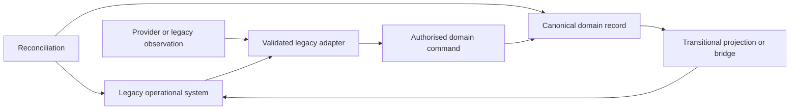
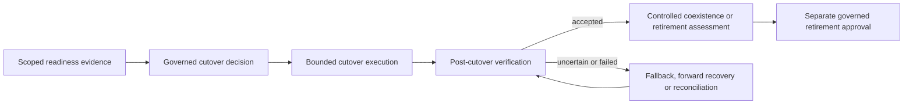

# ADR-010: Legacy Coexistence and Retirement

- Status: Accepted
- Date: 2026-07-27
- Stage: Stage 6 — Platform Architecture
- Decision owners: Platform Governance, constrained by approved business authority
- Depends on: ADR-001 and ADR-005 through ADR-009
- Supersedes: none

## Context

FIKA OS must evolve while stable operational workflows continue to support Hospitality, Production, reporting and provider-led work. Current systems include direct Booking platforms, site-specific dashboards, Gmail/XLSX intake, Calendar and attached-JSON observations, CPU Sheets, document workflows and provider-specific reporting. Their operational importance does not by itself establish canonical authority, and the existence or deployment of a replacement does not prove readiness for adoption or retirement.

The architecture therefore needs a controlled coexistence contract. It must make authority direction explicit, prevent dual truth, preserve provenance and history, demonstrate scoped equivalence and readiness, and govern cutover, fallback and retirement without choosing a migration technology or programme.

## Evidence considered

| Evidence | Relevant conclusion | Authority |
|---|---|---|
| [ADR-001](ADR-001-stage-6-platform-boundaries.md) | Current systems may coexist; authority, direction, reconciliation and exit conditions must be explicit. | Accepted architecture |
| [ADR-005](ADR-005-domain-event-and-integration-contract.md) | Provider events, delivery, processing, replay and business completion remain distinct. | Accepted architecture |
| [ADR-006](ADR-006-repository-and-consistency-contract.md) | Domain repositories remain authoritative; adapters, projections and providers cannot bypass commands or silently overwrite state. | Accepted architecture |
| [ADR-007](ADR-007-projection-and-dashboard-boundary.md) | Dashboards and projections are derived, rebuildable views with explicit freshness and completeness. | Accepted architecture |
| [ADR-008](ADR-008-identity-and-authmod-enforcement-boundary.md) | Access, authority and actor attribution remain governed during transition. | Accepted architecture |
| [ADR-009](ADR-009-booking-to-production-orchestration.md) | Canonical, orchestration, provider, legacy and projection states remain distinct; duplicate-safe parallel processing is required. | Accepted architecture |
| [Provider Mapping Principles](../platform-methodology/provider-mapping-principles.md) | Mappings preserve provenance, version and semantic gaps; provider models never become canonical by convenience. | Canonical method |
| [Current-system map](../current-system-map.md) | Booking platforms, dashboards, Calendar, Gmail, Drive and Sheets have different current roles and authority boundaries. | Canonical current-state record |
| [Hospitality Booking Platform audit](../../inventory/reports/hospitality-booking-platform-family.md) | Direct object submission and legacy email/form ingestion coexist; site variants remain separate current implementations. | Supporting evidence |
| [Hospitality Dashboard audit](../../inventory/reports/hospitality-dashboard-family.md) | Dashboards execute operational workflows and retain site-specific behaviour but do not own canonical Booking meaning. | Supporting evidence |
| [CPU Production audit](../../inventory/reports/cpu-production-dashboard.md) | Calendar/attachment ingestion and CPU Sheets are current execution/projection mechanisms with lossy reconstruction and partial-failure risks. | Supporting evidence |
| Packs 1–8 BDRs, schemas and traceability | Domain identity, ownership, versioning, provenance, authority and audit meaning must survive transition. | Governed business/schema baseline |

## Decision

FIKA OS adopts bounded, evidence-led coexistence. Each migration unit declares its canonical owner, current operational roles, authorised write direction, identity linkage, reconciliation method, acceptance evidence, fallback constraints and exit conditions. Only the owning domain accepts canonical changes.

Legacy workflows remain available where required for continuity until a governed replacement is understood, trained, verified and deliberately adopted. Parallel operation never creates two silent canonical writers. Cutover transfers authority only for the approved migration unit; it does not automatically retire every legacy dependency. Retirement requires separate evidence, approval and controlled decommissioning while preserving required history.

The arrows show declared information flow, not shared authority, a physical topology or unrestricted bidirectional writes.

## Legacy and transition taxonomy

- **Legacy operational system:** an existing system or workflow still used to execute work. “Legacy” is a lifecycle classification, not a judgement of quality.
- **Legacy system of record:** an existing source explicitly authorised for specified facts, scope and effective period during transition.
- **Legacy system of execution:** an existing workflow that initiates, coordinates or completes work without necessarily owning canonical state.
- **Legacy observation source:** a message, Calendar event, spreadsheet, document, dashboard row, log, provider record or export that supplies evidence but is not automatically canonical.
- **Legacy adapter:** a versioned, attributable boundary that translates representations and surfaces ambiguity; it does not guess business meaning or bypass domain commands.
- **Transitional projection or bridge:** a non-authoritative compatibility view used by old or new consumers during coexistence.
- **Migration unit:** the bounded capability, domain scope, record population, Operational Location, user group or integration direction being assessed and changed together.
- **Canonical write authority:** permission for the owning domain boundary to accept a governed mutation for a declared scope and period.
- **Shadow operation:** replacement logic evaluates real or representative inputs without creating canonical changes or external effects by default.
- **Comparison operation:** old and new outcomes are assessed against declared dimensions without either comparison result becoming authority.
- **Parallel operation:** old and new paths operate concurrently under one declared canonical-write direction and duplicate-effect controls.
- **Cutover:** the governed transfer of operational use and, where applicable, canonical-write direction for one migration unit.
- **Fallback:** temporary use of a previously available operational path under controlled write and reconciliation rules.
- **Forward recovery:** correction from the current accepted state without erasing intervening history.
- **Retirement candidate:** a capability for which cutover and retirement evidence is being assessed.
- **Retired capability:** a bounded legacy capability whose operational authority and mutation paths have been removed through governed approval.
- **Decommissioned dependency:** a component, credential, schedule, integration or access path that has been verified as no longer required and safely disabled or removed.
- **Retained history:** preserved read-only evidence; it does not retain mutation authority.

## Legacy classification

Every assessed system or capability records separately:

- lifecycle classification: live, stable, transitional, duplicated, planned, historical or unknown;
- operational role: input source, execution system, projection, reporting view, provider boundary, archive or support evidence;
- canonical authority, if any, bounded by domain, fact, scope and effective period;
- authorised read and write directions;
- dependencies, consumers and operational continuity needs;
- provenance quality and known semantic gaps;
- reconciliation and recovery route; and
- intended transition state or `TODO` when business authority is unavailable.

Current use, criticality, familiarity, storage volume or technical sophistication never establishes canonical authority. Unknown classifications remain explicit.

## Migration-unit model

Transition is governed per migration unit rather than per application name. A unit must be narrow enough to declare authority, compare outcomes, control effects and recover independently. Different capabilities within one application may cut over or retire at different times. One capability may serve different Operational Locations or user scopes under different transition states.

Each unit identifies scope, current and target roles, canonical owner, input/output directions, identities, in-flight work, dependencies, evidence categories, decision authority, fallback boundary and exit conditions. Splitting a unit must not split one domain invariant or create ambiguous ownership.

## Ownership and authority direction

- Canonical business meaning remains with the governed domain throughout transition.
- Each coexistence path declares exactly one canonical-write direction for the affected fact and period.
- A legacy system may remain the authorised source for a bounded fact until cutover, but authority must be explicit rather than inferred.
- Copying, synchronising or projecting data does not transfer ownership.
- New systems earn authority through governed cutover; deployment, access or technical success is insufficient.
- Temporary delegation or service execution follows AUTHMOD and does not transfer domain ownership.
- When authority is missing, conflicting or unavailable, protected mutation fails safely or enters visible reconciliation; it never becomes implicit allow.

## Adapter and compatibility boundaries

Inbound adapters preserve source identity, source version/time, adapter version, mapping evidence, parsing decisions, uncertainty, rejection and quarantine outcomes. They submit authorised domain commands; they never write canonical repositories directly.

Outbound adapters and transitional bridges preserve canonical identity/version and record delivery, provider acceptance, rejection, uncertainty and reconciliation separately from canonical success. A provider write cannot prove FIKA acceptance, and FIKA acceptance cannot prove provider synchronisation.

Temporary compatibility behaviour has an owner, scope, effective period, monitoring, known lossiness and exit condition. It must not silently become permanent business meaning.

## Identity, provenance and source linkage

Canonical identity, legacy identity, provider identity, event identity, command identity, migration-unit identity, crosswalk identity, projection identity and export identity remain distinct.

Identity linkage is explicit and versioned. Mutable names, emails, dates, titles, display labels and row numbers are supporting matching evidence, not universal identity. Provider-ID changes do not create new FIKA business entities. Ambiguous matches remain unresolved or quarantined; they are not forced into a canonical identity.

Provenance records source, transformation/mapping version, import or observation time, actor/service context, confidence or uncertainty, and resulting acceptance/rejection. It does not turn reconstructed evidence into verified history.

## Data migration and historical-record boundaries

- Structural validity is checked separately from business validity and authority.
- Imported records become canonical only through the owning domain's governed acceptance boundary.
- Unknown, unavailable, not applicable, zero, false, cancelled and complete remain distinct.
- Missing values are not invented; uncertainty and partial provenance remain visible.
- Historical reconstruction is labelled with its evidence and confidence and cannot claim unsupported precision.
- Historical import does not replay notifications, provider writes or operational work by default.
- Record transformation preserves source linkage, mapping version, rejected values and lossy conversions.
- Migration copies, staging material and exports are temporary technical artefacts with purpose-limited access; they do not become repositories or archives by default.
- Retention, historical restatement and deletion require separate governed policy where not already decided.

## Equivalence and coverage

Equivalence is assessed for the declared migration unit across distinct dimensions:

| Dimension | Question |
|---|---|
| Scope coverage | Are the intended records, users, locations, capabilities and exceptions represented? |
| Semantic equivalence | Does the replacement preserve approved business meaning? |
| Functional equivalence | Can required business work be completed? |
| Control equivalence | Are authority, validation, concurrency, audit and recovery controls preserved? |
| Data equivalence | Are governed facts complete, accurate, attributable and versioned? |
| Operational equivalence | Can Legends perform the workflow safely under real operating conditions? |
| Reporting equivalence | Are required decisions and reports supported without redefining ownership? |

No single metric, matching total or feature checklist proves full equivalence. Legacy defects and incidental behaviours are not replacement requirements unless governance confirms their business value.

## Readiness and acceptance evidence

Readiness evidence is scoped to a migration unit and includes the applicable equivalence dimensions, security/access readiness, operational support, user preparation, reconciliation results, fallback viability, in-flight-work handling and unresolved risks.

Technical readiness, business acceptance, operational readiness, user access, training delivery, competence and adoption remain distinct. A summary cannot hide a failed critical category. Exact evidence thresholds, observation periods, acceptable divergence and accountable acceptance roles require business or governance authority and are not invented here.

## Shadow, comparison and parallel operation

- Shadow operation creates no canonical state or external effects unless separately authorised.
- Comparison results are evidence, not authority and not permission to repair.
- Historical replay does not create new business occurrences or repeat effects.
- Parallel operation declares the one canonical writer per fact/scope/period and controls duplicate commands, notifications, provider effects and operational work.
- Read-only and projection paths may coexist broadly; mutation paths remain bounded.
- Progress checkpoints are technical evidence, not domain status or business completion.

## Divergence and reconciliation

Divergence is classified at least as missing, extra, duplicate, stale, out-of-order, semantically different, partially transformed, authority conflict, identity mismatch, provider-only difference, projection lag or outcome uncertain.

Reconciliation compares authoritative domain facts with attributable legacy/provider observations and transition evidence. It does not average differences, use arrival order as universal precedence or silently advance past unresolved discrepancies. Deterministic repair may resume an existing technical intent. Canonical repair uses authorised owning-domain commands; legacy/provider correction uses its governed adapter boundary. Manual repair records actor, authority, reason, evidence, affected versions and outcome.

## Change control during coexistence

Each comparison and readiness conclusion identifies the assessed versions of canonical contracts, adapters, provider mappings, legacy behaviour and relevant Configuration. Changes that can invalidate evidence trigger scoped reassessment. Emergency operational fixes remain attributable and do not silently redefine canonical meaning.

Temporary compatibility rules require ownership, effective period, risk visibility and exit criteria. A legacy change freeze, if required, is a migration decision rather than a universal architectural rule.

## Cutover decision boundary

Cutover is a governed decision for a bounded migration unit. Decision evidence identifies scope, canonical owner, current and target authority direction, readiness results, unresolved risks, in-flight-work plan, recovery/fallback constraints, user and support readiness, and approving role or delegated authority.

Architecture does not assign a universal approver. Where ownership, thresholds or sign-off authority are not governed, cutover remains blocked and the question returns to governance. Deployment, routing, user communication, training completion or disabling a screen cannot silently constitute approval.

## Cutover execution semantics

Cutover execution is idempotent, attributable and checkpointed. It prevents new competing writes, accounts for in-flight operations, preserves accepted changes, records uncertain or partial outcomes, and verifies the resulting authority direction through authoritative reads and operational evidence.

Partial cutover is visible and bounded. A technical checkpoint is not business completion. Successful execution does not prove every dependency can be retired.

## Rollback, fallback and forward recovery

Rollback, fallback, restore, forward recovery, correction and reconciliation are distinct:

- **Rollback** reverses a technical transition step where safe; it never erases accepted canonical business facts.
- **Fallback** temporarily restores an operational route under explicit write authority and duplicate-effect controls.
- **Restore** recovers technical state from governed evidence without choosing business truth by convenience.
- **Forward recovery** applies an authorised correction from current accepted state.
- **Reconciliation** establishes what occurred before further mutation.

Fallback cannot let stale legacy state silently retake authority or duplicate work, commands, notifications or provider effects. When the outcome is uncertain, reconcile before retrying or changing authority direction.

## Retirement eligibility and approval

A migration unit becomes a retirement candidate only when:

- the replacement's scoped authority and operational use are established;
- required equivalence/readiness evidence is accepted;
- divergence is resolved or explicitly accepted by authorised roles;
- in-flight work and fallback needs are closed or governed;
- all known consumers, integrations, schedules, credentials and dependencies are inventoried;
- required history and access arrangements are defined; and
- retirement consequences, ownership and support are accepted.

Retirement requires explicit governed approval. Successful cutover alone is insufficient. Retirement may occur by capability, direction, location, population or period; it need not be an application-wide event. Exact thresholds, acceptance roles and retention policy return to governance where absent.

## Decommissioning

Decommissioning verifies removal or disabling of mutation paths, scheduled work, integration routes, service identities, credentials, permissions, provider callbacks, hidden consumers, support obligations and obsolete configuration for the retired scope. Disabling a UI is not decommissioning.

Decommissioning evidence records what changed, who authorised/executed it, when, validation results, residual dependencies and recovery constraints. It does not delete required history or rewrite the Canon.

## Retained history and archive access

Retained history remains attributable, integrity-protected and readable according to governed purpose. Archive, backup, export, projection and operational repository are distinct. Read-only historical access does not preserve write authority. Queries must label reconstructed, partial or legacy-only data and must not present it as complete canonical history.

Retention periods, deletion rules and long-term archive owners remain business/governance decisions unless already governed.

## Provider-transition boundary

Provider replacement occurs behind versioned provider mappings and adapters. Canonical identity and history survive provider-ID changes. Provider comparison and synchronisation remain non-authoritative until accepted through owning-domain boundaries. Round-trip loss, rejected values, provider-only state and uncertain outcomes remain visible.

This ADR selects no provider and defines no mapping. Provider choice, mapping fields, transition sequencing and contract-specific consequences remain later decisions.

## User and operational-continuity boundary

Stable legacy workflows remain supported until the replacement is understood, trained, verified and deliberately adopted for the migration unit. User access, training, competence, authority and adoption are recorded separately. Training does not grant AUTHMOD authority, and access does not prove readiness.

Operational continuity identifies affected workflows, user groups, support path, exception handling, in-flight work and fallback constraints without inventing staffing, curriculum or communications policy. FIKA's People First principle requires the transition to adapt to Legends' work and preserve safe service delivery.

## Security and privacy

- Transition access is least-privilege, purpose-limited and time/scope bounded.
- Migration access or technical administration does not confer business authority.
- Initiating, executing and represented actors remain traceable under ADR-008.
- Copies, comparison outputs, logs and quarantine material minimise personal, client, commercial, dietary and allergen data.
- Credentials and provider secrets are never embedded in migration artefacts or user-facing errors.
- Legacy access after cutover is restricted to its declared read or fallback purpose.
- Retained sensitive history follows governing access and retention policy; architecture invents neither.

## Audit and observability

Audit preserves authority decisions, actor context, source/provenance, assessed versions, cutover and fallback decisions, manual repair, retirement approval and decommissioning evidence. Technical observability records flow, health, lag, comparison, divergence, retries and checkpoints but does not replace governed audit.

Health, migration progress, provider outcome, projection freshness, business state and acceptance remain distinct. Logs expose no unnecessary payloads. Whether an audit-system failure blocks a particular transition action remains governed risk policy.

## Outcome semantics

| Outcome | Meaning |
|---|---|
| Unclassified | Operational role or authority remains unknown; no transition assumption is permitted. |
| Observation accepted | Evidence was received; canonical acceptance has not occurred. |
| Rejected or quarantined | Input cannot safely cross the boundary; reason and provenance remain visible. |
| Shadow complete | Replacement result exists for comparison only; no canonical/external effect is implied. |
| Equivalent for assessed dimension | Declared evidence passed one scoped dimension; no wider readiness claim follows. |
| Diverged | Results differ in a classified way and require assessment or reconciliation. |
| Technically ready | Technical controls passed; business/operational acceptance remains separate. |
| Accepted for cutover | Authorised decision exists for the bounded unit; execution has not necessarily completed. |
| Cutover partial | Some bounded steps completed; authority and uncertainty remain explicit. |
| Cutover verified | Post-cutover evidence confirms the approved authority direction and operational outcome. |
| Fallback active | Controlled former route is temporarily active under declared authority. |
| Retirement candidate | Evidence is being assessed; the capability remains available as governed. |
| Retired | Governed operational/write authority has ended for the approved scope. |
| Decommissioned | Dependencies and access paths have been verified as removed/disabled for that scope. |
| History retained | Read-only evidence remains; no mutation authority follows. |

Unknown, unavailable, not applicable, failed, partial, divergent, accepted, cut over, retired and decommissioned are never conflated.

## Hospitality and CPU legacy-estate case study

| Concern | ADR-010 application |
|---|---|
| Direct Hospitality Booking | MNK and the preferred direct Angel Court path supply canonical Booking objects through the Booking boundary; site variants remain separate current implementations until a governed migration unit is defined. |
| Angel Court fallback | Gmail/XLSX intake remains a legacy observation/adapter path. Message, attachment and parser provenance are retained; output becomes canonical only through Booking validation and acceptance. |
| Hospitality dashboards | Continue as systems of execution and projections. Their rows, workflow labels and manager access do not confer Booking or Production ownership. |
| Calendar and attached JSON | Remain transition observations/envelopes. Structured content is validated and linked; it is not canonical by format alone. |
| CPU dashboard | Continues operational execution while canonical Production capability is proven. CPU Sheets remain projections and current statuses do not redefine Production lifecycle. |
| Parallel Booking-to-Production | Canonical and Calendar-led paths may run for shadow/comparison under shared identity/version linkage and one declared Production-write direction, preventing duplicate work. |
| Evidence | Compare record coverage, Booking/Production meaning, controls, operational workflow, reporting and exception handling—not totals alone. |
| Cutover | Occurs per bounded capability/scope after governed readiness and operational acceptance; no date or approver is invented. |
| Fallback | May restore a stable path only with explicit write direction, in-flight reconciliation and duplicate-effect prevention. |
| Retirement | Calendar ingestion, parsers, Sheets or dashboard capabilities retire separately only after consumers, history and dependencies are governed. |

The case study is not a migration plan. It changes no live application, data, provider configuration or operational authority.

## Consequences

### Positive consequences

- Operational continuity is protected without allowing legacy habit to redefine canonical meaning.
- Authority remains explicit during gradual migration.
- Shadow and parallel operation can prove readiness without creating dual truth.
- Identity, provenance, uncertainty and historical evidence survive transition.
- Cutover, fallback and retirement become bounded, auditable decisions.
- Applications and providers remain replaceable without changing domain identity.

### Trade-offs and risks

- Each migration unit requires disciplined classification, crosswalks, evidence and reconciliation.
- Parallel operation increases temporary support and observability needs.
- Incomplete provenance may prevent automatic migration or equivalence claims.
- Business acceptance, tolerance, retention and support ownership remain genuine governance dependencies.
- Partial retirement can leave hidden dependencies unless decommissioning evidence is thorough.

## Explicit non-decisions

This ADR does not decide:

- a migration programme, delivery plan, waves, sequence, cutover date or maintenance window;
- database, storage, staging, backup, restore or archive technology;
- replication, synchronisation, ETL, ELT, CDC, migration or data-quality tooling;
- event broker, messaging provider, workflow/orchestration engine, API style or transport;
- framework, language, hosting, cloud platform or deployment topology;
- feature-flag, traffic-routing or comparison product;
- physical schemas, tables, crosswalk stores, indexes or partitions;
- provider selection or provider-specific mapping;
- complete legacy-field/status mapping or universal duplicate-matching algorithm;
- universal equivalence tolerances, readiness thresholds or observation periods;
- retry counts/timings or reconciliation/escalation thresholds;
- support staffing, rota, training curriculum, communications channels or recipients;
- universal cutover or retirement approver;
- retention, historical-restatement or deletion policy not already governed;
- immediate migration or retirement of any stable workflow;
- Hospitality/CPU redesign, Logistics orchestration, production code or infrastructure change;
- event sourcing.

## Alternatives considered

### Immediate replacement of stable legacy systems

Rejected because deployment does not prove operational readiness, adoption, equivalence or recoverability.

### Unrestricted dual writes during parallel running

Rejected because competing authority creates dual truth, duplicate work and irreconcilable history.

### Legacy system always wins during transition

Rejected because operational longevity does not establish permanent canonical authority.

### New system always wins after deployment

Rejected because technical availability does not constitute governed cutover or business acceptance.

### Matching totals prove equivalence

Rejected because totals can hide semantic, control, identity, exception and operational differences.

### Big-bang cutover and retirement

Rejected as a universal model because migration units may be adopted and retired independently.

### Roll back by deleting accepted canonical changes

Rejected because recovery must preserve accepted facts, audit and intervening history.

### Archive means delete or retain write access

Rejected because history, operational authority, backup and deletion are separate concepts.

## Questions returned to the BDR or governance process

These questions do not block ADR-010 but must be answered for each affected migration unit before dependent action:

- Which role owns business acceptance and cutover approval for the scope?
- What divergence is tolerable for each equivalence dimension, and which categories are critical?
- What observation period or operational evidence is sufficient?
- Which legacy facts remain authoritative during each coexistence phase and until what effective event?
- What support ownership and escalation apply during shadow, parallel, cutover and fallback operation?
- What user competence/adoption evidence is required beyond training delivery?
- Which historical records must be imported, retained read-only, reconstructed or excluded?
- What retention, access, deletion and historical-restatement policies apply?
- Which in-flight operations may complete on the old path and which must transfer?
- Which retirement consequences require additional operational, contractual, finance, HR or client authority?
- When may fallback be invoked, by which role and for how long?
- Which provider-contract constraints affect transition or retained access?

## Required follow-up decisions

1. ADR-011: Notification Generation and Delivery, before a shared notification capability is implemented.
2. Migration-unit-specific BDR/governance decisions for acceptance ownership, tolerances, retention, support and retirement consequences where required.

## Traceability summary

| ADR-010 conclusion | Primary support |
|---|---|
| Operational use and canonical authority are separate | ADR-001; current-system map |
| One declared canonical-write direction prevents dual truth | ADR-001; ADR-006; ADR-009 |
| Adapters validate through owning-domain commands | ADR-003; ADR-005; ADR-006; provider-mapping principles |
| Provider, legacy, canonical and projection identities remain distinct | ADR-005–009; BOOK-007; Pack schemas |
| Equivalence/readiness are scoped and multidimensional | Platform principles; inventory evidence; ADR-007 |
| Parallel running controls duplicate effects | ADR-005; ADR-006; ADR-009 |
| Canonical repair uses authorised commands | ADR-006; ADR-008; ADR-009 |
| Cutover and retirement require separate governed evidence | ADR-001; platform principles |
| Retained history does not retain mutation authority | Documentation governance; BDR/schema audit requirements |
| Hospitality/CPU tools remain stable transition partners | Current-system map; Hospitality and CPU audits |

## Validation notes

This ADR was reviewed against ADR-001 and ADR-003–009, Packs 1–8 BDRs/schemas/traceability, Stage 5 closure, Stage 6 record, platform principles, provider-mapping principles, current-system evidence and Hospitality/CPU audits. It changes no BDR Decision, schema, fixture, inventory, production code, migration script, infrastructure, provider configuration, live workflow or data. It does not select migration technology, define a cutover schedule, design Logistics or select event sourcing.
