# ADR-011: Notification Generation and Delivery

- Status: Accepted
- Date: 2026-07-27
- Stage: Stage 6 — Platform Architecture
- Decision owners: Platform Governance, constrained by approved business authority
- Depends on: ADR-001 and ADR-005 through ADR-010
- Supersedes: none

## Context

FIKA workflows currently communicate through operational emails, dashboard messages, Calendar invitations, documents, exports and provider-led delivery. These communications are useful, but current behaviour is not automatically future business policy. A persisted Booking, accepted Production change or other domain fact may justify communication, yet message generation, dispatch, provider acceptance, observed delivery, human receipt and acknowledgement are different outcomes.

The architecture needs a notification contract that preserves source-domain ownership, makes communication purpose and eligibility explicit, protects recipient data, tolerates duplicate and uncertain provider observations, and supports legacy workflows without treating notifications as canonical proof of the underlying business outcome.

## Evidence considered

| Evidence | Relevant conclusion | Authority |
|---|---|---|
| [ADR-001](ADR-001-stage-6-platform-boundaries.md) | Notifications are consequences of facts; generation policy and channel delivery have separate responsibilities. | Accepted architecture |
| [ADR-005](ADR-005-domain-event-and-integration-contract.md) | Events, commands, notifications, provider events and audit entries are distinct; delivery is at least once and replay-safe. | Accepted architecture |
| [ADR-006](ADR-006-repository-and-consistency-contract.md) | Canonical persistence, event processing, provider execution and notifications have separate idempotency and reconciliation. | Accepted architecture |
| [ADR-007](ADR-007-projection-and-dashboard-boundary.md) | Dashboard/projection status is advisory and cannot prove notification or domain completion. | Accepted architecture |
| [ADR-008](ADR-008-identity-and-authmod-enforcement-boundary.md) | Stable Actors, provider principals, contact details, Assignments and Authority Grants remain distinct. | Accepted architecture |
| [ADR-009](ADR-009-booking-to-production-orchestration.md) | Notifications communicate outcomes or review needs and cannot complete or cancel Booking/Production work. | Accepted architecture |
| [ADR-010](ADR-010-legacy-coexistence-and-retirement.md) | Stable legacy communications may coexist under explicit authority, provenance and duplicate-effect controls. | Accepted architecture |
| [PROD-004](../business-decisions/prod-004-production-amendments-cancellations.md) | Post-start amendments/cancellations require operational notification and human review, without defining recipients or channels. | Canonical Decision |
| [Current-system map](../current-system-map.md) | Hospitality applications send lifecycle emails and operational notifications through provider/legacy workflows. | Canonical current-state record |
| [Hospitality Booking Platform audit](../../inventory/reports/hospitality-booking-platform-family.md) | Current direct submission persists before operational notification; configured recipients and current templates are implementation evidence. | Supporting evidence |
| [Hospitality Dashboard audit](../../inventory/reports/hospitality-dashboard-family.md) and [integration inventory](../../inventory/integrations.md) | Current dashboards send confirmations/cancellations and use shared provider services, but ownership and delivery policy remain partly unresolved. | Supporting evidence |
| Packs 1–8 BDRs, schemas and traceability | Domain identity, Client/Contact, actor, authority, provenance and audit meaning constrain notification use. | Governed business/schema baseline |

## Decision

FIKA OS separates notification intent, message preparation and provider delivery from the domain fact being communicated. A governed source fact or authorised request is evaluated against an explicit notification policy and purpose. If eligible, one stable notification occurrence is created for that business occurrence and policy context. Recipient, destination, channel and content are resolved independently and safely before dispatch.

Notification processing records attempts and qualified provider observations without claiming human receipt or acknowledgement. Duplicate triggers do not create duplicate occurrences; retries do not create new business occurrences; amendments and supersession preserve prior history. Failures and uncertainty do not reverse the source fact. Any recipient response that changes business state must cross the owning domain's authorised command boundary.

```mermaid
flowchart LR
  D["Source-domain fact or authorised request"] --> E["Purpose and eligibility evaluation"]
  E --> I["Notification intent and occurrence"]
  I --> R["Recipient, destination and content resolution"]
  R --> A["Dispatch request and delivery attempt"]
  A --> P["Provider execution"]
  P --> O["Qualified provider observation"]
  O --> Q["Notification projection and reconciliation"]
  H["Human response"] --> C["Authorised domain command where applicable"]
  C --> D
```

The diagram shows logical responsibilities, not a physical service, provider, broker, database or guarantee that provider acceptance means human delivery.

## Notification taxonomy

- **Source business fact:** an accepted domain fact whose meaning remains owned by its source domain.
- **Notification-trigger observation:** attributable evidence that a fact or authorised request may require policy evaluation; it is not itself notification intent.
- **Notification policy:** governed rules defining purpose, eligibility, recipient logic, permitted content and channel constraints for a notification class.
- **Notification purpose:** the declared operational, transactional, governance or other authorised reason for communicating.
- **Notification eligibility decision:** the qualified result of evaluating current source facts, policy, scope, authority and restrictions.
- **Notification intent:** a governed instruction to communicate a particular purpose about an attributable occurrence.
- **Notification occurrence:** one logical communication obligation or decision arising from one business occurrence and policy context.
- **Notification subject:** stable reference to the domain entity or occurrence being communicated; it is not notification ownership of that entity.
- **Recipient candidate:** an Actor, Person, Client Contact, role, group or destination suggested by governed policy before eligibility is verified.
- **Resolved recipient:** the approved recipient identity or governed recipient class for the occurrence.
- **Delivery destination:** a versioned address, account, endpoint or provider reference used for one attempt; it is not stable person identity.
- **Channel:** a governed communication mode, independent of any provider product.
- **Content/template definition:** versioned instructions and controlled content structure for a notification class.
- **Rendered message:** an immutable attempt-ready representation produced from an attributable definition and source snapshot.
- **Linked resource:** a separately authorised resource reference; possession of the message does not grant access.
- **Dispatch request:** an authorised request to attempt delivery of a rendered message.
- **Delivery attempt:** one traceable execution attempt for one occurrence, recipient, destination and channel.
- **Provider submission:** the adapter's request to an external delivery provider.
- **Provider acceptance:** provider acknowledgement of submission under its own semantics, not proof of delivery.
- **Provider delivery observation:** a classified provider claim about delivery state with provenance and uncertainty.
- **Delivery failure:** a qualified attempt outcome indicating delivery did not complete under the boundary's defined evidence.
- **Delivery uncertainty:** an outcome where completion cannot safely be established.
- **Human receipt:** evidence that a person received or accessed a communication, where governed and reliable.
- **Human acknowledgement:** an attributable human response with a governed meaning distinct from receipt.
- **Recipient response:** inbound communication that remains an observation until validated as an authorised command or other governed input.
- **Suppression:** a governed decision not to attempt a notification for a recipient/channel/purpose; it does not delete canonical contact data.
- **Expiry:** the point after which the communication intent must be reassessed or no longer attempted; it does not expire the source fact.
- **Retry:** another attempt for the same occurrence and intended effect.
- **Fallback:** governed use of another destination or channel after a qualified outcome; it cannot broaden disclosure by convenience.
- **Reconciliation:** comparison of intent, attempts and provider observations to resolve missing, duplicate, stale, partial or uncertain outcomes.
- **Notification projection:** a derived operational view of occurrences and attempts.
- **Notification report/export:** a purpose-bound representation with source and `as of` context; it is not a canonical notification repository.

These concepts may be represented separately. This ADR does not require one aggregate or physical repository.

## Ownership and responsibility

- The source domain owns the underlying business fact, status and permitted mutation.
- Notification policy ownership is declared per notification class and cannot be inferred from current sender code.
- The logical notification boundary owns accepted communication intent, occurrence identity, preparation, attempt history and notification reconciliation.
- Governed identity/contact records retain recipient and destination meaning.
- AUTHMOD owns authority evaluation; provider permissions do not replace it.
- Providers own only their execution and observations.
- Dashboards and projections present notification state but do not own it.
- Business-decision responsibility, content ownership, policy ownership, delivery execution and operational support may be different responsibilities.

Every notification class must declare purpose, source/trigger owner, policy owner, recipient-rule owner, content owner, permitted data classification, channel constraints, expiry/reassessment conditions, acknowledgement meaning where any, and audit/support responsibility. Unknown items block that class from unsafe automatic delivery but do not block this general architecture.

## Trigger and eligibility boundary

A domain event, authorised command outcome, scheduled policy evaluation or governed manual request may prompt notification evaluation. None automatically creates a notification.

Eligibility uses the current attributable source fact/version where material, notification purpose, policy version, relevant Configuration, recipient restrictions, suppression and required authority. Missing or contradictory source facts, unclear purpose, stale state, unresolved recipients or prohibited disclosure produce a safe rejection, suppression, quarantine or review outcome.

Exact status triggers, mandatory recipients, consent basis, escalation and acknowledgement requirements remain BDR/governance decisions. Current emails are evidence, not automatic policy.

## Notification intent and occurrence identity

One stable notification-occurrence identity represents one governed communication occurrence. It is distinct from domain ID/version, domain-event ID, trigger-processing ID, command ID, recipient/Actor ID, attempt ID, rendered-message ID, provider message ID, projection row and export ID.

Occurrence identity derives from stable attributable facts and policy context, not mutable content, display name or timestamp alone. Repeated delivery of the same trigger returns to the existing occurrence. A materially new governed business occurrence may create a new notification and must not be suppressed merely because its content resembles an earlier message.

Each occurrence preserves source fact/version, policy/purpose, correlation and causation, actor context and its recipients' individual outcomes.

## Recipient and destination resolution

- Recipient discovery, eligibility, identity resolution, destination resolution and authority to communicate are separate decisions.
- Email addresses, telephone numbers, account handles, display names, group names and provider IDs are mutable destinations or evidence, not stable Actors.
- Shared mailboxes and groups are recipient constructs; they do not establish one accountable human or human acknowledgement.
- Candidate lists, provider groups and distribution membership do not establish Assignment or Authority Grants.
- A present contact detail does not establish purpose, consent or permission to disclose.
- Ambiguous, conflicting, missing, stale, suppressed or prohibited recipients fail safely and remain visible.
- Bulk notification retains per-recipient resolution, minimisation, attempt identity and outcome; one success cannot hide another failure.

The source and effective time of resolved contact/destination data are recorded. Whether resolution must be repeated at dispatch depends on governed risk and current-state sensitivity.

## Actor and authority context

Notification creation, administrative change, manual resend, recipient override, export and provider action cross authorised boundaries. Each protected action re-evaluates the initiating, executing and represented Actors, Assignment, Authority Grant, scope, Capability, Configuration and current state under ADR-008.

A purpose-limited service actor may execute delivery but does not impersonate the initiating person or inherit unrestricted recipient authority. AUTHMOD allow permits an attempt; it does not prove policy eligibility, provider success or human receipt.

## Channel boundary

Channel eligibility is governed independently of provider availability. A channel must be appropriate for the purpose, recipient, content classification, accessibility needs, time context and disclosure constraints. Availability does not imply appropriateness.

Fallback or alternate destinations require policy authority and fresh recipient/content checks. They must not broaden disclosure, change recipient meaning or turn an operational communication into marketing. This ADR selects no channel or preference/fallback policy.

## Content, template and versioning boundary

Content definitions are stable, versioned and independently governed from source-domain schemas and notification policy. A template's existence or name does not create business rules. Each rendered message links to the definition/version, source fact/version, policy/purpose and rendering time/context used.

Content generation may format approved facts but cannot infer new domain state, alter the source record or silently replace missing facts. Manual edits and free-text additions are attributable and remain distinguishable from governed source facts. Earlier rendered/delivered content is preserved when later content supersedes it.

Brand presentation may be applied through the governed Brand boundary without transferring content ownership or changing the source meaning.

## Safe rendering, privacy and linked resources

- Only data required for the declared purpose and recipient is rendered.
- Missing, stale, partial, uncertain and not-applicable values remain qualified and are never presented as confirmed facts.
- Recipient-specific disclosure is evaluated per destination, including bulk actions.
- Sensitive Client, contact, commercial, dietary, allergen, workforce and authority information is minimised.
- Attachments and links carry stable references and independently enforce current access; a secure source record is not automatically safe message content.
- Expiring or revocable access is an implementation choice; the architectural requirement is independent access enforcement and attributable use.
- Preview and logs must not expose provider secrets or unnecessary personal data.

## Localisation, accessibility and time context

Where business meaning depends on language, locale, timezone or daylight-saving context, the applicable context is explicit in the source/policy and preserved in the rendered message. Unsupported or ambiguous context fails safely or requires review rather than guessing.

Content definitions should support accessible rendering and channel-appropriate alternatives, but languages, accessibility standards, quiet hours and delivery windows require governed requirements and are not selected here.

## Preparation and dispatch

Preparation validates occurrence identity, current policy, recipient eligibility, destinations, channel constraints, content definition, source snapshot, data classification and actor context. Rendering success means only that content was generated.

Before dispatch, current authoritative state is rechecked where a stale message could cause material harm or misrepresentation. Preview, generation, dispatch request and accepted attempt are separately recorded. Dispatch does not modify the source domain.

## Delivery attempts and provider observations

Each attempt has its own immutable identity, occurrence/recipient linkage, destination/channel, rendered-message reference, actor/service context, provider adapter/version, submission time and qualified outcome.

Provider submission, provider acceptance, observed delivery, bounce/rejection, delay, expiry and uncertainty retain the provider's stated semantics and provenance. Missing, duplicate, delayed, contradictory and out-of-order provider observations remain visible. A provider webhook is validated but never treated as canonical proof beyond its qualified meaning.

Provider-side idempotency may assist delivery but does not replace FIKA occurrence and attempt idempotency.

## Receipt, acknowledgement, response and action

Provider delivery does not prove inbox visibility, human receipt, reading, understanding or acknowledgement. Open tracking and read receipts remain qualified observations and require separate privacy policy.

Human acknowledgement exists only where governed meaning, identity and evidence are defined. Automated responses, out-of-office messages, shared-mailbox activity and provider acknowledgements are not human acknowledgement by default.

Recipient replies remain inbound observations. Any reply, acknowledgement or action link that changes Booking, Production or another domain must cross an authenticated, authorised owning-domain command boundary and revalidate current canonical state and concurrency. Notification identity may provide correlation, never authority.

## Idempotency and duplicate handling

- At-least-once trigger delivery is assumed.
- Trigger deduplication, notification-occurrence idempotency, attempt idempotency and provider idempotency are separate controls.
- Duplicate triggers for the same business occurrence/policy do not create duplicate notification occurrences.
- Retrying the same intended delivery preserves occurrence identity and creates a traceable attempt only when policy permits.
- Deduplication never suppresses a genuinely new material occurrence solely because subject or content is similar.
- Unknown attempt outcomes are reconciled before unsafe resend.
- Multi-recipient and multi-channel processing preserves individual outcomes; partial success is never total success.

## Ordering, amendment, cancellation and supersession

No global ordering or timestamp-wins rule is assumed. Source-domain versions and governed business precedence determine meaning. Late or out-of-order triggers cannot overwrite newer accepted notification history.

An amendment may create a new occurrence, supersede pending content or require no message according to governed policy. It never silently rewrites an already generated or delivered message. Cancellation of a source fact does not recall already received content; any corrective communication is a new attributable occurrence. Supersession links history rather than erasing it.

## Scheduling, delay and expiry

Scheduled time, eligibility-evaluation time, render time, dispatch time, provider-acceptance time, observed-delivery time, receipt time and acknowledgement time remain distinct. A scheduled time is not a delivery guarantee.

Delay is evaluated against governed purpose and policy. Expiry stops or reassesses notification attempts; it does not expire or reverse the source business fact. Quiet hours, numerical service levels, delivery windows and acknowledgement deadlines are not defined here.

## Retry, resend and fallback

- **Retry** repeats a safe attempt for the same occurrence/intended recipient effect.
- **Resend** is an authorised new attempt, retaining reason and relationship to prior attempts.
- **Replay** reprocesses existing facts and creates no external effect by default.
- **Fallback** uses another governed destination/channel after fresh purpose, recipient and disclosure checks.

Retry eligibility considers current source state, expiry, prior/unknown outcomes, provider constraints, recipient restrictions and duplicate-risk. Unsafe or uncertain cases require reconciliation or authorised review. Exact counts, timing, backoff and fallback sequences remain policy/implementation choices.

## Failure, recovery and reconciliation

Notification failure, provider outage or uncertain delivery never reverses a valid domain fact. Recovery resumes the existing occurrence where safe, preserves attempts and does not invent recipient consequences.

Reconciliation compares authoritative source facts/versions, notification intent, policy/content versions, recipients/destinations, attempts, provider observations and projections. It classifies missing, duplicate, stale, contradictory, partial and uncertain evidence. It does not silently choose the provider, dashboard, spreadsheet or latest timestamp as universal truth.

Notification-history correction preserves prior evidence. Canonical business repair uses the owning domain's authorised command; notification repair cannot mutate domain state.

## Commands, events, queries and projections

- Domain events or authorised requests can prompt eligibility evaluation; they are not notifications.
- Notification commands request evaluation, preparation, dispatch, suppression, resend or reconciliation; acceptance remains separate from completion.
- Authoritative notification queries expose current intent/attempt history where required.
- Projections support dashboards, support and reporting with explicit freshness/completeness.
- Projection rebuild and event replay do not generate or resend messages by default.
- Notification status never overwrites Booking, Production, orchestration or other domain status.

## Security, privacy, consent and administration

Purpose limitation, data minimisation, recipient eligibility and access enforcement apply at intent, rendering, dispatch, provider, projection, report and support boundaries. Contact data is used only under the applicable governed basis; this ADR does not choose consent or lawful-basis policy.

Administration of policies, content definitions, destinations, suppressions, provider adapters and manual actions requires separately scoped authority. Dashboard access or authentication alone grants none. Changes are versioned, effective-dated where applicable and attributable.

Provider payloads, quarantine content, previews and error messages are restricted and minimised. Retention and deletion periods require governed policy.

## Audit and observability

Audit records source/purpose, policy decision, actor context, recipient-resolution basis, content definition/version, manual overrides, attempts, acknowledgement decisions and administrative changes. Technical traces record processing, provider calls, latency, errors and reconciliation but do not replace governed audit.

Observability distinguishes trigger received, eligible/ineligible, intent accepted, recipient unresolved, generated, dispatch requested, attempt started, provider accepted, delivery observed, failed, uncertain, suppressed, expired, acknowledged and reconciled. Alert thresholds, support recipients and whether audit failure blocks delivery remain governed policy.

## Reporting and exports

Notification reporting distinguishes occurrences, recipients, attempts, provider acceptance, observed delivery, failure, uncertainty, suppression, expiry and acknowledgement. Reports state source coverage, definitions, completeness, freshness and `as of` context.

Exports are purpose-bound, access-controlled projections. Exporting or emailing a report does not make it canonical and does not grant recipients broader access. Business-significant delivery metrics require governed definitions; provider metrics are not silently re-labelled.

## Outcome semantics

| Outcome | Meaning |
|---|---|
| Trigger observed | A fact/request may require evaluation; no notification conclusion exists. |
| Ineligible | Policy evaluation decided no notification is required/permitted for this context. |
| Suppressed | A governed restriction prevents an otherwise considered attempt. |
| Recipient unresolved | Safe recipient identity or destination cannot be established. |
| Intent accepted | A notification occurrence exists; no message or attempt is implied. |
| Prepared | Content was rendered and validated for an attempt; not dispatched. |
| Dispatch requested | Provider execution was requested; acceptance is unknown. |
| Provider accepted | Provider accepted submission under qualified semantics; delivery unproven. |
| Delivery observed | Provider supplied validated delivery evidence; human receipt unproven. |
| Failed | A qualified attempt failed; source business fact remains unchanged. |
| Delayed | Attempt remains pending beyond expected policy context; not automatically failed. |
| Outcome uncertain | Completion cannot safely be established; reconcile before unsafe retry. |
| Partial | Some recipients/channels succeeded while others did not or remain uncertain. |
| Expired | Further attempt requires reassessment; source fact remains valid. |
| Human acknowledgement observed | Governed attributable acknowledgement exists; no domain mutation follows automatically. |
| Response received | Inbound communication exists; not yet an authorised domain command. |
| Superseded | A later occurrence/content replaces current communication purpose while history remains. |
| Reconciled | Evidence was compared and the qualified notification outcome was resolved. |

Unknown, unavailable, ineligible, suppressed, rejected, failed, expired, partial, delivered and acknowledged are never conflated.

## Hospitality notification case study

| Concern | ADR-011 application |
|---|---|
| Booking submission | Persistence and Booking acceptance occur before operational notification. Browser acknowledgement or email does not establish additional Booking status. |
| Confirmation/cancellation | A successful Booking command may create governed notification intent; sending or failure does not confirm, cancel or reverse the Booking. |
| Current recipients | Configured addresses in site variants are implementation evidence, not canonical recipient policy. |
| Dashboard action | A Legend invokes an authorised Booking action; notification intent follows the accepted outcome rather than dashboard state alone. |
| Gmail thread | Message/thread/provider IDs are provenance and attempt references, not Booking or Actor identity. |
| Out-of-hours response | An automated reply is a provider/legacy observation, not human acknowledgement or successful operational handoff. |
| Attachments/links | Quote, PDF or resource access is separately authorised and does not follow from receiving a message alone. |
| Legacy coexistence | Current Apps Script email workflows continue under ADR-010 until scoped replacement evidence and cutover are governed. |

The case study does not define complete Booking notification journeys, recipients, message wording, channels or deadlines.

## Booking-to-Production notification case study

- Production eligibility, creation, amendment, cancellation and review remain owned by Booking/Production under ADR-009.
- A Production outcome or post-start review need may create notification intent only under governed policy.
- Notification failure cannot roll back Booking or Production.
- A “Production ready” message cannot make Production ready; it communicates an attributable Production fact.
- Partial multi-order outcomes retain per-outcome and per-recipient visibility rather than a single success label.
- Human response must cross the authorised Production or Booking command boundary before changing canonical state.
- CPU dashboard labels and Sheets remain projections; they do not become notification or domain authority.

This does not design Logistics or a complete Production communications workflow.

## Legacy coexistence

Gmail/Mail delivery, dashboard alerts, Calendar invitations, spreadsheets and existing Apps Script communications remain provider/legacy workflows. Their identifiers, logs and histories are incomplete evidence unless reconciled. During coexistence, each notification class declares the authorised generation path and prevents duplicate external effects across legacy and replacement paths.

Shadow/replay/projection rebuild creates no real messages by default. Parallel delivery uses explicit authority direction, shared occurrence linkage and per-attempt reconciliation. Provider migration preserves FIKA occurrence identity and history; a new provider ID is not a new business occurrence. No current workflow is retired by this ADR.

## Consequences

### Positive consequences

- Domain truth remains independent of communication success.
- At-least-once triggers cannot automatically duplicate messages.
- Recipient, content, attempt and provider outcomes remain attributable and privacy-aware.
- Partial, uncertain and delayed delivery becomes visible and recoverable.
- Responses can support action without bypassing domain authority.
- Stable legacy communications can coexist without becoming permanent notification policy.

### Trade-offs and risks

- Notification classes require explicit purpose, ownership, recipient and disclosure policy before automation.
- Per-recipient/attempt tracking increases reconciliation and support responsibility.
- Provider observations may remain uncertain and cannot prove human outcomes.
- Strong minimisation and access checks can limit message content and attachment convenience.
- Missing consent, escalation, acknowledgement and retention policy remains a real delivery dependency.

## Explicit non-decisions

This ADR does not decide:

- notification, identity/contact or channel provider;
- email, SMS, chat, push or voice product;
- broker, queue, workflow engine, scheduler, template engine or rendering framework;
- database, notification/audit store, cache or search technology;
- API style, endpoint, protocol, token/link or attachment-delivery implementation;
- physical schema, table, topic, queue, index or partition;
- hosting, cloud platform, framework or deployment topology;
- provider mapping/status translation;
- complete notification, event, command, content-definition or template catalogue;
- exact recipients, distribution lists, channel preferences or fallback sequence;
- consent/lawful-basis or marketing policy not already governed;
- quiet hours, numerical service levels, retry counts/timing/backoff or deduplication windows;
- escalation thresholds/recipients, acknowledgement deadlines or consequences;
- retention/deletion periods, tracking-pixel or read-receipt policy;
- content wording, visual design or complete Booking/Hospitality journey;
- Logistics orchestration or immediate legacy-notification migration/retirement;
- event sourcing.

## Alternatives considered

### Domain event is the notification

Rejected because a completed internal fact is not a recipient-purpose decision, rendered communication or delivery outcome.

### Provider acceptance means delivered

Rejected because acceptance, delivery observation, human receipt and acknowledgement have different evidence.

### Notification success completes the business process

Rejected because source domains retain canonical status and invariants.

### Notification failure rolls back the source fact

Rejected because communication is a separately recoverable consequence of an accepted fact.

### Email address is recipient identity and authority

Rejected because destinations are mutable and do not establish Actor identity, purpose, Assignment or authority.

### Template configuration defines notification policy

Rejected because implementation configuration and content cannot create business purpose, recipients or consent rules.

### Retry creates a new notification

Rejected because retry is another attempt for the same occurrence; genuinely new business occurrences remain distinct.

### Replay and projection rebuild resend messages

Rejected because rebuilding evidence must not repeat external effects by default.

### One overall delivery status

Rejected because multi-recipient/channel and provider outcomes can be partial or uncertain.

## Questions returned to the BDR or governance process

These do not block ADR-011 but must be governed for each notification class before unsafe automation:

- Which exact source facts or authorised requests require, permit or prohibit notification?
- Who owns the notification policy, recipient rules and content approval for each purpose?
- Which recipients or governed recipient classes are mandatory, optional or prohibited?
- What governed basis permits use of each contact destination and data category?
- Which channels are appropriate, preferred or allowed as fallback?
- What acknowledgement, response or escalation has business meaning, and who may act on it?
- What quiet-hour, expiry, timing or delivery-service expectations apply?
- When may uncertain delivery be retried or resent, and by which authorised role?
- Which content requires localisation, accessibility treatment or human review?
- Which links/attachments and sensitive fields may be disclosed to each recipient class?
- What retention, deletion, tracking and support policy applies to notification evidence?
- Which legacy notification paths remain authoritative for generation during each migration unit?

## Required follow-up decisions

The controlled ADR-001 register contains no accepted ADR after ADR-011. Any further Stage 6 ADR must first be registered through governance. Notification-class-specific BDR/governance decisions remain required before implementing policy that is unresolved above.

## Traceability summary

| ADR-011 conclusion | Primary support |
|---|---|
| Source facts, events, notifications and provider outcomes are distinct | ADR-001; ADR-005 |
| Notification failure does not reverse canonical state | ADR-006; ADR-009 |
| Projections/dashboard state cannot prove delivery | ADR-007 |
| Actors, destinations, groups and authority remain distinct | ADR-008; ROLE BDRs |
| At-least-once triggers require occurrence/effect idempotency | ADR-005; ADR-006 |
| Replay and rebuild do not resend by default | ADR-005; ADR-007; ADR-009 |
| Legacy notification workflows coexist under one controlled generation path | ADR-010 |
| Post-start Production changes require notification without prescribing recipients | PROD-004; ADR-009 |
| Current Hospitality recipients/templates are evidence, not policy | Current-system map; Hospitality audits |

## Validation notes

This ADR was reviewed against ADR-001 and ADR-005–010, relevant supporting ADR-003/004 direction, Packs 1–8 BDR/schema/traceability evidence, Stage 5 closure, Stage 6 record, current-system evidence, notification catalogue and Hospitality/CPU audits. It changes no BDR Decision, schema, fixture, inventory, production code, template, provider configuration, infrastructure, live workflow or data. It sends or schedules no notification, selects no provider or implementation technology, does not design Logistics and does not select event sourcing.
