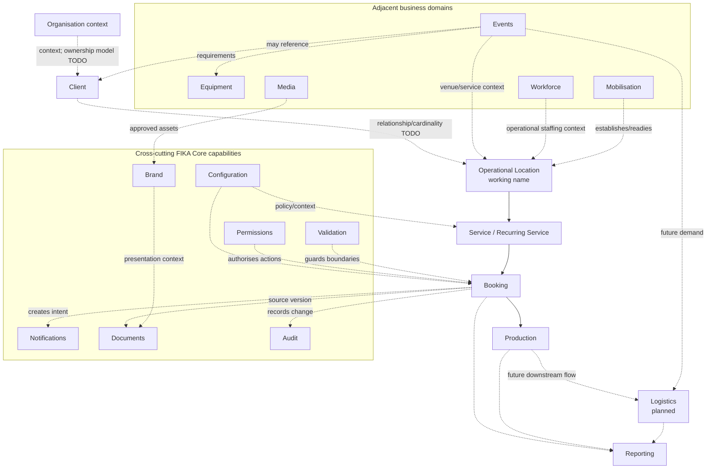
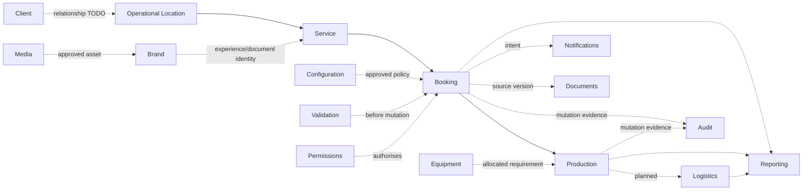

# FIKA Platform Domain Map

## Status and authority

This is the highest-level conceptual map of the FIKA Platform. It explains how business meaning, Core capabilities, applications, adapters and providers relate. It does not adopt schemas, choose technology, authorise implementation, or settle business decisions still marked TODO.

Where evidence is incomplete, relationships are labelled provisional. Detailed domain documents and ADRs remain authoritative for their narrower decisions.

## 1. Platform Overview

The FIKA Platform is organised around stable business domains rather than individual applications or providers.

### Business domains

Business domains describe what FIKA operates: clients, operational locations, services, bookings, production, events, equipment, workforce, logistics and reporting. Each domain owns its language, identity, lifecycle, rules and source-of-truth decisions.

**Business domains own business meaning.** A booking status means what the Booking domain defines, not what a dashboard column, Calendar event or provider calls it.

### Core Platform

FIKA Core supplies shared conceptual services and cross-cutting capabilities: repositories, workflows, configuration, brand, permissions, validation, notifications, documents and audit. Core implements or coordinates domain contracts without merging all domains into one model.

### Applications

Applications provide public, client-facing, administrative or internal operational experiences. They consume domain services and authorised projections. Applications may be replaced, consolidated or redesigned without redefining the underlying business concepts.

Applications must not create competing identities, statuses or rules for concepts owned by a domain.

### Adapters

Adapters translate between canonical domain contracts and legacy inputs, projections or external representations. Current examples include inbox/form ingestion, Calendar synchronisation, document parsing, provider connectors and operational Sheet projections.

Adapters preserve source references and uncertainty. They do not invent missing facts or become sources of truth.

### External providers

Providers supply optional capabilities such as communications, calendars, files, workforce data or till data. Provider accounts, location identifiers, statuses and object models remain integration metadata.

**Providers never define canonical FIKA business concepts.** An operational location can exist without a till, and provider migration must not change its identity.

## 2. Layer Diagram

### Conceptual layers

```text
FIKA organisation context
  -> Client relationship
  -> Operational location
  -> Service or recurring service arrangement
  -> Booking or demand
  -> Production work
  -> Logistics work
  -> Reporting and insight

Supporting and adjacent capabilities:
  Brand, Configuration, Permissions, Validation, Notifications,
  Documents, Audit, Media, Equipment, Events, Workforce and Mobilisation
```

The vertical sequence is a navigation model, not a claim that every operation uses every layer. Client-to-location cardinality, the Service boundary and the threshold for event venues/pop-ups remain TODO. Booking-to-Production and future Production-to-Logistics are confirmed architectural directions.



Dashed arrows denote supporting, consumer or provisional relationships rather than ownership.

## 3. Domain Catalogue

### Organisation

- **Purpose:** Provide the top-level FIKA organisational context within which clients, users, policies and operations exist.
- **Business question answered:** Which organisation owns or governs this platform context?
- **Owns:** TODO; organisational identity and boundaries have not been discovered formally.
- **Does not own:** Client, location, booking or workforce records merely because they operate under FIKA.
- **Depends on:** None identified at this level.
- **Consumers:** Permissions, Configuration, Reporting and all scoped domains.
- **Current maturity:** Conceptual context only; domain discovery missing.
- **Examples:** FIKA as the platform-operating organisation. No additional organisations are asserted.

### Client

- **Purpose:** Represent the commercial or organisational party for whom FIKA provides services.
- **Business question answered:** For whom is FIKA operating or delivering this service?
- **Owns:** Future client identity, lifecycle and relationships; precise boundary TODO.
- **Does not own:** Operational-location identity, brand assets, individual customer/contact snapshots, provider accounts or bookings.
- **Depends on:** Organisation context, Permissions and Configuration.
- **Consumers:** Operational Location, Service, Booking, Events, Reporting and Brand relationships.
- **Current maturity:** Clearly required boundary; no focused discovery or schema.
- **Examples:** Current application names imply client relationships, but a confirmed client register/cardinality is missing.

### Operational Location

- **Purpose:** Represent the stable context in which FIKA plans, delivers, manages or reports operational services, independent of building ownership or provider integrations.
- **Business question answered:** Where or under which durable operating context does FIKA operate?
- **Owns:** Candidate provider-neutral identity, approved aliases, lifecycle and capability relationships.
- **Does not own:** Client, brand, building/address, room/delivery point, recurring schedule, app settings or provider IDs.
- **Depends on:** Client relationship (cardinality TODO), Organisation context, Configuration and Permissions.
- **Consumers:** Service, Booking, Production, Logistics, Events, Workforce, Equipment, Mobilisation and Reporting.
- **Current maturity:** Discovery completed; `FikaOperationalLocation` is the recommended working name; workshop required before modelling.
- **Examples:** Angel Court, MNK, The Line, Munich RE and Wise; CFC is confirmed Development. CPU-only labels require verification.

### Service

- **Purpose:** Represent what FIKA agrees or plans to provide in an operational context, including recurring arrangements.
- **Business question answered:** What service is provided, on what pattern and under which operational expectations?
- **Owns:** Candidate service type, cadence/validity, expected attendance, service windows and operational requirements; final boundary TODO.
- **Does not own:** Location identity, individual booking, production conversion, event lifecycle or provider integration.
- **Depends on:** Operational Location, Client where applicable, Configuration, Permissions and Validation.
- **Consumers:** Booking, Production planning, Logistics, Workforce and Reporting.
- **Current maturity:** Emerging from operational-location discovery; focused workshop/domain discovery missing.
- **Examples:** Wise's confirmed weekly breakfast and lunch arrangements, each serving approximately 450–500 people.

### Booking

- **Purpose:** Own authoritative hospitality commercial and service intent.
- **Business question answered:** What has the customer requested or agreed, for whom, where, when, at what frozen commercial value and status?
- **Owns:** Booking identity/version/status, customer/contact snapshot, service request, ordered items, dietary declarations, acknowledgements, pricing snapshot and source provenance.
- **Does not own:** Dashboard workflow, quote/Calendar sync, CPU preparation, production quantities, logistics or raw legacy evidence.
- **Depends on:** Service/Operational Location context, Client/Customer concepts, Configuration, Permissions, Validation, Audit and relevant commercial policy.
- **Consumers:** Hospitality applications, Quote/Documents, Production, Notifications, Calendar adapter, Logistics downstream and Reporting.
- **Current maturity:** Most mature domain; draft model/schemas/fixtures and formal review exist. Seven decisions block revision; not adopted.
- **Examples:** Direct MNK and Angel Court booking flows; Angel Court email-derived booking through a provenance-preserving adapter.

### Production

- **Purpose:** Own work required to prepare or produce from eligible demand.
- **Business question answered:** What must be produced, where, when, in what production quantities/units and with which instructions?
- **Owns:** Future production order/lines, production status, conversion/yield snapshot, facility/routing, prep state and amendment/cancellation disposition.
- **Does not own:** Booking commercial status/pricing, Calendar/provider state, dashboard UI or logistics execution.
- **Depends on:** Booking or other approved demand source, Operational Location, Configuration, Equipment where relevant, Permissions, Validation and Audit.
- **Consumers:** CPU operational views, Logistics, Notifications and Reporting.
- **Current maturity:** Boundary confirmed by ADR-004 and CPU audit; domain model/schema not drafted.
- **Examples:** Future production order derived from an eligible booking ID/version; current CPU Orders is an operational projection only.

### Logistics

- **Purpose:** Own movements, delivery/collection work, routes/stops, assignments and outcomes.
- **Business question answered:** What must move, from where to where, by when, by whom and with what outcome?
- **Owns:** Future logistics jobs, stops, loads, assignments, timing/status, proof and exceptions.
- **Does not own:** Booking intent, production preparation, operational-location identity or Calendar event state.
- **Depends on:** Production, Events, Operational Location/service locations, Workforce/driver references, Equipment, Configuration, Permissions and Audit.
- **Consumers:** Operational logistics applications, Notifications and Reporting.
- **Current maturity:** Planned domain; no repository or adopted model. CPU delivery projection provides limited transitional evidence.
- **Examples:** Future delivery job created from production/event demand; current Calendar delivery records are not canonical.

### Events

- **Purpose:** Own the future company-wide event record shared by distinct enquiry and public channels.
- **Business question answered:** What event is being considered or delivered, where, when, for whom, and through which lifecycle?
- **Owns:** Future event identity, source, lifecycle, schedule, venue relationship, ownership and event requirements.
- **Does not own:** Public-channel presentation, operational-location identity, equipment inventory, workforce records, logistics execution or Calendar provider state.
- **Depends on:** Client, venue/Operational Location references, Brand, Configuration, Permissions, Media, Equipment, Workforce, Documents, Notifications and Audit as confirmed by future discovery.
- **Consumers:** Internal Events Dashboard, The Line experience, FIKA Events and Pop-ups, operations, Logistics and Reporting.
- **Current maturity:** Planned priority; no repository or adopted schema. Domain/channel discovery remains required.
- **Examples:** The Line, FIKA sites, FIKA Events and Pop-ups, external venues and email/phone/manual events feeding one internal source of truth.

### Equipment

- **Purpose:** Own physical equipment identity, availability, allocation, condition and maintenance.
- **Business question answered:** What equipment exists, where is it, is it available, and what action is required?
- **Owns:** Future equipment units/types, allocation, movement, fault and maintenance state.
- **Does not own:** Commercial equipment charges, event/booking status or logistics routing.
- **Depends on:** Operational Location, Events/Production demand, Permissions, Validation and Audit.
- **Consumers:** Events, Production, Logistics, Mobilisation and Reporting.
- **Current maturity:** Future domain concept; no focused inventory or model.
- **Examples:** Equipment Fault workflow is a candidate only; no production equipment register is confirmed.

### Media

- **Purpose:** Own reusable media metadata, rights, versions/renditions, visibility and usage.
- **Business question answered:** What approved media exists, who owns it, how may it be used and which version applies?
- **Owns:** Future media records, lifecycle, rights and usage relationships.
- **Does not own:** Brand policy, application layout, document business content or operational-evidence policy by default.
- **Depends on:** Permissions, Validation, Audit and retention policy.
- **Consumers:** Brand, Events, Documents, public/client experiences and future Media Portal.
- **Current maturity:** Future domain with fragmented asset/evidence clues; no first-class capability confirmed.
- **Examples:** Brand imagery and approved renditions; CPU evidence photos may require a separate stricter classification.

### Mobilisation

- **Purpose:** Coordinate establishment or transition of sites, clients, services and capabilities.
- **Business question answered:** What must be ready, by whom and by when before an operation can launch or transition?
- **Owns:** Future mobilisation plan, workstreams, milestones, dependencies, risks, readiness and handover.
- **Does not own:** Location, workforce, equipment, brand or application records it coordinates.
- **Depends on:** Operational Location, Client, Brand, Configuration, Workforce, Equipment, Media, Permissions, Documents and Audit.
- **Consumers:** Operations, site provisioning, Reporting and domain owners.
- **Current maturity:** Architectural concept; current business process not inventoried.
- **Examples:** Planned operational location progressing toward opening; no current workflow asserted.

### Workforce

- **Purpose:** Coordinate workforce identity references, demand, availability, rotas, absence, relief, agency and gaps.
- **Business question answered:** Which people/roles are available and assigned to meet operational demand?
- **Owns:** Future workforce planning concepts subject to privacy and authority decisions.
- **Does not own:** User authentication/permissions, operational-location identity, event/production records or external-provider identity.
- **Depends on:** Organisation, Operational Location, Events/Production demand, Permissions, Configuration, Audit and provider adapters.
- **Consumers:** Operations, Events, Production, Logistics, Mobilisation and Reporting.
- **Current maturity:** Existing provisionally in-scope application; focused audit, lifecycle, data authority and privacy decisions missing.
- **Examples:** Rota, relief, agency, gap detection and employee/absence synchronisation evidence.

### Waste

- **Purpose:** TODO: determine whether waste tracking is a first-class domain, reporting measure or operational workflow.
- **Business question answered:** What waste is generated, measured, attributed and acted upon? Business confirmation required.
- **Owns:** Nothing confirmed.
- **Does not own:** No boundary can be approved yet.
- **Depends on:** Potentially Operational Location, Service, Production, Events and Reporting; unconfirmed.
- **Consumers:** Potential operations and reporting consumers; unconfirmed.
- **Current maturity:** Missing domain evidence; requested as a capability during location discovery only.
- **Examples:** None confirmed in the inspected architecture/inventory.

### Reporting

- **Purpose:** Provide trusted operational, client and future executive insight from governed definitions and traceable sources.
- **Business question answered:** What happened, how is performance changing and where is attention required?
- **Owns:** Reporting definitions, lineage, derived measures, reporting periods/snapshots and presentation-specific state where approved.
- **Does not own:** Source booking, production, location, event, workforce or provider facts.
- **Depends on:** Authoritative domain records, approved projections, Configuration, Permissions and Audit/lineage.
- **Consumers:** Operations, clients, managers and future executive users.
- **Current maturity:** Fragmented active utilities and client-specific reporting; executive reporting is a future domain/capability.
- **Examples:** Hospitality feedback reporting and Munich RE hot-drinks reporting.

### Brand

- **Purpose:** Govern coherent FIKA/client/experience identity and approved overrides.
- **Business question answered:** Which identity, assets and presentation rules apply in this context?
- **Owns:** Brand definitions, tokens, asset roles, typography, co-brand/white-label rules and override policy.
- **Does not own:** Business rules, operational-location identity, media content lifecycle or application layout.
- **Depends on:** Media, Configuration, Permissions and brand governance.
- **Consumers:** Applications, Documents, Notifications, Events and client/public experiences.
- **Current maturity:** FIKA Core conceptual model completed; brand inventory/owners/tokens remain TODO.
- **Examples:** FIKA brand, client brands, future Events branding and site overrides.

### Configuration

- **Purpose:** Resolve governed variation across global, brand, site/location, application and user scopes while separating secrets.
- **Business question answered:** Which approved policy and settings apply to this action/context?
- **Owns:** Configuration records, scope, versions, inheritance and publication lifecycle.
- **Does not own:** Business records, secrets, brand assets, permissions or provider identity.
- **Depends on:** Ownership/governance, Permissions, Audit and referenced domain records.
- **Consumers:** All services, workflows, adapters and applications.
- **Current maturity:** FIKA Core conceptual model completed; key catalogue, owners and inheritance decisions missing.
- **Examples:** Capability enablement and references to menus, calendars, folders, pricing policy or brand context—not their private values here.

### Permissions

- **Purpose:** Decide whether an actor may perform an action on a resource within scope.
- **Business question answered:** May this actor do this here and now?
- **Owns:** Conceptual permission policy, roles/grants/restrictions/scopes and decision semantics.
- **Does not own:** Authentication credentials, user profile, domain records or UI visibility.
- **Depends on:** User/actor identity, Organisation, domain scope, Configuration and Audit.
- **Consumers:** Every authoritative query, command, administrative action and sensitive projection.
- **Current maturity:** Conceptual model completed; real roles, policy owner and privacy rules missing.
- **Examples:** Site-scoped booking operator, production operator, client user and system actor—all provisional roles.

### Notifications

- **Purpose:** Generate governed notification intent and track delivery separately from domain state.
- **Business question answered:** Who needs to know or act, through which permitted channel, and what happened to delivery?
- **Owns:** Notification intent, policy application, deduplication and delivery lifecycle records.
- **Does not own:** Source booking/event/production state, recipient identity or provider transport.
- **Depends on:** Source domain intent, User/Contact, Brand, Configuration, Permissions, Documents, Validation and Audit.
- **Consumers:** External/client and internal operational experiences.
- **Current maturity:** FIKA Core conceptual model completed; recipients, preferences, escalation and retention missing.
- **Examples:** Email and dashboard notifications; future mobile and collaboration-channel delivery.

### Validation

- **Purpose:** Provide layered structural, business, workflow, permission and integration validation.
- **Business question answered:** Is this input, state or action structurally valid, allowed and safe to process?
- **Owns:** Shared validation result conventions and orchestration; domains own their business rules.
- **Does not own:** Domain policy decisions, source records, permissions policy or retries.
- **Depends on:** Schemas/contracts, domain policy, Configuration and Permissions.
- **Consumers:** Every ingestion, command, workflow, adapter and configuration publication.
- **Current maturity:** FIKA Core conceptual model completed; code catalogue and override/revalidation policy missing.
- **Examples:** Booking structural validation, status-transition validation and legacy mapping review.

### Documents

- **Purpose:** Govern reproducible document-generation requests, artefact identity, versions and source relationships.
- **Business question answered:** Which document version represents which approved source record/version?
- **Owns:** Document metadata and generation lifecycle.
- **Does not own:** Booking/event pricing policy, physical storage implementation, brand definitions or notification delivery.
- **Depends on:** Source domain, Brand, Media, Configuration, Permissions, Validation and Audit.
- **Consumers:** Booking, Quote, Events, Notifications and applications.
- **Current maturity:** Existing quote/PDF generation in applications; Core conceptual service/repository only.
- **Examples:** Hospitality quote documents and PDFs as separate downstream artefacts.

### Audit

- **Purpose:** Preserve attributable, immutable evidence of important domain, configuration, permission and integration actions.
- **Business question answered:** Who or what did what, to which record/version, when, and with what outcome?
- **Owns:** Audit-event identity, integrity, linkage and retention treatment.
- **Does not own:** Current domain state, raw sensitive payloads, debug logs or reporting definitions.
- **Depends on:** Actor identity, Permissions, Configuration and retention/security policy.
- **Consumers:** Domain owners, operations, security, support and authorised reporting.
- **Current maturity:** Conceptual Core service/repository; formal audit model and policy missing.
- **Examples:** Booking amendment/cancellation evidence, configuration publication and integration attempt outcomes.

## 4. Dependency Rules

1. **Domains own business meaning.** Identities, statuses, invariants and lifecycle rules live with the owning domain.
2. **Domains depend downward for outcomes, not upward for identity.** In the main operational flow, downstream work references the source record/version. Production may depend on Booking; Booking must not derive its meaning from Production.
3. **Upstream domains do not embed downstream workflow state.** `FikaBooking` does not contain CPU preparation or logistics state.
4. **Same-level domain relationships use stable references and explicit workflows.** They do not share private storage layouts.
5. **Cross-cutting Core capabilities support all layers without taking domain ownership.** Validation checks Booking; it does not own booking rules.
6. **Applications consume services and authorised projections.** They must not redefine canonical identity, status, pricing or permissions.
7. **Adapters translate; providers integrate.** Provider IDs, statuses and data shapes remain outside canonical concepts unless essential business meaning is explicitly approved.
8. **Schemas represent domain contracts.** A schema describes an owned concept; it is not a storage schema or application row layout.
9. **Core services implement or coordinate domain contracts.** A conceptual service need not be independently deployed.
10. **Repositories hide persistence.** Domain rules never depend on rows, files, provider keys or query syntax.
11. **Projections are rebuildable consumers.** Dashboards, calendars, documents, reports and operational Sheets do not become authoritative through use.
12. **Reporting consumes but does not own source data.** Metric definitions and snapshots may be reporting-owned; underlying business facts remain with source domains.
13. **Configuration selects approved variation.** It must not conceal different business rules or contain secrets as ordinary values.
14. **Permissions are enforced at authoritative boundaries.** Interface visibility is not authorisation.
15. **Audit records history; it does not replace current state.** Important mutations and effects remain attributable and version-linked.
16. **Legacy support is explicit and temporary by decision.** Adapters remain until parity, reconciliation, retention and rollback conditions are satisfied.

## 5. Canonical Flow

The normal hospitality-derived lifecycle currently provides the strongest evidence:

```text
Organisation context
  -> Client relationship
  -> Operational location
  -> Service arrangement
  -> Canonical booking
  -> Canonical production order (future)
  -> Logistics job (future)
  -> Reporting projections and insight
```

Client/location/service relationships remain provisional until workshops. Booking authority and the Booking-to-Production separation are confirmed.



Participation rules:

- Brand shapes presentation, not business identity.
- Configuration supplies versioned policy/context.
- Permissions authorise actions.
- Validation guards structure, policy and workflow state.
- Equipment is referenced or allocated by its own domain.
- Media supplies governed assets.
- Notifications are effects of authoritative workflows.
- Documents are versioned artefacts linked to source record/version.
- Audit records attributable history.
- Reporting consumes authorised facts and projections.

## 6. Current Progress

| Area | Current maturity | Confirmed evidence | Next gate |
|---|---|---|---|
| Discovery foundation | Completed for Stage 1 | Scope, inventories, current map and priority audits exist | Maintain as new domains are inspected |
| Engineering standards | Completed first Stage 2 deliverable | Coding, repository, branching, testing, review, AI playbook, prompts and Definition of Done | Apply incrementally to active repositories |
| Platform principles | Established | Stable principles cover authority, migration, storage independence, security, UX and growth | Review only when long-term direction changes |
| FIKA Core specification | First conceptual draft complete | Overview plus service/repository/workflow and cross-cutting models | Confirm owners and first Core slice |
| Booking domain | Advanced draft, not adopted | Domain model, schemas/fixtures, ADR-003, formal review and downstream CPU test | Decision workshop for seven revision blockers |
| Operational Location domain | Discovery complete; name provisional | Workspace audit, boundary recommendation and pre-filled workshop | Complete workshop before any model/schema |
| Client domain | Boundary recognised only | Separated from location/brand in architecture | Focused Client workshop/discovery |
| Service domain | Emerging | Wise recurring breakfast/lunch evidence and booking service intent | Define service/recurring-arrangement boundary |
| Production domain | Boundary confirmed | ADR-004 and CPU audit | Production-order business workshop/domain model |
| Logistics domain | Planned | Target flow and CPU delivery concern | Discovery of current manual workflow/ownership |
| Events domain | Planned priority | Channels and intended internal source of truth confirmed | Events business/domain discovery workshop |
| Equipment domain | Future concept | Future-domain/Core boundary only | Inventory current equipment/fault/allocation process |
| Media domain | Future concept | Brand/assets/evidence clues and Core boundary | Media ownership/rights/retention discovery |
| Mobilisation domain | Future concept | Site provisioning/growth need | Inventory current mobilisation process |
| Workforce domain | Provisionally in scope | Existing application and provider workflow evidence | Focused audit, privacy and authority decisions |
| Waste domain | Missing evidence | Requested as candidate capability only | Decide whether a domain exists and identify owner/problem |
| Reporting domain | Fragmented implementations | Feedback and client-specific reporting inventories | Metric ownership/lineage and executive-reporting discovery |
| Configuration | Conceptual model complete; current state fragmented | Repeated site/app configuration and FIKA Core model | Key catalogue, ownership and inheritance workshop |
| Permissions | Conceptual model only | Roles/scopes principles specified | Actor/role/privacy workshop |
| Notifications | Conceptual model plus existing email effects | Generation/delivery boundary specified | Recipient/preference/escalation decisions |
| Validation | Conceptual model plus Booking evidence | Five validation layers specified | Shared issue vocabulary/override policy |
| Audit | Conceptual requirement only | ADRs/Core require attributable history | Audit/privacy/retention workshop and model |
| Implementation | Not started as FIKA Core | Existing applications remain current implementations | No Core implementation until contracts/owners approved |
| Adapters | Current and transitional | Inbox/form, Calendar-led CPU, document and provider mappings inventoried | Define parity/reconciliation/retirement criteria |
| Applications | Inventoried; mixed lifecycle | Hospitality families, CPU, reporting and workforce catalogued | Add repository standards and confirm owners/lifecycle |

## 7. Future Platform Vision

The long-term platform is a set of stable business domains exposed through shared Core services and consumed by replaceable applications.

- Applications can change without changing canonical identity or history.
- Public and internal experiences can remain distinct while using the same authoritative facts.
- Business domains remain stable because their contracts describe FIKA operations, not current screens or providers.
- Technology, persistence and external providers may change behind repositories and adapters.
- New operational locations and capabilities are enabled primarily through governed configuration and relationships rather than copied applications.
- Legacy channels can continue through adapters until canonical paths are proven and recoverable.
- Reporting grows from traceable sources without becoming a competing operational truth.
- Events can become the first flagship domain built to these standards after discovery.

Canonical business meaning must remain even as technology, applications, suppliers and organisational scale change.

## Missing domain work

The map contains every domain/capability currently evidenced or explicitly identified in the architecture. The following lack sufficient discovery to be treated as mature domains:

- Organisation/identity boundary;
- Client;
- Service and recurring service arrangements;
- Logistics;
- Events;
- Equipment;
- Media;
- Mobilisation;
- Workforce authority/privacy;
- Waste;
- Reporting/metric governance;
- Documents, Audit and user/actor identity as adopted contracts.

No additional business domains are asserted.

## Recommended Stage 3 workshop

Run the **Operational Location decision workshop first**, because its outcome constrains `FikaSite`/location naming, Client relationships, Service arrangements, Configuration scopes, Events venue references, Production routing and the initial schema catalogue.

Immediately follow it with a combined **Client and Service boundary workshop** using Wise, Angel Court/MNK, The Line and one CPU-only location label as contrasting cases. Do not create schemas until those workshops settle identity, cardinality and ownership.

The existing `FikaBooking` decision workshop remains the first schema-revision workshop and can proceed in parallel where its seven blockers do not depend on final location naming.

## Recommended roadmap adjustments after Stage 2

Recommendations only; the roadmap is not changed by this document.

1. Insert explicit domain-discovery/decision workshops before Stage 3 schema drafting.
2. Replace the assumption that `FikaSite` is automatically the first location schema with the workshop outcome; retain `FikaOperationalLocation` as the working candidate.
3. Add Client and Service/Recurring Service ahead of, or alongside, location and booking configuration schemas.
4. Split Stage 3 into candidate, draft, reviewed and adopted schema states with explicit adoption gates.
5. Add Production immediately after Booking decisions because downstream evidence is already strong.
6. Keep Events discovery before `FikaEvent` schema and before Events implementation.
7. Add audit, permission, configuration and personal-data policy decisions as prerequisites for adopted schemas, not later implementation details.
8. Add adapter parity/reconciliation/retirement standards before consolidation work.
9. Keep storage/provider decisions after domain and repository requirements.
10. Add a Waste discovery gate rather than assuming it is a platform domain.

## 8. Architectural North Star

> The purpose of the FIKA Platform is to let FIKA grow without proportional growth in operational complexity by expressing business knowledge once, preserving it as stable canonical meaning, and allowing every authorised application and workflow to reuse it.
