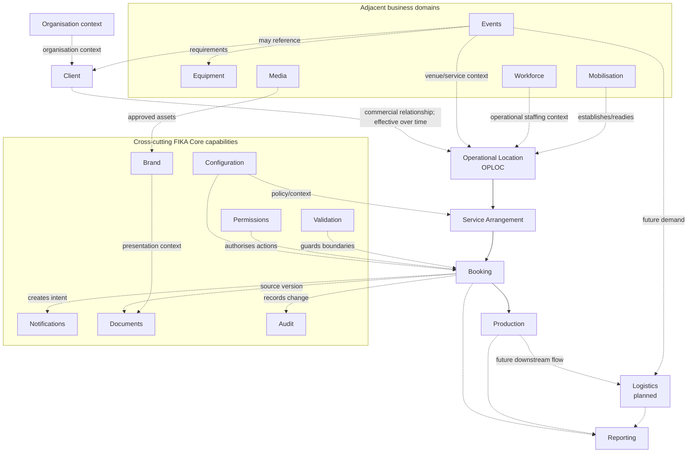
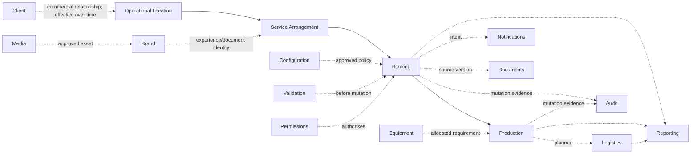

# FIKA Platform Domain Map

## Status and authority

This is the highest-level conceptual map of FIKA OS. It explains how business meaning, Core capabilities, applications, adapters and providers relate. The 54 approved decisions in the FIKA Business Knowledge Workbook govern business meaning; this map summarises their relationships without replacing their exact wording.

This document does not adopt schemas, choose technology or authorise implementation. See [documentation governance](documentation-governance.md) for the authority order.

## 1. Platform Overview

The FIKA Platform is organised around stable business domains rather than individual applications or providers.

### Business domains

Business domains describe what FIKA operates: clients, operational locations, services, bookings, production, events, equipment, workforce, logistics and reporting. Each domain owns its language, identity, lifecycle, rules and source-of-truth decisions.

**Business domains own business meaning.** A booking status means what the Booking domain defines, not what a dashboard column, Calendar event or provider calls it.

### Core Platform

FIKA Core supplies shared conceptual services and cross-cutting capabilities: repositories, workflows, configuration, brand, permissions, validation, notifications, documents and audit. Core implements or coordinates domain contracts without merging all domains into one model.

### Applications

Applications provide public, client-facing, administrative or internal operational experiences. They consume domain services and authorised projections. Applications may be replaced, consolidated or redesigned without redefining the underlying business concepts.

Applications must not create competing identities, statuses or rules for concepts owned by a domain.

### Adapters

Adapters translate between canonical domain contracts and legacy inputs, projections or external representations. Current examples include inbox/form ingestion, Calendar synchronisation, document parsing, provider connectors and operational Sheet projections.

Adapters preserve source references and uncertainty. They do not invent missing facts or become sources of truth.

### External providers

Providers supply optional capabilities such as communications, calendars, files, workforce data or till data. Provider accounts, location identifiers, statuses and object models remain integration metadata.

**Providers never define canonical FIKA business concepts.** An operational location can exist without a till, and provider migration must not change its identity.

## 2. Layer Diagram

### Conceptual layers

```text
FIKA organisation context
  -> Client relationship
  -> Operational Location
  -> Service or recurring service arrangement
  -> Booking or demand
  -> Production work
  -> Logistics work
  -> Reporting and insight

Supporting and adjacent capabilities:
  Brand, Configuration, Permissions, Validation, Notifications,
  Documents, Audit, Media, Equipment, Events, Workforce and Mobilisation
```

The vertical sequence is a navigation model, not a claim that every operation uses every layer. Client, Operational Location, Service Arrangement, Booking, Event and Production boundaries are governed by approved decisions. Logistics remains a later discovery and delivery domain.



Dashed arrows denote supporting, consumer or provisional relationships rather than ownership.

## 3. Domain Catalogue

### Organisation

- **Purpose:** Provide the top-level FIKA organisational context within which clients, users, policies and operations exist.
- **Business question answered:** Which organisation owns or governs this platform context?
- **Owns:** TODO; organisational identity and boundaries have not been discovered formally.
- **Does not own:** Client, location, booking or workforce records merely because they operate under FIKA.
- **Depends on:** None identified at this level.
- **Consumers:** Permissions, Configuration, Reporting and all scoped domains.
- **Current maturity:** Conceptual context only; domain discovery missing.
- **Examples:** FIKA as the platform-operating organisation. No additional organisations are asserted.

### Client

- **Purpose:** Represent an external organisation with which FIKA has a commercial or operational relationship.
- **Business question answered:** For whom is FIKA operating or delivering this service?
- **Owns:** Stable business identity, commercial relationship and shared business information independently of any individual Operational Location.
- **Does not own:** Operational Location identity, brand assets, individual people, provider accounts or bookings. People are represented separately as Client Contacts.
- **Depends on:** Organisation context, Permissions and Configuration.
- **Consumers:** Operational Location, Service, Booking, Events, Reporting and Brand relationships.
- **Current maturity:** Business definition, BDR and Pack 1 schema contracts complete; Stage 6 architecture is active.
- **Examples:** One Client may relate to multiple Operational Locations. An Operational Location may exist without an external Client but must have an accountable internal owner.

### Operational Location

- **Purpose:** Represent a site, venue or recurring operating context that FIKA works with over time under one durable identity.
- **Business question answered:** Where or under which durable operating context does FIKA operate?
- **Owns:** Stable identity, approved name, historical aliases, lifecycle and durable relationships to other business objects.
- **Does not own:** Provider integrations, application configuration, branding, physical-address master data, menus, pricing, equipment inventory, staffing, Calendars, Bookings, Events, Services or other domain records.
- **Depends on:** Organisation context, optional Client relationships, Configuration and Permissions.
- **Consumers:** Service, Booking, Production, Logistics, Events, Workforce, Equipment, Mobilisation and Reporting.
- **Current maturity:** Canonical meaning, BDRs and Pack 1 schema contracts complete; Stage 6 architecture is active.
- **Examples:** Angel Court, MNK, The Line, Munich RE and Wise; CFC is confirmed Development. CPU-only labels require verification.

### Operational Capability

- **Purpose:** Represent a reusable business function that an Operational Location may enable independently of its identity or primary type.
- **Business question answered:** What is this Operational Location able to support?
- **Owns:** The approved capability catalogue, dependency/exclusion policy, enablement and effective-dated overrides.
- **Does not own:** Domain meaning, domain records, user permissions or the internal operation of the enabled domain.
- **Depends on:** Operational Location, Configuration, accountable business ownership and relevant domain prerequisites.
- **Consumers:** Mobilisation, application composition, Configuration, Permissions and Reporting.
- **Current maturity:** Definition, governance and Pack 2 schema contracts complete; detailed catalogue values remain governed future work.
- **Examples:** Hospitality, Events, Coffee, Production, Logistics, Reporting, Feedback and Training.

### Service

- **Purpose:** Represent a durable offering or arrangement describing what FIKA provides, distinct from its dated operation.
- **Business question answered:** What service is provided, on what pattern and under which operational expectations?
- **Owns:** Service Arrangement identity, purpose, commercial/operating model and its effective-dated Recurring Schedules.
- **Does not own:** Operational Location identity, individual Booking, production conversion, Event lifecycle or provider integration.
- **Depends on:** Operational Location, Client where applicable, Configuration, Permissions and Validation.
- **Consumers:** Booking, Production planning, Logistics, Workforce and Reporting.
- **Current maturity:** Service BDRs and Pack 3 schema contracts complete; Stage 6 architecture is active.
- **Examples:** Wise's confirmed weekly breakfast and lunch arrangements, each serving approximately 450–500 people.

### Booking

- **Purpose:** Own authoritative hospitality commercial and service intent.
- **Business question answered:** What has the customer requested or agreed, for whom, where, when, at what frozen commercial value and status?
- **Owns:** Booking identity/version/status, customer/contact snapshot, service request, ordered items, dietary declarations, acknowledgements, pricing snapshot and source provenance.
- **Does not own:** Dashboard workflow, quote/Calendar sync, CPU preparation, production quantities, logistics or raw legacy evidence.
- **Depends on:** Service/Operational Location context, Client/Customer concepts, Configuration, Permissions, Validation, Audit and relevant commercial policy.
- **Consumers:** Hospitality applications, Quote/Documents, Production, Notifications, Calendar adapter, Logistics downstream and Reporting.
- **Current maturity:** Seven Booking BDRs and the Pack 4 schema contracts are complete and integrated. The earlier standalone `FikaBooking` model remains supporting draft evidence.
- **Examples:** Direct MNK and Angel Court booking flows; Angel Court email-derived booking through a provenance-preserving adapter.

### Production

- **Purpose:** Own work required to prepare or produce from eligible demand.
- **Business question answered:** What must be produced, where, when, in what production quantities/units and with which instructions?
- **Owns:** Production Order and Production Line meaning, production status, conversion/yield snapshot, routing, preparation state and amendment/cancellation disposition.
- **Does not own:** Booking commercial status/pricing, Calendar/provider state, dashboard UI or logistics execution.
- **Depends on:** Booking or other approved demand source, Operational Location, Configuration, Equipment where relevant, Permissions, Validation and Audit.
- **Consumers:** CPU operational views, Logistics, Notifications and Reporting.
- **Current maturity:** Booking-to-Production boundary and Pack 6 Production contracts are complete and integrated; workflow architecture remains Stage 6 work.
- **Examples:** Future production order derived from an eligible booking ID/version; current CPU Orders is an operational projection only.

### Logistics

- **Purpose:** Own movements, delivery/collection work, routes/stops, assignments and outcomes.
- **Business question answered:** What must move, from where to where, by when, by whom and with what outcome?
- **Owns:** Future logistics jobs, stops, loads, assignments, timing/status, proof and exceptions.
- **Does not own:** Booking intent, production preparation, operational-location identity or Calendar event state.
- **Depends on:** Production, Events, Operational Location/service locations, Workforce/driver references, Equipment, Configuration, Permissions and Audit.
- **Consumers:** Operational logistics applications, Notifications and Reporting.
- **Current maturity:** Planned domain; no repository or adopted model. CPU delivery projection provides limited transitional evidence.
- **Examples:** Future delivery job created from production/event demand; current Calendar delivery records are not canonical.

### Events

- **Purpose:** Own bespoke offerings planned specifically for a customer or occasion and shared by distinct enquiry and public channels.
- **Business question answered:** What event is being considered or delivered, where, when, for whom, and through which lifecycle?
- **Owns:** Event identity, source, approved governance and Event-specific intent; lifecycle detail remains deferred where the governed baseline does not define it.
- **Does not own:** Public-channel presentation, operational-location identity, equipment inventory, workforce records, logistics execution or Calendar provider state.
- **Depends on:** Operational Location and governed authority references; other cross-domain dependencies require Stage 6 confirmation rather than inference.
- **Consumers:** Internal Events Dashboard, The Line experience, FIKA Events and Pop-ups, operations, Logistics and Reporting.
- **Current maturity:** Event qualification, Event Contact, optional Client relationship, approval evidence and the Pack 5 Event contract are complete; lifecycle and publication policy remain deferred.
- **Examples:** The Line, FIKA Operational Locations, FIKA Events and Pop-ups, external venues and email/phone/manual Events feeding one internal source of truth.

### Equipment

- **Purpose:** Own physical equipment identity, availability, allocation, condition and maintenance.
- **Business question answered:** What equipment exists, where is it, is it available, and what action is required?
- **Owns:** Future equipment units/types, allocation, movement, fault and maintenance state.
- **Does not own:** Commercial equipment charges, event/booking status or logistics routing.
- **Depends on:** Operational Location, Events/Production demand, Permissions, Validation and Audit.
- **Consumers:** Events, Production, Logistics, Mobilisation and Reporting.
- **Current maturity:** Future domain concept; no focused inventory or model.
- **Examples:** Equipment Fault workflow is a candidate only; no production equipment register is confirmed.

### Media

- **Purpose:** Own reusable media metadata, rights, versions/renditions, visibility and usage.
- **Business question answered:** What approved media exists, who owns it, how may it be used and which version applies?
- **Owns:** Future media records, lifecycle, rights and usage relationships.
- **Does not own:** Brand policy, application layout, document business content or operational-evidence policy by default.
- **Depends on:** Permissions, Validation, Audit and retention policy.
- **Consumers:** Brand, Events, Documents, public/client experiences and future Media Portal.
- **Current maturity:** Future domain with fragmented asset/evidence clues; no first-class capability confirmed.
- **Examples:** Brand imagery and approved renditions; CPU evidence photos may require a separate stricter classification.

### Mobilisation

- **Purpose:** Coordinate establishment or transition of Operational Locations, Clients, Service Arrangements and Operational Capabilities.
- **Business question answered:** What must be ready, by whom and by when before an operation can launch or transition?
- **Owns:** A governed Mobilisation programme, scope, role-based accountability, phase plan, tasks, readiness evidence, effective period, outcome and history.
- **Does not own:** Location, workforce, equipment, brand or application records it coordinates.
- **Depends on:** Operational Location, Client, Brand, Configuration, Workforce, Equipment, Media, Permissions, Documents and Audit.
- **Consumers:** Operations, Operational Location provisioning, Reporting and domain owners.
- **Current maturity:** Pack 7 Mobilisation contracts are complete. MNK-derived phase names remain workshop evidence and are not Canon; the material-remobilisation threshold remains deferred.
- **Examples:** A Mobilisation with one accountable organisational role, a coordinator assignment and domain-owned readiness evidence.

### Workforce

- **Purpose:** Coordinate workforce identity references, demand, availability, rotas, absence, relief, agency and gaps.
- **Business question answered:** Which people/roles are available and assigned to meet operational demand?
- **Owns:** Future workforce planning concepts subject to privacy and authority decisions.
- **Does not own:** User authentication/permissions, operational-location identity, event/production records or external-provider identity.
- **Depends on:** Organisation, Operational Location, Events/Production demand, Permissions, Configuration, Audit and provider adapters.
- **Consumers:** Operations, Events, Production, Logistics, Mobilisation and Reporting.
- **Current maturity:** Existing provisionally in-scope application; focused audit, lifecycle, data authority and privacy decisions missing.
- **Examples:** Rota, relief, agency, gap detection and employee/absence synchronisation evidence.

### Waste

- **Purpose:** Measure and manage food and operational waste as a sustainability, commercial and continuous-improvement concern.
- **Business question answered:** What waste occurred, in what quantity, for what reason and with what outcome?
- **Owns:** Waste events, quantities, reasons, Operational Location attribution and outcomes.
- **Does not own:** Source Service, Production, Event or financial records.
- **Depends on:** Operational Location, relevant operating domains, Reporting and Permissions.
- **Consumers:** Operations, individual Operational Locations and central Reporting.
- **Current maturity:** Waste BDR and Pack 8 Waste Event and Waste Disposition contracts complete; Measurement Catalogue values and Improvement Action detail remain deferred.
- **Examples:** Location-recorded waste feeding trend, cost and environmental-improvement reporting.

### Reporting

- **Purpose:** Provide trusted operational, client and future executive insight from governed definitions and traceable sources.
- **Business question answered:** What happened, how is performance changing and where is attention required?
- **Owns:** Reporting definitions, lineage, derived measures, reporting periods/snapshots and presentation-specific state where approved.
- **Does not own:** Source booking, production, location, event, workforce or provider facts.
- **Depends on:** Authoritative domain records, approved projections, Configuration, Permissions and Audit/lineage.
- **Consumers:** Operations, clients, managers and future executive users.
- **Current maturity:** Fragmented active utilities and client-specific reporting; executive reporting is a future domain/capability.
- **Examples:** Hospitality feedback reporting and Munich RE hot-drinks reporting.

### Brand

- **Purpose:** Govern coherent FIKA/client/experience identity and approved overrides.
- **Business question answered:** Which identity, assets and presentation rules apply in this context?
- **Owns:** Brand definitions, tokens, asset roles, typography, co-brand/white-label rules and override policy.
- **Does not own:** Business rules, operational-location identity, media content lifecycle or application layout.
- **Depends on:** Media, Configuration, Permissions and brand governance.
- **Consumers:** Applications, Documents, Notifications, Events and client/public experiences.
- **Current maturity:** Default FIKA branding, approved client/co-brand/white-label variation and Marketing/Brand approval are confirmed; detailed inventory/tokens remain later work.
- **Examples:** FIKA brand, client brands, future Events branding and site overrides.

### Configuration

- **Purpose:** Resolve governed variation across organisation, Client, Brand, Operational Capability, Operational Location, application and user scopes while separating secrets.
- **Business question answered:** Which approved policy and settings apply to this action/context?
- **Owns:** Configuration records, scope, versions, inheritance and publication lifecycle.
- **Does not own:** Business records, secrets, brand assets, permissions or provider identity.
- **Depends on:** Ownership/governance, Permissions, Audit and referenced domain records.
- **Consumers:** All services, workflows, adapters and applications.
- **Current maturity:** Scope ownership, layered inheritance, effective-dated overrides and exception ownership are approved; key catalogue remains later work.
- **Examples:** Capability enablement and references to menus, calendars, folders, pricing policy or brand context—not their private values here.

### Permissions

- **Purpose:** Decide whether an actor may perform an action on a resource within scope.
- **Business question answered:** May this actor do this here and now?
- **Owns:** Conceptual permission policy, roles/grants/restrictions/scopes and decision semantics.
- **Does not own:** Authentication credentials, user profile, domain records or UI visibility.
- **Depends on:** User/actor identity, Organisation, domain scope, Configuration and Audit.
- **Consumers:** Every authoritative query, command, administrative action and sensitive projection.
- **Current maturity:** Role, Responsibility, Assignment, Approval Authority, scope, action vocabulary, least privilege and emergency access are approved; implementation policy remains later work.
- **Examples:** Operational Location-scoped Booking operator, Production operator, Client user and system actor.

### Notifications

- **Purpose:** Generate governed notification intent and track delivery separately from domain state.
- **Business question answered:** Who needs to know or act, through which permitted channel, and what happened to delivery?
- **Owns:** Notification intent, policy application, deduplication and delivery lifecycle records.
- **Does not own:** Source booking/event/production state, recipient identity or provider transport.
- **Depends on:** Source domain intent, User/Contact, Brand, Configuration, Permissions, Documents, Validation and Audit.
- **Consumers:** External/client and internal operational experiences.
- **Current maturity:** FIKA Core conceptual model completed; recipients, preferences, escalation and retention missing.
- **Examples:** Email and dashboard notifications; future mobile and collaboration-channel delivery.

### Validation

- **Purpose:** Provide layered structural, business, workflow, permission and integration validation.
- **Business question answered:** Is this input, state or action structurally valid, allowed and safe to process?
- **Owns:** Shared validation result conventions and orchestration; domains own their business rules.
- **Does not own:** Domain policy decisions, source records, permissions policy or retries.
- **Depends on:** Schemas/contracts, domain policy, Configuration and Permissions.
- **Consumers:** Every ingestion, command, workflow, adapter and configuration publication.
- **Current maturity:** FIKA Core conceptual model completed; code catalogue and override/revalidation policy missing.
- **Examples:** Booking structural validation, status-transition validation and legacy mapping review.

### Documents

- **Purpose:** Govern reproducible document-generation requests, artefact identity, versions and source relationships.
- **Business question answered:** Which document version represents which approved source record/version?
- **Owns:** Document metadata and generation lifecycle.
- **Does not own:** Booking/event pricing policy, physical storage implementation, brand definitions or notification delivery.
- **Depends on:** Source domain, Brand, Media, Configuration, Permissions, Validation and Audit.
- **Consumers:** Booking, Quote, Events, Notifications and applications.
- **Current maturity:** Existing quote/PDF generation in applications; Core conceptual service/repository only.
- **Examples:** Hospitality quote documents and PDFs as separate downstream artefacts.

### Audit

- **Purpose:** Preserve attributable, immutable evidence of important domain, configuration, permission and integration actions.
- **Business question answered:** Who or what did what, to which record/version, when, and with what outcome?
- **Owns:** Audit-event identity, integrity, linkage and retention treatment.
- **Does not own:** Current domain state, raw sensitive payloads, debug logs or reporting definitions.
- **Depends on:** Actor identity, Permissions, Configuration and retention/security policy.
- **Consumers:** Domain owners, operations, security, support and authorised reporting.
- **Current maturity:** Conceptual Core service/repository; formal audit model and policy missing.
- **Examples:** Booking amendment/cancellation evidence, configuration publication and integration attempt outcomes.

## 4. Dependency Rules

1. **Domains own business meaning.** Identities, statuses, invariants and lifecycle rules live with the owning domain.
2. **Domains depend downward for outcomes, not upward for identity.** In the main operational flow, downstream work references the source record/version. Production may depend on Booking; Booking must not derive its meaning from Production.
3. **Upstream domains do not embed downstream workflow state.** `FikaBooking` does not contain CPU preparation or logistics state.
4. **Same-level domain relationships use stable references and explicit workflows.** They do not share private storage layouts.
5. **Cross-cutting Core capabilities support all layers without taking domain ownership.** Validation checks Booking; it does not own booking rules.
6. **Applications consume services and authorised projections.** They must not redefine canonical identity, status, pricing or permissions.
7. **Adapters translate; providers integrate.** Provider IDs, statuses and data shapes remain outside canonical concepts unless essential business meaning is explicitly approved.
8. **Schemas represent domain contracts.** A schema describes an owned concept; it is not a storage schema or application row layout.
9. **Core services implement or coordinate domain contracts.** A conceptual service need not be independently deployed.
10. **Repositories hide persistence.** Domain rules never depend on rows, files, provider keys or query syntax.
11. **Projections are rebuildable consumers.** Dashboards, calendars, documents, reports and operational Sheets do not become authoritative through use.
12. **Reporting consumes but does not own source data.** Metric definitions and snapshots may be reporting-owned; underlying business facts remain with source domains.
13. **Configuration selects approved variation.** It must not conceal different business rules or contain secrets as ordinary values.
14. **Permissions are enforced at authoritative boundaries.** Interface visibility is not authorisation.
15. **Audit records history; it does not replace current state.** Important mutations and effects remain attributable and version-linked.
16. **Legacy support is explicit and temporary by decision.** Adapters remain until parity, reconciliation, retention and rollback conditions are satisfied.

## 5. Canonical Flow

The normal hospitality-derived lifecycle currently provides the strongest evidence:

```text
Organisation context
  -> Client relationship
  -> Operational Location
  -> Service Arrangement
  -> Canonical booking
  -> Canonical production order (future)
  -> Logistics job (future)
  -> Reporting projections and insight
```

Client, Operational Location and Service Arrangement relationships are approved business decisions. Booking authority and the Booking-to-Production separation are also confirmed.



Participation rules:

- Brand shapes presentation, not business identity.
- Configuration supplies versioned policy/context.
- Permissions authorise actions.
- Validation guards structure, policy and workflow state.
- Equipment is referenced or allocated by its own domain.
- Media supplies governed assets.
- Notifications are effects of authoritative workflows.
- Documents are versioned artefacts linked to source record/version.
- Audit records attributable history.
- Reporting consumes authorised facts and projections.

## 6. Current Progress

| Area | Current maturity | Confirmed evidence | Next gate |
|---|---|---|---|
| Vision | Complete | Scope and principles established | Maintain as enduring authority |
| Domain discovery | Complete | Maps, audits, workshops and journeys retained | Use as BDR evidence |
| Business discovery | Complete | 54 canonical decisions; 100%; no review items | Continue through governed increments |
| Business Decision Records | Complete | 54 exact Decision sections preserved in repository BDRs | Add or amend only through BDR governance |
| Schema design | Complete for Packs 1–8 | 51 integrated schemas and 104 fixtures freshly validated | Extend through future governed Packs |
| Platform architecture | Active | Target/FIKA Core conceptual drafts plus completed Stage 5 baseline | Reconcile boundaries and create required ADRs |
| Implementation | Planned | Existing applications remain current implementations | No new platform build without upstream gates |
| Validation and rollout | Planned | Engineering standards exist | Apply to authorised increments |
| Continuous discovery | Planned ongoing | Proven workbook method documented | Activate when new evidence arises |

## 7. Future Platform Vision

The long-term platform is a set of stable business domains exposed through shared Core services and consumed by replaceable applications.

- Applications can change without changing canonical identity or history.
- Public and internal experiences can remain distinct while using the same authoritative facts.
- Business domains remain stable because their contracts describe FIKA operations, not current screens or providers.
- Technology, persistence and external providers may change behind repositories and adapters.
- New operational locations and capabilities are enabled primarily through governed configuration and relationships rather than copied applications.
- Legacy channels can continue through adapters until canonical paths are proven and recoverable.
- Reporting grows from traceable sources without becoming a competing operational truth.
- Applications can adopt governed domains incrementally while stable legacy workflows continue through explicit adapters.

Canonical business meaning must remain even as technology, applications, suppliers and organisational scale change.

## Later domain work

Business discovery is complete for the initial 54-decision scope. The following areas still require later domain-specific evidence or policy before schemas or implementation:

- Organisation and user identity;
- Logistics;
- Equipment;
- Media;
- Workforce authority and privacy;
- Reporting and metric governance;
- Documents and Audit as adopted contracts.

No additional business domains are asserted.

## Next governed work

Stage 6 must reconcile the preliminary architecture and FIKA Core catalogues with the completed Packs 1–8. It must define service, repository, projection and adapter boundaries without selecting storage prematurely or rewriting business meaning. Any missing business policy returns to the BDR process.

## 8. Architectural North Star

> The purpose of the FIKA Platform is to let FIKA grow without proportional growth in operational complexity by expressing business knowledge once, preserving it as stable canonical meaning, and allowing every authorised application and workflow to reuse it.
