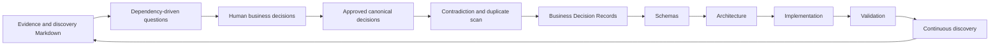

# Business Discovery Process

## Purpose

This document describes the proven FIKA OS method for turning evidence into approved, traceable business knowledge and then carrying that knowledge safely into delivery.

## End-to-end flow

## Evidence before questions

Discovery begins with confirmed evidence: repositories, inventories, current workflows, workshops, journeys and human context. Evidence is classified as confirmed fact, historical fact, inference, proposal or unknown. AI must not convert an unknown into a business rule.

The evidence remains valuable after a decision because it explains context, examples and the reason the question mattered.

## Why questions are dependency-driven

Some decisions cannot be answered safely until earlier concepts are stable. For example, location relationships depend on an agreed Operational Location definition. Dependencies:

- reduce repeated explanation;
- prevent downstream answers from assuming unresolved meaning;
- expose which decision unlocks the most later knowledge;
- allow blocked questions to reopen automatically only when every prerequisite is approved.

Partial satisfaction is not enough. A question remains blocked until all prerequisite decisions are canonical.

## One decision per question

One question should normally produce one decision. Compound questions hide disagreement, make approval ambiguous and create records that are difficult to supersede. If one answer resolves only part of a compound question, narrow it to the remaining validation rather than asking the completed part again.

Before presenting a question, check:

1. Can the repository already answer it?
2. Can approved decisions infer the answer?
3. Is it genuinely one decision?
4. Will answering it reduce later questions?
5. Is there a different question that unlocks more knowledge?

Redundant questions should be retired or converted into a direct validation test.

## Discovery and validation questions

- A **discovery question** asks for business meaning that evidence cannot determine safely.
- A **validation question** tests a specific interpretation already supported by evidence or approved decisions.

A validation answer must answer the test directly first—usually yes/no or a clear choice—before explaining conditions. General policy that does not resolve the named example remains incomplete.

## Suggested answers and confidence

Suggested answers reduce decision-owner effort where evidence supports them. They remain proposals until a human approves them and must stay concise.

- **HIGH:** the repository or approved decisions already answer the question.
- **MEDIUM:** the evidence strongly suggests an answer.
- **LOW:** business judgement is required.
- **UNKNOWN:** evidence is insufficient.

Confidence is recalculated after each approval because a decision may resolve or strengthen later questions.

## Approval and canonical wording

Human decision owners approve business meaning. Their approved wording is stored exactly and becomes canonical. Codex must not reinterpret, shorten or silently improve it in the decision register.

An approved decision is processed once, assigned a stable decision ID and recorded with its owner, date, source row and repository-sync status. Duplicate decision IDs or duplicate records are not allowed.

## History is never overwritten

Questions, previous answers, evidence and superseded decisions remain traceable. Amendments create a new version or superseding record; they do not erase why an earlier decision existed. Operational views may hide completed rows, but the history remains available for audit.

## Contradictions and duplicates

After every approval, compare the answer with existing canonical decisions:

- If two decisions cannot both be true, mark them **Needs Review** and explain the conflict.
- Do not choose a winner by inference.
- Resolve the contradiction through revised human wording.
- Update the existing decision record rather than creating a duplicate.

Questions fully answered by another decision should be retired or converted into validation. The dependency graph and decision register are checked for duplicates, orphan references and cycles.

## Workbook and repository roles

### FIKA Business Knowledge Workbook

The workbook is the interactive discovery session. It holds questions, dependency status, human answers and approvals, canonical decisions, glossary candidates, dashboard measures and activity history.

### Repository

The repository is the durable governed knowledge base. It holds evidence, BDRs, domain definitions, schemas, architecture and delivery standards. Workbook decisions enter the repository through a dedicated synchronisation workflow, not through silent edits.

### Codex

Codex reads evidence, maintains traceability, suggests evidence-backed answers, processes approvals, rebuilds dependencies, detects contradictions and prepares repository artefacts. Codex does not invent FIKA or act as the business owner.

### Human decision owners

Human owners provide and approve business meaning, resolve contradictions and authorise adoption, implementation and release where applicable.

## From decisions to delivery

1. **Business Decision Records:** preserve decision wording and explain context, rationale and consequences.
2. **Schemas:** implement approved meaning as versioned contracts.
3. **Architecture:** composes domains and schemas without redefining them.
4. **Implementation:** builds against approved upstream authority.
5. **Validation:** proves business behaviour, safety and operational readiness.
6. **Continuous discovery:** captures new evidence and routes governed change back through the appropriate stages.

## Current proven result

The first FIKA OS business-discovery cycle completed with 54 canonical decisions, 100% discovery, no remaining questions, no Needs Review items and no duplicate decisions.

## Related documents

- [Documentation governance](../documentation-governance.md)
- [Stage 3 — Business Discovery](../stages/stage-3-business-discovery.md)
- [Stage 4 — Business Decision Records](../stages/stage-4-business-decision-records.md)

