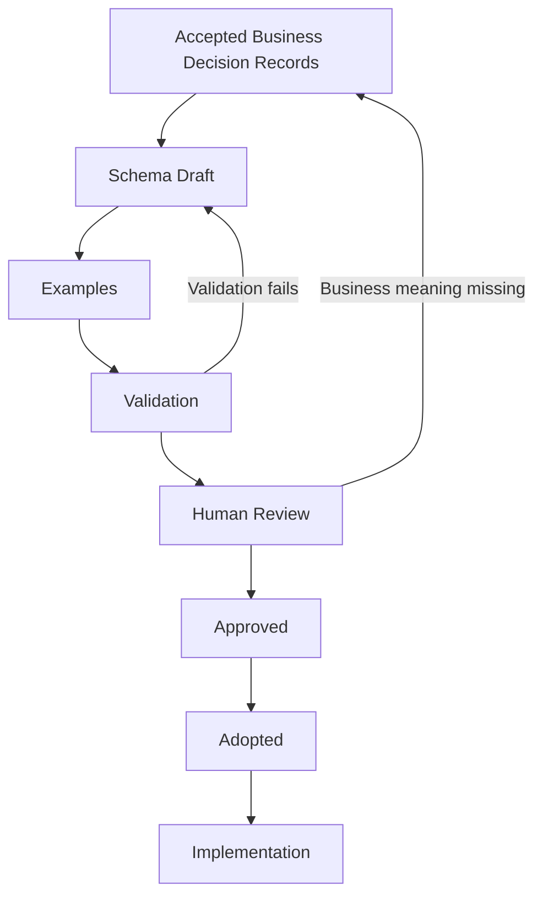

# Schema Generation and Approval Process

## Purpose

This document is the canonical methodology for Stage 5 of FIKA OS. It governs how approved business meaning is translated into versioned canonical schemas, reviewed, approved and adopted without allowing schemas, applications or providers to invent FIKA business meaning.

This process does not adopt a schema merely because a file exists. Draft schema material remains supporting evidence until it completes every applicable gate below.

## Core principles

- Schemas translate accepted Business Decision Records (BDRs); they never invent business meaning.
- BDRs remain authoritative over schemas.
- Providers never define canonical schemas. Canonical schemas define how provider data is mapped.
- Every required property must be traceable to one or more accepted BDRs.
- Optional properties must have a stated purpose, owner and evidence.
- History is never overwritten. Amendments, deprecations and supersession remain traceable.
- Relationships, cardinality and aggregate ownership must be explicit.
- Business behaviour belongs in approved business decisions and architecture. Schemas define structure and validation constraints, not workflow orchestration.
- Canonical records, operational projections and legacy or provider metadata must remain distinguishable.
- Storage and implementation technology must not shape canonical business meaning.

## Authority and entry gate

The authority order in [Documentation Governance](../documentation-governance.md) applies. A schema may enter drafting only when:

1. its business boundary is supported by accepted BDRs;
2. prerequisite BDRs and schema-pack dependencies are identified;
3. unresolved questions that would change required structure, ownership or cardinality are resolved by the relevant business owner; and
4. a review owner is named.

Draft BDRs may be used to plan a pack, but not to justify adoption. If schema work exposes missing business meaning, return the issue to the governed business-decision process rather than resolving it in the schema.

## End-to-end workflow



### 1. Business Decision Record

- **Purpose:** establish the authoritative business meaning the schema must express.
- **Entry criteria:** the decision is canonical and its BDR exists.
- **Exit criteria:** the relevant BDRs are Accepted, dependencies are known and no blocking contradiction remains.
- **Deliverables:** BDR references, dependency list and identified business/review owners.

### 2. Schema Draft

- **Purpose:** express the approved concepts, boundaries, relationships and structural constraints in a technology-neutral contract.
- **Entry criteria:** the BDR gate is satisfied and the schema pack is ready.
- **Exit criteria:** identity, ownership, properties, required/optional status, relationships, lifecycle metadata and validation constraints are explicit and traceable.
- **Deliverables:** versioned draft schema, traceability record and draft change notes.

### 3. Examples

- **Purpose:** demonstrate intended records and expose ambiguity in boundaries or constraints.
- **Entry criteria:** a coherent draft exists.
- **Exit criteria:** representative valid and invalid cases cover normal, boundary and failure conditions without production data.
- **Deliverables:** valid fixtures, invalid fixtures and a fixture index linked to the draft.

### 4. Validation

- **Purpose:** prove that the schema is internally valid and classifies the examples as intended.
- **Entry criteria:** the draft and examples are complete enough to test.
- **Exit criteria:** schema syntax, references, valid fixtures, invalid fixtures, naming and traceability checks pass; any exceptions are documented.
- **Deliverables:** reproducible validation evidence and exception record.

### 5. Human Review

- **Purpose:** confirm that the draft expresses the intended business meaning and boundaries.
- **Entry criteria:** validation passes and the review pack identifies changes and unresolved matters.
- **Exit criteria:** the business owner confirms meaning; affected domain owners confirm boundaries; technical reviewers confirm consistency and storage independence; blocking comments are resolved.
- **Deliverables:** completed [schema review checklist](schema-review-checklist.md), review comments and review outcome.

### 6. Approved

- **Purpose:** record that the proposed contract is acceptable for adoption planning.
- **Entry criteria:** human review is complete and no blocking decision remains.
- **Exit criteria:** an accountable approver records the approved version, date and scope; migration and compatibility impacts are understood.
- **Deliverables:** approval record, final candidate and adoption prerequisites.

Approval does not yet make the schema an implementation contract.

### 7. Adopted

- **Purpose:** establish a specific schema version as a canonical contract.
- **Entry criteria:** approval exists; catalogue, version, fixtures, validation and transition consequences are complete.
- **Exit criteria:** adoption is explicitly recorded, documentation identifies the adopted version, and downstream consumers can reference it unambiguously.
- **Deliverables:** adopted schema, catalogue entry, adoption record, fixtures, validation evidence and migration guidance where applicable.

### 8. Implementation

- **Purpose:** implement applications, repositories, adapters and workflows against the adopted contract.
- **Entry criteria:** the schema is Adopted and the applicable Stage 6 architecture has been reviewed.
- **Exit criteria:** implementation and rollout satisfy Stages 7 and 8.
- **Deliverables:** implementation, tests, operational documentation and release evidence. These are outside Stage 5.

## Review workflow

1. Prepare a review bundle containing the draft, traceability, examples, validation result and change summary.
2. Complete the schema review checklist before requesting human review.
3. Review business meaning and ownership before technical representation.
4. Review dependent and consuming domains for boundary or cardinality changes.
5. Record each comment as blocking, non-blocking or future consideration.
6. Route missing business policy back to a BDR workflow; do not resolve it in schema prose.
7. Revalidate after every structural change.
8. Retain the review outcome with the schema version.

## Approval workflow

- The relevant business decision owner approves fidelity to business meaning.
- A designated schema approver confirms cross-domain consistency, traceability and validation evidence. **TODO:** name the standing FIKA OS schema approver or approval group.
- Approval must identify the exact candidate version and date.
- Conditional approval must list conditions and cannot advance to Adopted until they are resolved.
- Silence, file creation, merge or implementation use does not constitute approval.

## Adoption workflow

1. Confirm the approved candidate is unchanged since review.
2. Confirm every required property traces to accepted BDRs.
3. Confirm validation is reproducible and fixtures contain no production or sensitive personal data.
4. Confirm compatibility, migration and deprecation effects are documented.
5. Record the adopting authority, date, exact version and effective scope.
6. Update the schema catalogue and pack roadmap.
7. Notify downstream architecture and application owners that an adopted contract is available.

## Schema lifecycle

| Status | Meaning | Permitted use |
|---|---|---|
| Draft | Work in progress derived from accepted BDRs; not reviewed as a complete contract. | Exploration and review preparation only |
| Under Review | A fixed draft is undergoing business, domain and technical review. | Review and validation only |
| Approved | Review is complete and the exact version is approved for adoption preparation. | Adoption planning; not yet an implementation contract |
| Adopted | Explicitly established as a canonical contract for its stated scope and version. | Architecture and implementation contract |
| Deprecated | Still supported for a stated transition period but not for new use. | Existing consumers during governed migration |
| Superseded | Replaced by a named later version or schema and no longer current authority. | Historical traceability only, except documented legacy support |

Status changes must be explicit, dated and attributable. History must not be rewritten.

## Versioning and breaking changes

- Every schema has a stable schema identity and an explicit version.
- A version identifies a fixed contract; published versions are not silently edited.
- Corrections that change validation or meaning require a new version.
- A breaking change is any change that can invalidate previously valid canonical records, make previously invalid records valid in a meaning-changing way, change ownership or cardinality, remove or rename a property, narrow allowed values, or alter a relationship's meaning.
- Breaking changes require impact assessment, new examples, full review, explicit approval, migration guidance and a deprecation or supersession plan.
- Non-breaking additions still require BDR traceability, review and a new recorded version.
- **TODO:** approve the repository-wide version-numbering convention before the first adoption.

## Traceability

Every schema must have an accompanying traceability record containing:

- schema identity, version and lifecycle status;
- decision IDs and links to related BDRs;
- dependencies on other schemas or decisions;
- property-level justification for every required property;
- purpose and owner for optional properties;
- valid and invalid examples;
- validation fixtures and validation evidence;
- provider mappings where applicable;
- review, approval and adoption records;
- deprecation or supersession links where applicable.

A provider field, spreadsheet column or application property is evidence for a mapping or compatibility concern, not sufficient authority for a canonical property.

## Provider mapping philosophy

Providers and legacy systems connect through mappings and adapters. Canonical schemas remain stable when a provider changes. Mappings must preserve provenance, distinguish provider identifiers from canonical identity, document loss or transformation, and never promote provider workflow state into canonical meaning without a BDR. See [Provider Mapping Principles](provider-mapping-principles.md).

## Validation requirements

Before approval, each schema must have:

- a syntactically valid, resolvable definition;
- documented required and optional properties;
- stable identities and unambiguous formats where the domain requires them;
- valid fixtures covering representative cases;
- invalid fixtures covering required fields, formats, relationships and boundary rules;
- checks for duplicate meaning and provider leakage;
- checks that examples contain no secrets, sensitive production data or private customer data;
- reproducible validation results;
- completed traceability and review checklists.

Validation proves conformance to the proposed contract. It does not approve the underlying business policy.

## Repository structure

Stage 5 artefacts should use the existing governed areas:

```text
docs/
  business-decisions/       authoritative business meaning
  domain-models/            explanatory domain-model guidance
  schema-reviews/           review and adoption evidence
  platform-methodology/     Stage 5 governance
schemas/                    versioned canonical schema definitions and catalogue
fixtures/                   non-production valid and invalid examples
```

Provider mappings should be stored separately from canonical schemas. **TODO:** approve their precise repository location before Pack 9 begins.

## Business ownership

Business owners approve meaning; schema reviewers confirm faithful representation; technical reviewers confirm consistency and validation; adoption authority makes the contract canonical. None of these roles may use schema design to bypass a missing business decision.

Where a pack spans domains, every affected business owner must review the boundary relevant to their domain. **TODO:** confirm the standing adoption authority and any delegated approval thresholds.

## Current stage

Stage 5 governance is being established. No schema is adopted by this document. Existing `FikaBooking` schemas, fixtures and review material remain draft supporting evidence. The 54 BDRs are currently Draft pending human review, so schema pack generation remains gated until the relevant BDRs are Accepted.

## Recommended working practices

- Work one dependency-ordered schema pack at a time.
- Freeze a review candidate while comments are gathered.
- Keep canonical schemas, provider mappings and projections separate.
- Prefer small, reviewable schema versions over broad speculative models.
- Use examples early to expose ambiguity.
- Record TODOs as business or governance questions rather than guessing.
- Re-run validation and link checks after every revision.
- Update the schema pack roadmap after each status change.
- Return new business meaning to the earliest affected governance stage.

## Related documents

- [Schema Review Checklist](schema-review-checklist.md)
- [Provider Mapping Principles](provider-mapping-principles.md)
- [Schema Pack Roadmap](../schema-pack-roadmap.md)
- [Stage 5 — Schema Design](../stages/stage-5-schema-design.md)
- [Documentation Governance](../documentation-governance.md)

