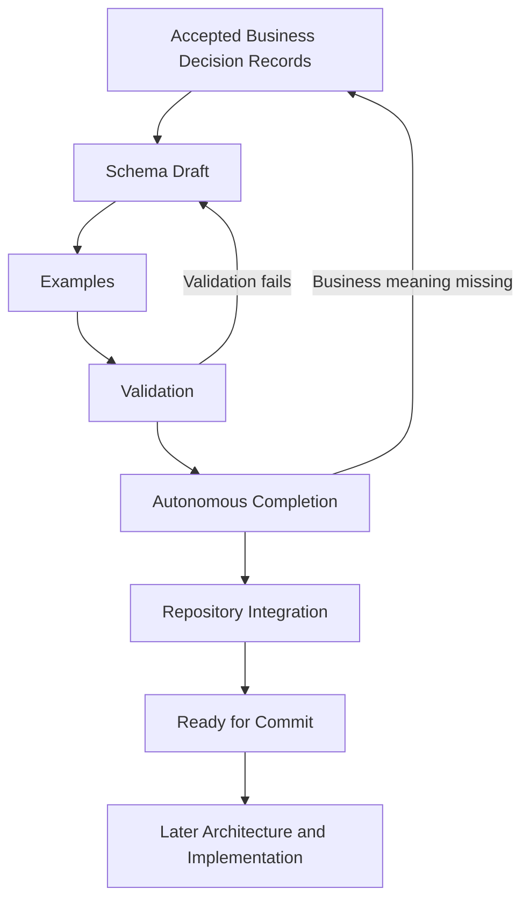

# Schema Generation and Completion Process

## Purpose

This document is the canonical methodology for Stage 5 of FIKA OS. It governs how approved business meaning is translated into versioned canonical schemas, validated, completed and integrated without allowing schemas, applications or providers to invent FIKA business meaning.

File creation alone is not completion. A schema Pack becomes the current repository baseline only after traceability, fixtures, validation, autonomous completion and deterministic repository integration succeed.

## Core principles

- Schemas translate accepted Business Decision Records (BDRs); they never invent business meaning.
- BDRs remain authoritative over schemas.
- Providers never define canonical schemas. Canonical schemas define how provider data is mapped.
- Every required property must be traceable to one or more accepted BDRs.
- Optional properties must have a stated purpose, owner and evidence.
- History is never overwritten. Amendments, deprecations and supersession remain traceable.
- Relationships, cardinality and aggregate ownership must be explicit.
- Business behaviour belongs in approved business decisions and architecture. Schemas define structure and validation constraints, not workflow orchestration.
- Canonical records, operational projections and legacy or provider metadata must remain distinguishable.
- Storage and implementation technology must not shape canonical business meaning.

## Authority and entry gate

The authority order in [Documentation Governance](../documentation-governance.md) applies. A schema may enter drafting only when:

1. its business boundary is supported by governed BDR authority;
2. prerequisite BDRs and schema-pack dependencies are identified;
3. unresolved questions that would change required structure, ownership or cardinality are resolved by the relevant business owner; and
4. its validation and repository-integration targets are identified.

If schema work exposes missing business meaning, return the issue to the governed business-decision process rather than resolving it in the schema. No separate Schema Adoption Authority or additional review/adoption gate applies.

## End-to-end workflow



### 1. Business Decision Record

- **Purpose:** establish the authoritative business meaning the schema must express.
- **Entry criteria:** the decision is canonical and its BDR exists.
- **Exit criteria:** the relevant business Decisions and BDRs are governed, dependencies are known and no blocking contradiction remains.
- **Deliverables:** BDR references, dependency list and identified business owners.

### 2. Schema Draft

- **Purpose:** express the approved concepts, boundaries, relationships and structural constraints in a technology-neutral contract.
- **Entry criteria:** the BDR gate is satisfied and the schema pack is ready.
- **Exit criteria:** identity, ownership, properties, required/optional status, relationships, lifecycle metadata and validation constraints are explicit and traceable.
- **Deliverables:** versioned draft schema, traceability record and draft change notes.

### 3. Examples

- **Purpose:** demonstrate intended records and expose ambiguity in boundaries or constraints.
- **Entry criteria:** a coherent draft exists.
- **Exit criteria:** representative valid and invalid cases cover normal, boundary and failure conditions without production data.
- **Deliverables:** valid fixtures, invalid fixtures and a fixture index linked to the draft.

### 4. Validation

- **Purpose:** prove that the schema is internally valid and classifies the examples as intended.
- **Entry criteria:** the draft and examples are complete enough to test.
- **Exit criteria:** schema syntax, references, valid fixtures, invalid fixtures, naming and traceability checks pass; any exceptions are documented.
- **Deliverables:** reproducible validation evidence and exception record.

### 5. Autonomous Completion

- **Purpose:** complete every deterministic Pack artefact and surface only genuine Human Decision Gates.
- **Entry criteria:** validation passes and all affected artefacts are available.
- **Exit criteria:** schemas, fixtures, traceability, reports, reflection, manifest and archive evidence are consistent; no unresolved Human Decision Gate remains.
- **Deliverables:** completed Pack and reproducible completion evidence.

### 6. Repository Integration

- **Purpose:** make the completed Pack the local repository baseline.
- **Entry criteria:** autonomous completion succeeds and no Human Decision Gate remains.
- **Exit criteria:** governed Markdown, schemas, fixtures, reports, Pack archive and indexes are repository-visible and revalidated.
- **Deliverables:** repository integration manifest, validation report and updated indexes.

### 7. Ready for Commit

- **Purpose:** identify a completed and integrated repository baseline awaiting the sole manual engineering action.
- **Entry criteria:** repository integration and revalidation pass.
- **Exit criteria:** Git commit occurs through the separate engineering action.
- **Deliverables:** completed local diff and readiness report.

### 8. Later Architecture and Implementation

- **Purpose:** implement applications, repositories, adapters and workflows against the committed canonical baseline.
- **Entry criteria:** the Pack is committed and the applicable Stage 6 architecture has been completed.
- **Exit criteria:** implementation and rollout satisfy Stages 7 and 8.
- **Deliverables:** implementation, tests, operational documentation and release evidence. These are outside Stage 5.

## Completion workflow

1. Assemble the schema, traceability, examples, validation result and change summary.
2. Confirm business meaning and ownership before technical representation.
3. Check dependent and consuming domains for boundary or cardinality conflicts.
4. Route missing business policy to a Human Decision Gate; do not resolve it in schema prose.
5. Complete all unaffected deterministic work before pausing.
6. Revalidate after every structural change.
7. Integrate the completed Pack and update repository indexes mechanically.
8. Revalidate the integrated repository and report `READY FOR COMMIT`.

## Schema lifecycle

| Status | Meaning | Permitted use |
|---|---|---|
| Draft | Work in progress derived from governed BDR authority. | Autonomous Pack processing and validation |
| Completed | All deterministic Pack artefacts and validation are complete with no Human Decision Gate. | Repository integration |
| Integrated | The completed Pack is repository-visible and revalidated. | Ready for commit |
| Deprecated | Still supported for a stated transition period but not for new use. | Existing consumers during governed migration |
| Superseded | Replaced by a named later version or schema and no longer current authority. | Historical traceability only, except documented legacy support |

Status changes must be explicit, dated and attributable. History must not be rewritten.

## Versioning and breaking changes

- Every schema has a stable schema identity and an explicit version.
- A version identifies a fixed contract; published versions are not silently edited.
- Corrections that change validation or meaning require a new version.
- A breaking change is any change that can invalidate previously valid canonical records, make previously invalid records valid in a meaning-changing way, change ownership or cardinality, remove or rename a property, narrow allowed values, or alter a relationship's meaning.
- Breaking changes require impact assessment, new examples, any required Business Decision, full validation, migration guidance and a deprecation or supersession plan.
- Non-breaking additions still require BDR traceability, validation and a new recorded version.
- **TODO:** confirm the repository-wide version-numbering convention before the first implementation dependency.

## Traceability

Every schema must have an accompanying traceability record containing:

- schema identity, version and lifecycle status;
- decision IDs and links to related BDRs;
- dependencies on other schemas or decisions;
- property-level justification for every required property;
- purpose and owner for optional properties;
- valid and invalid examples;
- validation fixtures and validation evidence;
- provider mappings where applicable;
- completion and repository-integration records;
- deprecation or supersession links where applicable.

A provider field, spreadsheet column or application property is evidence for a mapping or compatibility concern, not sufficient authority for a canonical property.

## Provider mapping philosophy

Providers and legacy systems connect through mappings and adapters. Canonical schemas remain stable when a provider changes. Mappings must preserve provenance, distinguish provider identifiers from canonical identity, document loss or transformation, and never promote provider workflow state into canonical meaning without a BDR. See [Provider Mapping Principles](provider-mapping-principles.md).

## Validation requirements

Before repository integration, each schema must have:

- a syntactically valid, resolvable definition;
- documented required and optional properties;
- stable identities and unambiguous formats where the domain requires them;
- valid fixtures covering representative cases;
- invalid fixtures covering required fields, formats, relationships and boundary rules;
- checks for duplicate meaning and provider leakage;
- checks that examples contain no secrets, sensitive production data or private customer data;
- reproducible validation results;
- completed traceability and deterministic completion checks.

Validation proves conformance to the proposed contract. It does not approve the underlying business policy.

## Repository structure

Stage 5 artefacts should use the existing governed areas:

```text
docs/
  business-decisions/       authoritative business meaning
  domain-models/            explanatory domain-model guidance
  schema-reviews/           completion and validation evidence
  platform-methodology/     Stage 5 governance
schemas/                    versioned canonical schema definitions and catalogue
fixtures/                   non-production valid and invalid examples
```

Provider mappings should be stored separately from canonical schemas. **TODO:** approve their precise repository location before Pack 9 begins.

## Business ownership

Business owners retain authority over business meaning. Autonomous schema processing confirms faithful representation, consistency and validation. Repository integration is deterministic and does not create a separate business or adoption authority. Schema design must never bypass a missing business decision.

Where a Pack exposes unresolved cross-domain meaning, it pauses at one batched Human Decision Gate. Otherwise processing continues through repository integration without an additional review gate.

## Current baseline

Stage 5 closed on 2026-07-25 with Packs 1 through 8 completed, integrated, committed and freshly validated. Existing standalone `FikaBooking` material remains supporting draft evidence unless incorporated through a governed Pack. Future BDR and schema Packs may extend the baseline incrementally through this process. Pack 9 remains gated by the business decision selecting the first provider mapping and its accountable owner.

## Recommended working practices

- Work one dependency-ordered schema pack at a time.
- Preserve a fixed candidate while validation or a Human Decision Gate is pending.
- Keep canonical schemas, provider mappings and projections separate.
- Prefer small, reviewable schema versions over broad speculative models.
- Use examples early to expose ambiguity.
- Record TODOs as business or governance questions rather than guessing.
- Re-run validation and link checks after every revision.
- Update the schema pack roadmap after each status change.
- Return new business meaning to the earliest affected governance stage.

## Related documents

- [Schema Review Checklist](schema-review-checklist.md)
- [Provider Mapping Principles](provider-mapping-principles.md)
- [Schema Pack Roadmap](../schema-pack-roadmap.md)
- [Stage 5 — Schema Design](../stages/stage-5-schema-design.md)
- [Documentation Governance](../documentation-governance.md)
