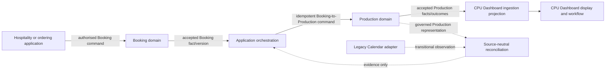

# Stage 7 Dashboard-to-CPU Contract Boundary Review

**Review date:** 2026-07-27

**Primary verdict:** **DASHBOARD-TO-CPU CONTRACT BOUNDARY READY**

## 1. Scope and authority

This governance-only review defines the business and architectural boundary between hospitality/ordering state, a dashboard-originated Production request, Production-domain acceptance, canonical Production Orders, CPU Dashboard ingestion, legacy Calendar observation and source-neutral reconciliation.

It does not create or revise a schema, Pack, fixture, application, adapter or provider connection. The implementation repository remains read-only. The existing CPU Dashboard and Calendar-led workflow remain operationally unchanged.

## 2. Repositories and commits reviewed

| Repository | Starting commit | Ending state before governance commit | Treatment |
|---|---|---|---|
| FIKA OS implementation, `C:\FIKA` | `f18574c003c228a5d8d804e7467b79d94103bd8d`, branch `design/fika-impact-visual-refactor` | Same commit and branch | Read-only; nothing staged or committed |
| FIKA specifications, `C:\FIKA\fika-platform-specs` | `ee9286bd4a2a5640b6a38d7897a7152846a08fa9` | This review and minimum Stage 7 reference only before commit | Governed documentation |

The existing technical verdict remains **NOT TECHNICALLY COMPLETE — OFFLINE SEAM**. This boundary review does not correct or waive the junction, malformed-JSON or resource-boundary findings.

## 3. Applicable governance evidence

- [Technical completion review](stage-7-increment-1-technical-completion-review-2026-07-27.md)
- [Stage 7 implementation](stage-7-implementation.md)
- [Increment 1 charter](stage-7-increment-1-shadow-cpu-production-charter.md)
- [ADR-004 — Booking-to-Production boundary](../decisions/ADR-004-booking-to-production-boundary.md)
- [ADR-005 — Domain event and integration contract](../decisions/ADR-005-domain-event-and-integration-contract.md)
- [ADR-006 — Repository and consistency contract](../decisions/ADR-006-repository-and-consistency-contract.md)
- [ADR-007 — Projection and dashboard boundary](../decisions/ADR-007-projection-and-dashboard-boundary.md)
- [ADR-008 — Identity and AUTHMOD enforcement](../decisions/ADR-008-identity-and-authmod-enforcement-boundary.md)
- [ADR-009 — Booking-to-Production orchestration](../decisions/ADR-009-booking-to-production-orchestration.md)
- [ADR-010 — Legacy coexistence and retirement](../decisions/ADR-010-legacy-coexistence-and-retirement.md)
- `BOOK-001` through `BOOK-007`, `PROD-001` through `PROD-005`, applicable AUTHMOD/OPLOC/Capability Decisions and Packs 2, 4 and 6
- Pack 6 Production Order, Production Line, Routing Allocation and Production Change Record schemas and fixtures
- [Schema versioning and compatibility](../engineering/schema-versioning-and-compatibility.md)
- [Workflow catalogue](../fika-core/workflow-catalog.md) and [validation model](../fika-core/validation-model.md)

Representative booking-object structure was considered only as sanitised structural evidence. No live object, personal data, provider identifier, URL or commercial value was inspected or reproduced.

## 4. Current and target architecture

### Current transitional path

Hospitality/dashboard records, Calendar entries, attached structured JSON, Sheets and parser logic currently contribute to CPU demand visibility. They carry useful evidence but mix source facts, workflow state, projections and provider metadata. Calendar and CPU Sheets remain legacy observation/projection surfaces, not canonical Production authority.

### Target authority flow

The dashboard-led user journey does not mean the dashboard owns Production. An upstream application initiates or records Booking intent. The Booking domain accepts the authoritative Booking version. Orchestration then issues the Production command. Production independently decides and persists its result. The CPU Dashboard consumes a projection of Production-owned outcomes.

## 5. Primary decision

**Alternative B is established.** Dashboard JSON is a governed Production request/command that the Production domain transforms or refuses; it is not a canonical Production Order created by the originating dashboard.

This follows existing authority:

- ADR-004 says future workflows transform eligible canonical Booking versions into Production Orders.
- ADR-009 says a Booking version triggers Production evaluation but does not create or mutate Production directly.
- Production owns eligibility, Order/Line identity, timing, quantities, routing, lifecycle and change disposition.
- ADR-006 prohibits applications from bypassing a domain command boundary or directly mutating another domain's repository.
- ADR-007 makes dashboard state a projection/workflow concern rather than canonical authority.

The logical contract name is **Booking-to-Production Command**. Its semantic meaning is:

> an authorised, attributable and idempotent request for the Production domain to evaluate one governed Booking version or Booking change and return zero, one or several explicit Production outcomes.

The name is architectural terminology, not a new adopted JSON Schema or API.

## 6. Domain and contract ownership

| Concern | Owner | Does not own |
|---|---|---|
| Booking state and Booking version | Booking domain | Production eligibility, routing or lifecycle |
| Booking-to-Production Command meaning and acceptance | Production domain, invoked through orchestration | Booking commercial meaning or dashboard workflow |
| Orchestration instance and delivery progress | Application orchestration | Booking or Production facts |
| Canonical Production Order/Line | Production domain | Booking prices, quotes, recharge or customer relationship |
| CPU Dashboard ingestion projection | Production projection owner | Canonical Production mutation or eligibility decisions |
| CPU Dashboard workflow/display state | CPU Dashboard application boundary | Production lifecycle authority |
| Legacy Calendar observation | Transitional adapter boundary | Booking or Production authority |
| Reconciliation evidence | Reconciliation process | Authority to select or rewrite either source |

Production is authorised to create canonical Production identity only after it accepts a valid command under current authority, Capability, Configuration, Booking evidence and Production invariants. Neither dashboard, orchestrator, Calendar adapter nor projection may manufacture Production Order or Line IDs.

## 7. Producer-to-consumer boundary

The originating hospitality/ordering application is not the direct canonical producer of Production state. The governed sequence is:

1. the application submits an authorised Booking command or causes an attributable Booking change;
2. Booking validates and persists the new Booking version;
3. a Booking fact or authoritative query supplies the current accepted version to orchestration;
4. orchestration creates one idempotent Booking-to-Production Command for the bounded logical change;
5. Production accepts, rejects, holds or returns an indeterminate outcome after independent validation;
6. accepted Production facts feed the CPU Dashboard ingestion projection; and
7. CPU Dashboard actions return through authorised Production commands and current-state validation.

A structured booking object attached to or linked from a dashboard/Calendar record may provide source evidence. It does not bypass Booking acceptance, field-authority resolution or Production validation.

## 8. Contract responsibility matrix

| Contract content | Required disposition | Authority |
|---|---|---|
| Command identity, operation and contract version | Required | Orchestration/Production integration boundary |
| Source Booking ID and exact Booking version | Required | Booking domain reference |
| Booking Item references and ordered snapshots | Required where affected | Booking domain |
| Customer-facing service commitment | Required where Production evaluation needs it | Booking domain |
| Producing OPLOC | Not asserted as final routing by originator; candidate/context may be supplied only when governed | Production decides routing; OPLOC/Capability validate identity/capability |
| Destination/service location | Booking-owned commitment/reference; not producing-location inference | Booking/OPLOC |
| Required Ready Time | Production-owned; may be proposed input only if provenance and policy permit | Production domain |
| Production quantity/unit, conversion, yield and aggregation | Never originated as authoritative Booking/dashboard fields | Production domain |
| Dietary/allergen requirements | Minimum authorised Booking references needed for safe fulfilment; allocation remains Production-owned | Booking supplies; Production applies |
| Commercial totals, VAT, delivery charges, service charges, quote and recharge state | Excluded by default | Booking/commercial domains |
| Client/contact data | Excluded unless a named Production purpose requires a minimised field | Booking/Client domains |
| Notes, attachments and free text | Excluded by default; use governed structured fields/references | Owning source domain |
| Production lifecycle/status | Never accepted from Booking/dashboard as authoritative | Production domain |
| Dashboard workflow status | Projection-only and separately named | CPU Dashboard application |
| Warnings, uncertainties and exclusions | Required when present; never silently defaulted away | Producing boundary and validator |

## 9. Identity and idempotency model

| Identity | Meaning and owner |
|---|---|
| Source system identity | Identifies the governed application/service boundary; never a user email or provider resource alias |
| Booking ID | Durable Booking identity owned by Booking |
| Booking version | Exact accepted commercial/service state evaluated by Production |
| Booking Item ID | Booking-owned source-line identity |
| Booking amendment/cancellation action ID | Booking-owned change identity, distinct from versions and commands |
| Command/request ID | Immutable identity for one logical Production operation attempt scope |
| Idempotency key | Stable key scoped to Booking lineage, Booking version/change and intended operation |
| Orchestration instance ID | Correlates processing attempts and outcomes for one bounded logical change |
| Correlation ID | Connects the cross-domain workflow without becoming shared business identity |
| Causation ID | Identifies the accepted fact/change that caused this command |
| Production Order ID/version | Created and owned only by Production after acceptance |
| Production Line ID/version | Created and owned only by Production; retains Booking Item lineage where applicable |
| Production change ID | Production-owned accepted change/review outcome identity |
| Projection record/checkpoint ID | CPU Dashboard ingestion/projection identity only |
| Legacy source/observation ID | Calendar adapter evidence identity only |

Repeated delivery of the same command intent returns or reconciles to the prior outcome. Reuse of one idempotency identity with materially different intent is rejected or quarantined. Event deduplication, command idempotency, projection checkpointing and provider-observation deduplication remain separate controls.

No global arrival ordering is assumed. Booking version and current authoritative queries determine source order. Production versions/expected comparison tokens govern modifications to existing Orders. Late input cannot overwrite an outcome based on a newer accepted Booking version.

## 10. Versioning and compatibility

- Booking-to-Production Command identity/version is independent from Booking schema, Pack 6 schema, orchestration, projection and legacy snapshot versions.
- A future schema must have its own stable `$id`, declared version and source specification commit.
- The consumer declares exact supported contract versions; unknown or semantically ambiguous versions fail closed.
- Compatible additions require explicit compatibility evidence, especially under `additionalProperties: false`.
- Breaking semantic or validation changes require a governed major revision and transition plan.
- No adapter silently coerces `fika.cpu-intake-snapshot`, legacy booking JSON or a CPU projection into the command contract.
- Command acceptance records every relevant input contract/schema identity and version.

## 11. Provenance and field-authority rules

The command records source system, Booking ID/version, relevant Booking Item/action references, initiating and executing actor/service context, causation, correlation, command/idempotency identity, creation time and applicable source contract versions.

Field authority is resolved before Production transformation:

1. the accepted current Booking version governs commercial/service intent;
2. original client-submission content remains attributable history, not automatic current truth;
3. later operational/enriched fields are authoritative only if accepted by their owning domain;
4. stale nested `clientBooking` state never overrides a later governed Booking version;
5. guest count never substitutes for ordered or Production quantity;
6. original and amended item collections are never silently merged—each affected item references an explicit Booking version/action;
7. quote, recharge, confirmation and Calendar state never become Production lifecycle;
8. top-level totals or charges do not enter Production merely because they are newer; and
9. conflicts that cannot be resolved from authoritative versions are rejected, quarantined or held for review.

## 12. Amendment and cancellation model

An accepted Booking amendment or cancellation is a new attributable Booking change. It creates a new idempotent Production command referencing:

- Booking ID and new Booking version;
- Booking amendment/cancellation action identity;
- previous source Booking version where relevant;
- linked Production Order IDs/versions when already known;
- expected Production comparison version for each intended modification; and
- causation/correlation and actor authority.

Before affected work is **In Production**, Production may accept governed automatic updates/cancellations while preserving history. At or after **In Production**, Production requires authorised human review and records its own change/disposition. Cancellation never deletes Orders, disappearance never proves cancellation, and Booking cancellation does not claim Production cancellation until Production accepts that outcome.

## 13. CPU Dashboard ingestion expectations

The CPU Dashboard should consume an ingestion-specific Production projection built from accepted Production facts/outcomes, not mutate or reinterpret canonical Production Orders directly.

The ingestion boundary must:

- validate source identity, contract/event version and Production Order/Line versions;
- deduplicate stable event/delivery identities;
- order by attributable Production versions/checkpoints rather than arrival time;
- expose freshness, completeness, partiality and rebuild status;
- preserve producing OPLOC, required timing, lines, quantities/units and governed dietary/allergen allocation supplied by Production;
- distinguish canonical Production lifecycle from dashboard workflow state;
- acknowledge receipt/validation/projection outcome separately from Production acceptance;
- reject or quarantine incompatible, stale or structurally invalid input;
- retry safely without duplicating work or user-visible side effects; and
- route dashboard actions through authorised Production commands with current-state and expected-version checks.

An acknowledgement must distinguish at least received, rejected/quarantined, projected, duplicate/preserved and reconciliation-required outcomes. Exact acknowledgement transport and timing/SLA remain implementation/governance decisions.

## 14. Privacy and minimisation boundary

CPUX receives only information necessary to produce and route work safely.

- Exclude prices, VAT, quote/recharge fields, customer confirmation mechanics and provider links.
- Exclude Client names and contact details unless a separately governed operational purpose proves necessity.
- Exclude employee data, attendees and unrestricted notes/free text.
- Do not copy attachments; use a governed reference only if Production has an authorised need.
- Carry dietary/allergen information through structured, purpose-limited Booking references and Production-owned allocation—not raw declarations by default.
- Store intent fingerprints for idempotency without retaining unnecessary full payload copies.
- Apply explicit retention/access policy to commands, quarantine, projections, reconciliation evidence and audit.

## 15. Source-neutral reconciliation boundary

Future reconciliation should accept **two independently validated representation envelopes** and map each into a **common governed comparison projection**. This preserves source-specific evidence without forcing either representation to impersonate the other.

### Representation envelopes

Each envelope identifies representation type, contract/version, source identity, source record/version, snapshot/as-of scope, provenance, integrity, warnings, uncertainties and exclusions. Candidate representation types are:

- legacy Calendar observation; and
- governed Production command/outcome or Production projection.

### Common comparison projection

The comparison projection contains only governed comparable dimensions: Booking lineage, intended occurrence/service time, source item lineage where available, observed quantities/units with semantic labels, producing/destination OPLOC references, amendment/cancellation evidence, and completeness/freshness markers.

It is non-canonical and does not merge the two sources, select a universal winner, assign a match score or repair either domain. It produces missing, duplicate, stale, incompatible, partial, conflicting and uncertain evidence. Any repair occurs later through the owning domain's authorised command.

The current `fika.cpu-intake-snapshot` remains the Calendar-side transitional envelope candidate only. It is not the common comparison projection or dashboard-to-CPU contract. Evolution of the current tool is separately authorised after its safety defects are corrected and the new contracts are governed.

## 16. Transitional Calendar coexistence and migration cases

| Current case | Transitional handling | Authority rule |
|---|---|---|
| Governed Booking JSON available | Resolve/validate the accepted Booking version; issue Production command through orchestration | JSON structure alone is not canonical proof |
| Booking JSON plus linked Calendar event | Booking/Production path is target; Calendar is labelled comparison/compatibility evidence | Prevent duplicate Production using shared Booking/source traceability |
| Calendar-only manual or historical booking | Legacy adapter observation remains operational; ambiguous reconstruction is quarantined/reviewed | Do not force into canonical Production Order |

Calendar-led operation remains intact until a separately governed migration unit demonstrates coverage, equivalence, authority direction, fallback and cutover readiness. Neither “legacy always wins” nor “new always wins” is adopted during coexistence.

## 17. Unresolved decisions and approval owners

These do not block the boundary decision but block schema adoption or implementation:

| Decision | Required owner |
|---|---|
| Exact Booking statuses/facts that trigger Production evaluation | Booking and Production business owners; Derek governance approval |
| Command operation vocabulary and minimum required payload versus authoritative query references | Production domain owner with architecture/schema governance |
| Governed hold prerequisites and release policy | Production business owner |
| Required Ready Time derivation/acceptance policy | Production with Booking/Logistics input |
| Whether multi-Order creation needs stronger all-or-nothing rules | Production business owner |
| Minimum dietary/allergen fields and access roles for CPUX | Production and food-safety/privacy authority |
| Whether any Client/contact field is operationally necessary | Production/privacy authority |
| Command, quarantine, projection and evidence retention periods | Information governance/privacy owners |
| CPU Dashboard acknowledgement timing/SLA and operational owner | CPU Operations/Production owner |
| Exact source-system/service actor identities and AUTHMOD grants | Authority/identity governance |
| Exact common comparison dimensions and tolerances | Production owner with Stage 7 product owner |

## 18. Effect on current offline implementation

The committed tool remains a valid first legacy-observation seam but not a final dashboard-to-CPU or two-source reconciliation implementation. Its Calendar constants are transitional constraints rather than target-domain rules. No code change is authorised here.

Before expansion:

1. correct the recorded junction, malformed-JSON quarantine and resource-boundary defects;
2. govern the Booking-to-Production Command schema from this boundary;
3. govern the CPU Dashboard ingestion projection/event contract;
4. govern the representation envelope and common comparison projection; and
5. then evolve the tool through separately authorised implementation tasks.

## 19. Relationship to recorded technical defects

This READY boundary verdict does not alter **NOT TECHNICALLY COMPLETE — OFFLINE SEAM**. The junction escape and malformed-JSON quarantine defects remain blocking. Unbounded input/resource risk remains recorded. Architectural contract work and technical hardening are separate; neither waives the other.

## 20. Capabilities deferred from the first contract implementation

- provider or Calendar access;
- legacy free-text parsing into canonical Production;
- canonical Booking redesign or Pack 6 modification;
- Production routing optimisation, capacity planning or Logistics;
- yield/conversion policy not already governed;
- dashboard UI redesign;
- live notifications or external side effects;
- automated post-start amendment/cancellation disposition;
- client/contact distribution beyond approved need;
- universal comparison scoring;
- deployment, hosting, cutover, retirement or Stage 8 rollout.

## 21. Remaining Stage 7 gaps

- Resolve the existing offline implementation defects and rerun technical completion.
- Decide the unresolved business/policy items required for command schema design.
- Draft and review the Booking-to-Production Command schema and fixtures without modifying Pack 6.
- Define the CPU Dashboard ingestion projection/event contract.
- Define source-neutral representation envelopes and comparison projection.
- Prepare legacy Calendar adapter authority only after the target comparison contract exists.
- Complete Stage 7 technical/product acceptance before Stage 8 entry.

## 22. Next smallest bounded task

Conduct a governance-only **Booking-to-Production Command contract design** using ADR-005, ADR-006, ADR-008, ADR-009, Packs 4 and 6 and the decisions in this review.

The task should prepare a draft command schema, valid/invalid synthetic fixtures, traceability and a review report while leaving Pack 6 unchanged. It must return any trigger-status, Required Ready Time, hold-policy, dietary/minimisation or multi-Order atomicity question requiring business authority rather than inventing policy.

It must not modify the CPU Dashboard, implement ingestion, access Calendar, correct the current tool, create canonical records, push or deploy.

## 23. Protected-scope confirmation

No implementation, Pack 6 schema/fixture, CPU Dashboard, Calendar, Drive, Gmail, provider, live booking object, canonical record or operational system was inspected or modified. No implementation-repository file was staged or committed.

## 24. Verdict

**DASHBOARD-TO-CPU CONTRACT BOUNDARY READY**

This verdict establishes ownership and contract boundaries only. It does not adopt a JSON Schema, complete the offline seam, authorise live integration, permit Calendar extraction, approve Stage 8 entry or release Production functionality.
