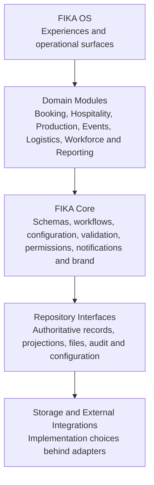
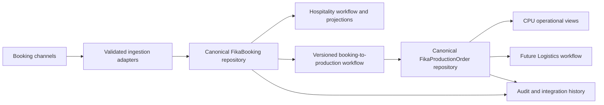

# Target Architecture

> **Classification: Supporting provisional architecture.** Stage 6 is active. This technology-neutral direction must be reconciled with the governed Stage 5 Packs 1–8 before it becomes implementation authority.

## Purpose and status

This document defines a technology-neutral architectural direction. It does not select a database, hosting model, runtime, deployment platform, or provider. Existing applications can migrate gradually through adapters and repository interfaces.

## Architectural layers

**FIKA OS** is the coherent collection of public, client-facing, administrative, and internal operational experiences. It does not require one user interface or one deployment.

**Domain Modules** own business meaning and domain-specific workflows. A module may serve several experiences while remaining separate from other domains.

**FIKA Core** supplies shared, versioned capabilities whose business meaning is common across the platform.

**Repository Interfaces** express how domain records, projections, configuration, files, and audit history are accessed without exposing storage layout to the domain.

**Storage and External Integrations** are replaceable implementation choices connected through adapters. Storage selection remains a later decision based on evidence.

## FIKA OS experiences

Public experiences and internal operations remain separate presentation and permission boundaries. Hospitality booking channels, The Line, FIKA Events and Pop-ups, internal dashboards, and future operational surfaces may use different journeys and brands while relying on shared domain contracts.

Experiences must not create competing sources of truth. They submit commands, read authorised views, and display workflow state through domain contracts.

## Domain modules

Initially evidenced or planned modules include:

- Hospitality Booking and customer/service intent;
- Hospitality Operations and dashboard workflow;
- Production and CPU preparation;
- Events as a company-wide internal event model with separate source channels;
- Logistics downstream of operational demand;
- Workforce Operations, provisionally in scope pending manual review;
- Reporting and client-specific operational reporting;
- document, media, equipment and mobilisation capabilities where future business evidence justifies first-class domains.

Module boundaries must follow business ownership and lifecycle, not current folders or Sheet layouts.

## FIKA Core

### Canonical schemas

Canonical schemas define stable IDs, versions, timestamps, ownership, required/optional fields, validation, and source-of-truth. They are independent of interfaces, sites, storage layouts, and external providers.

The Stage 5 baseline contains governed contracts across foundational identity and Operational Location, authority and capability, Service, Booking, Event, Production, Mobilisation, Brand Variation and Waste. The earlier standalone `FikaBooking` material remains supporting draft evidence rather than the only platform contract. Logistics, workforce, reporting and other unresolved concepts still require their applicable governed discovery before schema or implementation work.

### Shared workflows

Shared workflows coordinate business actions such as booking submission, server-authoritative pricing, acknowledgement, quote/document generation, Calendar projection, notifications, booking-to-production transformation, amendment/cancellation handling, and audit logging.

They must be idempotent where repeated delivery is possible, version-aware, observable, explicit about partial failure, and safe to migrate gradually.

### Shared configuration

Shared configuration represents sites, branding, enabled capabilities, catalogue references, workflow policies, provider connections, permissions, and operational rules. Safe/public configuration must remain separate from private configuration and secrets.

Configuration changes require ownership, validation, versioning, auditability, and controlled rollout. Configuration should express genuine variation without hiding different business behaviour.

### Brand system

The brand system supplies reusable identity, content patterns, presentation tokens, and accessibility expectations while allowing confirmed public/client distinctions. Brand configuration must not contain domain rules or private integration data.

### Validation

Validation occurs at trust boundaries and within authoritative workflows. Client validation improves experience; server/domain validation remains authoritative. Validation errors should identify actionable corrections without exposing sensitive implementation detail.

### Notifications

Notifications are effects of domain workflows, not the source of workflow state. Templates, recipients, channel policy, retry behaviour, delivery evidence, and failure escalation require explicit ownership. Repeated processing must not send unintended duplicates.

### Permissions

Permissions express roles and allowed actions across domains, sites, clients, and experiences. They follow least privilege and must be enforced at authoritative boundaries, not only hidden in interfaces. Important actions require attributable audit records.

## Repository abstraction

Each canonical aggregate should define a repository interface around domain needs, such as retrieving a stable ID/version, creating with idempotency, conditionally updating with an expected version, querying authorised views, and recording domain/audit events.

Separate repository interfaces may serve:

- canonical domain records;
- operational projections and read models;
- configuration;
- files and generated artefacts;
- integration checkpoints/idempotency;
- immutable audit history.

The interface contract must not expose physical row numbers, folder layouts, provider object IDs, or query syntax as domain semantics. Implementations may initially use current stores if they satisfy correctness, security, recovery, and performance requirements.

## Adapters

Adapters translate between domain contracts and external or legacy representations. Examples include public-channel submissions, legacy email/forms, Calendar events, file/document formats, notifications, workforce providers, till providers, and reporting projections.

An adapter owns provider-specific references, parsing, retries, rate/permission failures, and mapping diagnostics. It must not silently invent missing business facts. Unresolved input should be rejected or routed to an explicit review workflow.

## Legacy support and migration

Legacy inbox, spreadsheet, quote/form, Calendar-led CPU, and current projection workflows remain supported while replacement paths are introduced. Migration follows these steps:

1. define and validate the target contract;
2. adapt existing inputs into that contract;
3. run old and new projections in parallel where risk warrants;
4. compare results and expose discrepancies;
5. move authority only with rollback and recovery plans;
6. retire legacy paths only after usage and retention decisions are confirmed.

No future site should recreate a booking-form spreadsheet by default. A specific operational requirement and documented decision would be required.

## Target booking-to-operations flow

Calendar, Sheets, files, and dashboards may remain useful projections or integrations. They no longer define booking or production identity and status.

## Target Events direction

Separate experiences for The Line, FIKA sites, FIKA Events and Pop-ups, external venues, and manual channels should normalise into the governed Event contract. The internal Events Dashboard should become the company-wide operational source of truth for events. Stage 6 must now define workflow, permissions, repositories, projections and adapters without changing the Event business meaning.

## Quality attributes

The architecture should support:

- clear ownership and traceability;
- optimistic concurrency and duplicate-safe mutations;
- measurable performance and capacity decisions;
- recovery from partial processing;
- least-privilege access and secret isolation;
- versioned, compatible contracts;
- accessible, dependable user experiences;
- gradual, reversible migration.

## Decisions deliberately deferred

- database or storage technology;
- runtime, hosting, messaging, or deployment platform;
- physical repository implementation;
- future schema Pack scope and versioning conventions;
- production authentication and permission model;
- Events and Logistics architecture and implementation design;
- production workflow orchestration and any business policy not already settled by Pack 6;
- migration cutover dates and legacy retirement.
