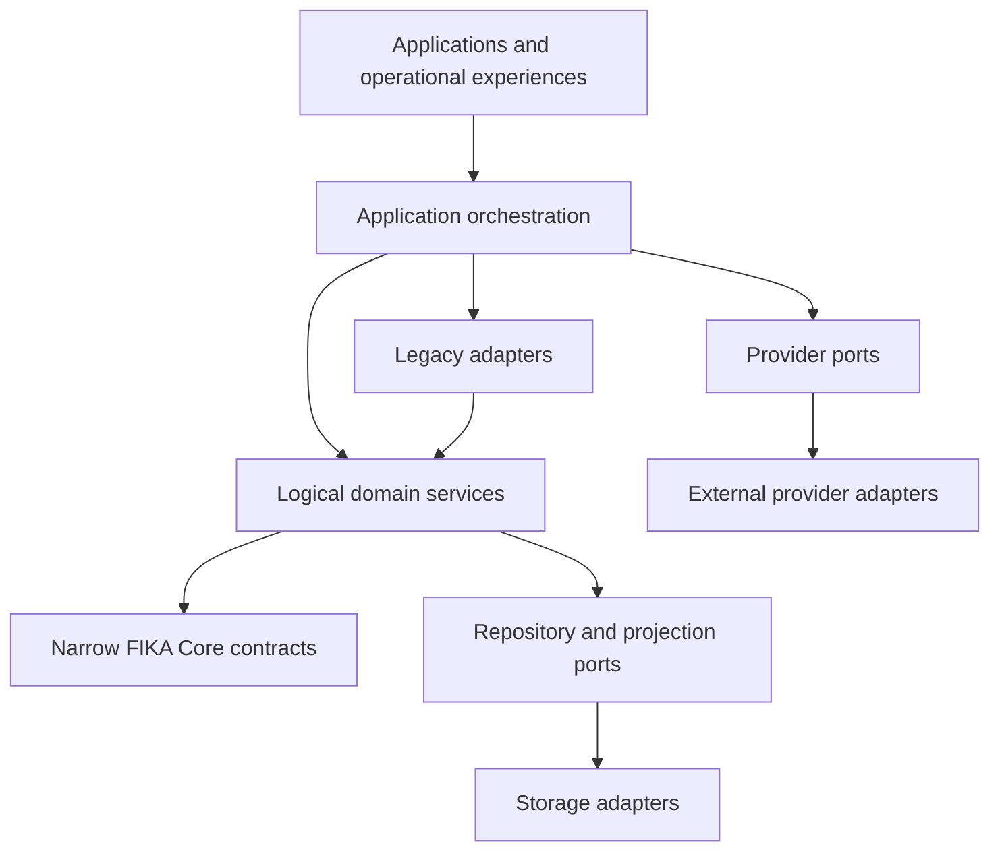
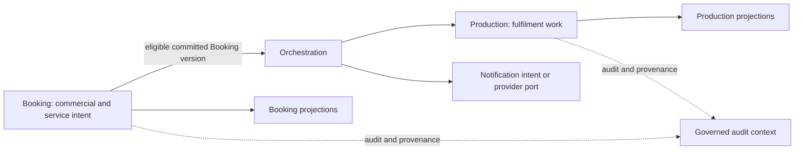

# Target Architecture

## Status and authority

This accepted Stage 6 target boundary is governed by [ADR-001](decisions/ADR-001-stage-6-platform-boundaries.md) and [ADR-005](decisions/ADR-005-domain-event-and-integration-contract.md) through [ADR-011](decisions/ADR-011-notification-generation-and-delivery.md). It is technology-neutral and does not decide deployment topology, storage, hosting, provider or programming language.

Business meaning remains authoritative in the Business Decision Records and completed Packs. This document explains how future software must respect that meaning.

## Architecture at a glance

These are responsibility boundaries, not separate servers.

## Applications and operational experiences

Applications present business capabilities to Legends, clients or other authorised actors. They may coordinate use cases through orchestration, read governed projections and provide early validation feedback. They do not own canonical business meaning and must not reconstruct it from screen state, spreadsheets, messages or provider payloads.

Public experiences and internal operations remain separate experiences even where they use the same domain services. A public booking experience does not inherit internal dashboard authority. An internal dashboard does not become the commercial source of truth: it may initiate an authorised command, the owning domain accepts or rejects the change, and projection builders later update or reconcile the view. The dashboard never directly rewrites canonical or projection state.

## Application orchestration

Orchestration coordinates work that crosses domain boundaries. It supplies actor and authority context, invokes domain commands, carries idempotency and correlation references, and coordinates projections, notifications and providers after authoritative changes.

Orchestration owns sequencing, not domain invariants. It cannot infer authority, bypass a domain service or edit canonical records directly.

## Logical domain services

The initial governed boundaries are:

- Client;
- Operational Location;
- Authority and Assignment;
- Operational Capability;
- Configuration;
- Service;
- Booking;
- Event;
- Production;
- Mobilisation;
- Brand;
- Waste.

Each owns its canonical records, invariants, lifecycle decisions and business language. Equipment has partial governed evidence but not yet a complete service boundary. Media, Workforce, Logistics, Reporting, Documents and Notifications remain candidate or future domains pending business authority.

Logical services do not imply microservices. Several may share one deployment while preserving their contracts and ownership.

## Narrow FIKA Core

FIKA Core standardises domain-neutral contracts that genuinely recur across governed domains:

- identifier and reference conventions;
- schema and record version conventions;
- effective-time, provenance and audit conventions;
- actor, assignment and authority-context references;
- correlation, causation, idempotency and concurrency context;
- validation-issue and operation-result shapes;
- domain-event envelope conventions;
- repository, projection and provider-port conventions.

Core does not own domain schemas, records, business rules, workflows, permissions, configuration values, brand meaning, notifications, providers, dashboards or miscellaneous shared utilities.

## Repository and projection ports

A domain repository is a logical contract owned by the domain responsible for the canonical records and invariants it protects. Its consistency scope follows governed invariants rather than a schema, storage structure or universal repository-per-domain rule. It hides persistence and returns canonical concepts rather than provider or storage shapes.

Domain services remain the command boundary. Other domains and applications use authorised commands or domain queries rather than directly mutating a repository. Workflow repositories may retain orchestration progress and canonical references without acquiring ownership of participating records.

A projection port publishes or retrieves a derived consumer view with explicit ownership, source linkage, freshness, completeness and recovery responsibility. Projections may optimise dashboards, calendars, documents, operational Sheets and reporting. They remain non-authoritative, may lag, and must not become the sole record of business state or audit history.

Dashboards normally read projections and use an authoritative domain query where a decision materially requires current owned state. Every dashboard action invokes an authorised application or domain command and is revalidated; it never mutates a repository or projection store directly.

Repository interfaces do not imply one database per domain, one repository per schema, separate deployment or any particular storage technology. Cross-domain workflows coordinate independently accepted changes, expose partial completion and do not assume a distributed transaction.

## Adapters and providers

Adapters translate at system boundaries:

- storage adapters implement repository ports;
- provider adapters implement capabilities such as message, calendar or document delivery;
- ingestion adapters normalise legacy inputs while preserving provenance;
- projection adapters update operational views;
- legacy adapters allow controlled coexistence with current systems.

Providers never define canonical concepts. Provider IDs and payloads remain integration metadata unless a governed domain explicitly requires a stable source reference.

## Canonical records, operational execution and read models

| Classification | Meaning |
|---|---|
| Canonical authority | Accepted owner of a governed business record and history. |
| Operational system of execution | Performs day-to-day work using canonical records or governed projections. |
| Read projection | Rebuildable view optimised for a consumer; no independent business authority. |
| Provider | External capability behind an adapter. |
| Legacy transition partner | Current system participating temporarily in a controlled migration. |
| Planned retirement candidate | System that may be retired only after evidence, reconciliation and acceptance. |

Unknown current classifications remain TODO. Production use alone does not establish canonical authority.

## Confirmed cross-domain flow

Booking and Production remain separate authorities. Production determines fulfilment eligibility and owns preparation, routing and production lifecycle. Logistics remains a planned downstream capability and is not defined by this flow.

## Enforcement

- Schemas enforce structure at trust boundaries.
- Domain services enforce business invariants and lifecycle.
- AUTHMOD evaluation enforces explicit scoped actions.
- Orchestration enforces cross-domain sequencing.
- Adapters enforce provider and transport constraints.
- Repositories enforce persistence concurrency and uniqueness required by their contract.

User-interface validation improves usability but is not authoritative enforcement.

Authentication establishes an accepted principal, governed account mapping resolves a FIKA actor, and AUTHMOD evaluates explicit scoped authority. The owning domain still validates capability, Configuration, current state and invariants. A valid session, application access, job title, Assignment or provider group does not grant authority, and every protected action is enforced beyond the client interface under [ADR-008](decisions/ADR-008-identity-and-authmod-enforcement-boundary.md).

## Events, notifications and audit

Domain events describe accepted business facts after durable domain change. Integration events are deliberately stable, minimised publications of those facts across boundaries. Commands request actions and may be refused; notifications communicate consequences; provider webhooks remain untrusted observations behind adapters. Capitalised **Event** remains the governed Event-domain business concept.

[ADR-005](decisions/ADR-005-domain-event-and-integration-contract.md) governs the logical envelope, versioning, duplicate-safe delivery, ordering limitations, correlation, replay and provider boundaries. [ADR-006](decisions/ADR-006-repository-and-consistency-contract.md) governs the relationship between durable canonical change and recoverable publication, including explicit publication uncertainty. [ADR-011](decisions/ADR-011-notification-generation-and-delivery.md) governs notification intent, recipient/content resolution, delivery attempts, provider observations, acknowledgement and reconciliation; use-case-specific recipient, consent, timing, escalation and retention policy remains governed business work.

## Legacy support and gradual migration

Current applications may continue while boundaries are introduced. Each coexistence path must name:

- the authoritative record;
- synchronisation direction;
- conflict and failure handling;
- reconciliation evidence;
- rollback approach;
- accountable acceptance and exit condition.

No legacy path is retired by this architecture document. [ADR-010](decisions/ADR-010-legacy-coexistence-and-retirement.md) governs bounded coexistence, readiness, cutover, fallback and retirement: each migration unit declares one canonical-write direction, and cutover does not automatically prove retirement eligibility.

## Decisions deliberately deferred

- deployment topology and service distribution;
- storage and hosting;
- physical repository/publication coordination and delivery implementation;
- domain-specific merge, compensation and conflict policy not yet supported by BDRs;
- identity-provider, authentication and account-lifecycle implementation;
- numerical projection freshness targets and domain-specific reporting/restatement policy;
- provider selection;
- final boundaries for candidate domains;
- legacy retirement timing.
